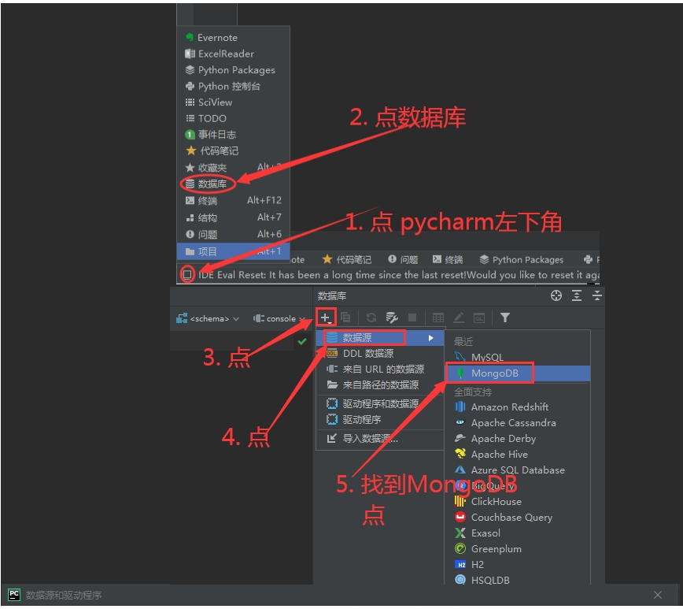

# Mongodb

## 业务场景

传统的关系型数据库 (比如 MySQL), 在数据操作的三高需求以及对应的 Web 2.0 网站需求面前, 会有力不从心的感觉

所谓的三高需求： 高并发, 高性能, 高可用, 简称三高 非关系型数据库(没有外键约束 一个一个文档像 一对多这种关系的)

- High Performance: 对数据库的高并发读写的要求
- High Storage: 对海量数据的高效率存储和访问的需求
- High Scalability && High Available: 对数据的高扩展性和高可用性的需求

**而 MongoDB 可以应对三高需求**

具体的应用场景:

- 社交场景, 使用 MongoDB 存储存储用户信息, 以及用户发表的朋友圈信息, 通过地理位置索引实现附近的人, 地点等功能.
- 游戏场景, 使用 MongoDB 存储游戏用户信息, 用户的装备, 积分等直接以内嵌文档的形式存储, 方便查询, 高效率存储和访问.
- 物流场景, 使用 MongoDB 存储订单信息, 订单状态在运送过程中会不断更新, 以 MongoDB 内嵌数组的形式来存储, 一次查询就能将订单所有的变更读取出来.
- 物联网场景, 使用 MongoDB 存储所有接入的智能设备信息, 以及设备汇报的日志信息, 并对这些信息进行多维度的分析.
- 视频直播, 使用 MongoDB 存储用户信息, 点赞互动信息等.

这些应用场景中, 数据操作方面的共同点有:

1. 数据量大
2. 写入操作频繁
3. 价值较低的数据, 对事务性要求不高(安全性不是很高)

对于这样的数据, 更适合用 MongoDB 来实现数据存储

**什么时候选择 MongoDB 呢 ?**

除了架构选型上, 除了上述三个特点之外, 还要考虑下面这些问题:

- 应用不需要事务及复杂 JOIN 支持
- 新应用, 需求会变, 数据模型无法确定, 想快速迭代开发
- 应用需要 2000 - 3000 以上的读写QPS（更高也可以）
- 应用需要 TB 甚至 PB 级别数据存储
- 应用发展迅速, 需要能快速水平扩展
- 应用要求存储的数据不丢失
- 应用需要 99.999% 高可用
- 应用需要大量的地理位置查询, 文本查询(字典型数据 方便查询)

如果上述有 1 个符合, 可以考虑 MongoDB, 2 个及以上的符合, 选择 MongoDB 绝不会后悔.

## MongoDB 简介

MongoDB 是一个开源, 高性能, 无模式的文档型数据库, 当初的设计就是用于简化开发和方便扩展, 是NoSQL数据库产品中的一种.是最 像关系型数据库（MySQL）的非关系型数据库. 它支持的数据结构非常松散, 是一种类似于 JSON 的 格式叫BSON, 所以它既可以存储比较复杂的数据类型, 又相当的灵活. MongoDB中 的记录是一个文档, 它是一个由字段和值对（field:value）组成的数据结构.MongoDB 文档类似于 JSON 对象, 即一个文档认 为就是一个对象.字段的数据类型是字符型, 它的值除了使用基本的一些类型外, 还可以包括其他文档, 普通数组和文档数组.

“最像关系型数据库的 NoSQL 数据库”. MongoDB 中的记录是一个文档, 是一个 key-value pair. 字段的数据类型是字符型, 值除了使用基本的一些类型以外, 还包括其它文档, 普通数组以及文档数组


| SQL属于/概念 | MongoDB术语/概念 | 解释/说明                          |
| :----------- | :--------------- | :--------------------------------- |
| database     | database         | 数据库                             |
| table        | collection       | 数据表/集合                        |
| row          | document         | 数据记录行/文档                    |
| column       | field            | 数据字段/域                        |
| index        | index            | 索引                               |
| table join   |                  | 表连接/MongoDB不支持               |
|              | 嵌入文档         | MongoDB通过嵌入文档代替多表连接    |
| primary key  | primary key      | 主键，MongoDB自动将`_id`设置为主键 |

MongoDB 数据模型是面向文档的, 所谓文档就是一种类似于 JSON 的结构, 简单理解 MongoDB 这个数据库中存在的是各种各样的 JSON（BSON）

- 数据库 (database)
  - 数据库是一个仓库, 存储集合 (collection)
- 集合 (collection)
  - 类似于数组, 在集合中存放文档
- 文档 (document)
  - 文档型数据库的最小单位, 通常情况, 我们存储和操作的内容都是文档

在 MongoDB 中, 数据库和集合都不需要手动创建, 当我们创建文档时, 如果文档所在的集合或者数据库不存在, 则会自动创建数据库或者集合

## MongoDB 的特点

### 高性能

MongoDB 提供高性能的数据持久化

- 嵌入式数据模型的支持减少了数据库系统上的 I/O 活动
- 索引支持更快的查询, 并且可以包含来自嵌入式文档和数组的键 (文本索引解决搜索的需求, TTL 索引解决历史数据自动过期的需求, 地理位置索引可以用于构件各种 O2O 应用)
- mmapv1, wiredtiger, mongorocks (rocksdb) in-memory 等多引擎支持满足各种场景需求
- Gridfs 解决文件存储需求

### 高可用

MongoDB 的复制工具称作副本集 (replica set) 可以提供自动故障转移和数据冗余

### 高扩展

水平扩展是其核心功能一部分

分片将数据分布在一组集群的机器上 (海量数据存储, 服务能力水平扩展)

MongoDB 支持基于片键创建数据区域, 在一个平衡的集群当中, MongoDB 将一个区域所覆盖的读写只定向到该区域的那些片

### 其他

MongoDB支持丰富的查询语言, 支持读和写操作(CRUD), 比如数据聚合, 文本搜索和地理空间查询等. 无模式（动态模式）, 灵活的文档模型


## 软件下载

访问官方的下载地址： https://www.mongodb.com/try/download/community ，然后选择对应的版本进行下载

下载好了之后双击进行安装

## 软件安装

1、点击 next


点击下一步

2、勾选接受协议，点击 next


3、第三页有两个选项，一个是 `Complete` 完整安装，还有一个是 `Custom` 自定义安装。在这里选择自定义安装


4、然后修改安装位置为 `D:\MongoDB\Server\6.0\`，点击 next


5、查看数据存储的目录，不修改，下一步。


6、这一页会有一个 `Install MongoDB Compass` 的选项，取消勾选，不然会安装非常久。然后点击下一步


7、再点击安装，然后慢慢等待。

## 启动数据库

安装完成后，项目的根目录如下

进入到 data 目录下，创建一个叫 db 的空目录，

然后进入到 bin 目录下，然后运行


```
mongod   --dbpath D:\mongodb\data\db
```


启动 MongoDB 数据库

启动后可以在浏览器输入 [http://127.0.0.1:27017](http://127.0.0.1:27017/) 进行查看是否启动成功

（这个样子就)说明启动成功了）


然后新建一个 txt 文件，写入以下内容


```
D:\mongodb\bin\mongod.exe   --dbpath D:\mongodb\data\db
```


然后修改后缀为 `.bat` ，之后双击就可以启动了。

还有其他的方式可以启动数据库，例如配置环境变量、配置 windows 服务等等，这里我就不再演示了。

## 链接数据库

链接数据库的方式有很多种，官方的 `MongoDB Compass` 、`Navicat` ，在这里我选择用 Pycharm 专业版自带的功能。




然后在新开的命令行里面输入 show dbs 能够查看到返回就表示使用成功了。


# 快速上手

## 数据库操作

默认保留的数据库

- admin: 从权限角度考虑, 这是 root 数据库, 如果将一个用户添加到这个数据库, 这个用户自动继承所有数据库的权限, 一些特定的服务器端命令也只能从这个数据库运行, 比如列出所有的数据库或者关闭服务器
- local: 数据永远不会被复制, 可以用来存储限于本地的单台服务器的集合 (部署集群, 分片等)
- config: Mongo 用于分片设置时, config 数据库在内部使用, 用来保存分片的相关信息

### 数据库管理语法

| 操作                                | 语法                             |
| :---------------------------------- | :------------------------------- |
| 查看所有数据库                      | `show dbs;` 或 `show databases;` |
| 查看当前数据库                      | `db;`                            |
| 切换到某数据库 (不存在则创建数据库) | `use ;`                          |
| 删除当前数据库                      | `db.dropDatabase();`             |

### 集合 (collection) 管理语法

| 操作         | 语法                       |
| :----------- | :------------------------- |
| 查看所有集合 | `show collections;`        |
| 创建集合     | `db.createCollection("");` |
| 删除集合     | `db..drop()`               |

### 数据模型

| 数据类型      | 描述                                                         | 举例                                                 |
| :------------ | :----------------------------------------------------------- | :--------------------------------------------------- |
| 字符串        | UTF-8字符串都可表示为字符串类型的数据                        | ("x" : foobar")                                      |
| 对象id        | 对象id是文档的12字节的唯一ID                                 | ("X" :objectld() }                                   |
| 布尔值        | 真或者假: true或者false                                      | ("x"true)+                                           |
| 数组          | 值的集合或者列表可以表示成数组                               | ("x”: T"a","b", “c")}                                |
| 32位整数      | 类型不可用。JavaScript仅支持64位浮点数,所以32位整数会被自动转换。 | shel是不支持该类型的, shell中默认会转换成64位浮点数  |
| 64位整数      | 不支持这个类型。shell会使用一个特殊的内嵌文档来显示64位      | shell是不支持该类型的，shell中默认会转换成64位浮点数 |
| 64位浮点数    | shell中的数字就是这一种类型                                  | ("x" :3.14159, "y":3)                                |
| null          | 表示空值或者未定义的对象                                     | ("x"null)                                            |
| undefined     | 文档中也可以使用未定义类型                                   | ("x":undefined)                                      |
| 符号          | shelI不支持，shell会将数据库中的符号类型的数据自动转换成字符串 |                                                      |
| 正则表达式    | 文档中可以包含正则表达式,采用JavaScript的正则表达式语法      | {"x": /foobar/i)                                     |
| 代码          | 文档中还可以包含JavaScript代码                               | ("x" : function0(/* ... */)}                         |
| 二进制数据    | 二进制数据可以由任意字节的串组成,不过hell中无法使用          |                                                      |
| 最大值/最小值 | BSON包括一个特殊类型 ，表示可能的最大值。shell中没有这个类型。 |                                                      |

## 快速上手


```
1.连接 MongoDB 服务器
通过 mongo 连接 MongoDB 服务器

2.查看数据库
show dbs
# 和 MySQL 中的 show databases; 指令一样

3.创建数据库
use 数据库名称
# 和 MySQL 中的 use 指令一样, 只不过 MongoDB 中的 use 数据库不存在会自动创建

4.查看数据库中有哪些集合
show collections
# 和 MySQL 中的 show tables; 指令一样

5.创建集合
db.createCollection('集合名称');
# 和 MySQL 中的 create table xxx(); 指令一样

6.插入数据
db.集合名称.insert(文档对象);
# 和 MySQL 中的 insert into xxx values () 指令一样

7.查询数据
db.集合名称.find();
# 和 MySQL 中的 select * from xxx; 指令一样

8.删除集合
db.集合名称.drop()
# 和 MySQL 中的 drop table xxx; 指令一样

9.删除数据库
db.dropDatabase()
# 在哪个数据库中就会删除哪个数据库
# 和 MySQL 中的 drop database xxx; 指令一样

10.和 MySQL 的不同
- 没有 MySQL 中表的概念, 取而代之的是集合
- 创建集合时不用指定集合中有哪些字段
- 只要是一个合法的文档对象都可以往里面存储
- ... ...
```


- https://docs.mongodb.com/manual/
- https://www.mongodb.org.cn/tutorial/