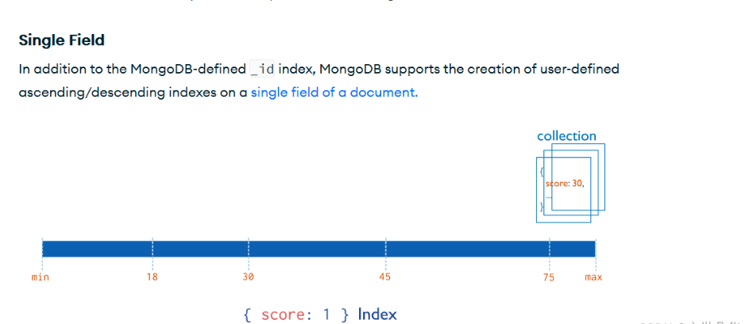
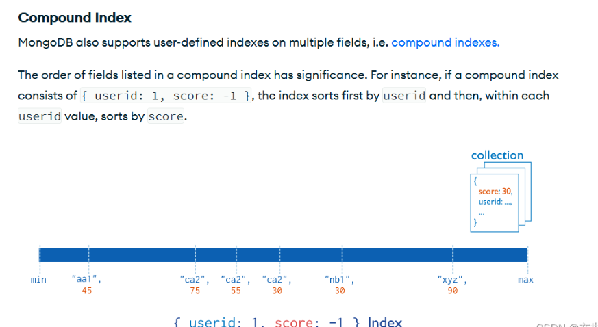

# 聚合

1、什么是聚合操作?

- 聚合操作就是通过一个方法完成一系列的操作
- 在聚合操作中, 每一个操作我们称之为一个阶段, 聚合操作会将上一个阶段处理结果传给下一个阶段继续处理, 所有阶段都处理完毕会返回一个新的结果集给我们

2、聚合操作格式


```
db.<collection>.aggregate(<pipeline>, <options>)
<pipeline>: 定义每个阶段操作
<options> : 聚合操作额外配置
```


## `$project`

3、聚合管道阶段


```
$project: 对输入文档进行再次投影
作用    : 按照我们需要的格式生成结果集
格式    : {$project:{<field>:<value>}}
```


4、示例

```
db.person.insert([
    {name: {firstName: 'Jonathan', lastName: 'Lee'}, age: 18, book: {name: '玩转HTML', price: 88}},
    {name: {firstName: 'Amelie', lastName: 'Jiang'}, age: 17, book: {name: '玩转JavaScript', price: 99}}
])
db.person.aggregate([
    {
        $project: {
            _id: 0,
            clientName: '$name.firstName',
            clientAge: '$age'
        }
    }
])
```


5、聚合表达式

5.1 字段路径表达式


```
$<filed>: 使用 $ 来指示字段路径
$<filed>.<sub-field>: 使用 $ 和 . 来指示内嵌文档字段路径
```


5.2 字段路径表达式示例


```
$name
$book.name
```


6、注意点:

```
// 注意点: $project修改的是结果集而不是原有的集合
db.person.find()
// 注意点: 如果字段表达式使用了不存在的字段, 那么会自动用Null填充
db.person.aggregate([
    {
        $project: {
            _id: 0,
            fullName: ['$name.firstName', '$name.middleName', '$name.lastName'],
            clientAge: '$age'
        }
    }
])
```


## `$match`

1、聚合管道阶段


```
$match: 和 find 方法中的第一个参数一样, 用于筛选符合条件的文档
格式  : {$match:{<query>}}
```


2、示例

```
db.person.aggregate([
    {
        $match: {
            'name.firstName': 'Jonathan'
        }
    }
])
db.person.aggregate([
    {
        $match: {
            'name.firstName': 'Jonathan'
        }
    },
    {
        $project: {
            _id: 0,
            clientName: '$name.firstName',
            clientAge: '$age'
        }
    }
])
```


3、使用技巧:

应该在聚合操作的最前面使用 `$match`, 这样可以有效减少处理文档的数量, 大大提升处理的效率

## `$limit`

1、聚合管道阶段


```
$limit: 和游标的limit方法一样, 用于指定获取几个文档
格式  : {$limit:<number>}
$skip : 和游标的skip方法一样, 用于指定跳过几个文档
格式  : {$skip:<number>}
```


2.示例

```
db.person.aggregate([
    {
        $skip: 1
    },
    {
        $limit: 1
    },
    {
        $project: {
            _id: 0,
            clientName: '$name.firstName',
            clientAge: '$age'
        }
    }
])
```


## `$unwind`

1、聚合管道阶段


```
$unwind: 展开数组字段
格式   : {$unwind:{path:<field>}}
```


2、示例:

```
db.person.update({'name.firstName': 'Jonathan'}, {$set: {tags: ['html', 'js']}})
db.person.update({'name.firstName': 'Amelie'}, {$set: {tags: 'vue'}})
db.person.aggregate([
    {
        $unwind: {
            path: '$tags'
        }
    }
])
```


3、注意点:

- `$unwind` 会为数组中的每个元素创建一个新的文档
- 可以通过 `includeArrayIndex` 属性添加展开之后的元素在原数组中的位置

```
db.person.aggregate([
    {
        $unwind: {
            path: '$tags',
            includeArrayIndex: 'index'
        }
    }
])
```


- 如果需要展开的字段不存在, 或者数组中没有元素, 或者为 `null`, 会被 `unwind` 剔除

```
db.person.insert([
    {name: {firstName: 'san', lastName: 'zhang'}, age: 20},
    {name: {firstName: 'si', lastName: 'li'}, age: 21, tags: []},
    {name: {firstName: 'wu', lastName: 'wang'}, age: 22, tags: null}
])
```


- 如果想让 `unwind` 不剔除不存在/没有元素/为 `Null` 的文档, 那么可以添加 `preserveNullAndEmptyArrays` 属性

```
db.person.aggregate([
    {
        $unwind: {
            path: '$tags',
            includeArrayIndex: 'index',
            preserveNullAndEmptyArrays: true
        }
    }
])
```


## `$sort`

1、聚合管道阶段


```
$sort: 和文档游标sort方法一样, 对文档进行排序
格式   : {$sort:{<field>>:1|-1}}
```


2.示例

```
db.person.aggregate([
    {
        $sort: {
            age: 1
        }
    }
])
```


## `$lookup` 上

1、聚合管道阶段


```
$lookup: 用来做关联查询
格式   :
{$lookup:{
    from: 关联集合名称,
    localField: 当前集合中的字段名称,
    foreignField:关联集合中的字段名称,
    as: 输出字段的名称
}}
```


2、示例:

```
db.person.insert([
    {name: {firstName: 'Jonathan', lastName: 'Lee'}, age: 18, books: ['html', 'js']},
    {name: {firstName: 'Amelie', lastName: 'Jiang'}, age: 19, books: ['vue']},
    {name: {firstName: 'si', lastName: 'Li'}, age: 20, books: []}
])
db.books.insert([
    {name: 'html', price: 88},
    {name: 'js', price: 99},
    {name: 'vue', price: 110},
])

db.person.aggregate([
    {
        $lookup: {
            from: 'books',
            localField: 'books',
            foreignField: 'name',
            as: 'booksData'
        }
    }
])
```


3、和 `unwind` 阶段结合使用 可以有效的过滤掉无效数据 可以给每个匹配的结果生成一个新的文档

```
db.person.aggregate([
    {
        $unwind: {
            path: '$books'
        }
    },
    {
        $lookup: {
            from: 'books',
            localField: 'books',
            foreignField: 'name',
            as: 'booksData'
        }
    }
])
```


## `$lookup` 下

1、聚合管道阶段


```
$lookup: 用来做关联查询
格式   :
{$lookup:{
    from: 关联集合名称,
    let: {定义给关联集合的聚合操作使用的当前集合的常量},
    pipeline: [关联集合的聚合操作]
    as: 输出字段的名称
}}
```


2、示例: 不相关查询

```
db.person.aggregate([
    {
        $lookup: {
            from: 'books',
            pipeline: [
                {
                    $match: {
                        price: {$gte: 100}
                    }
                }
            ],
            as: 'booksData'
        }
    }
])
```


相关查询

```
db.person.aggregate([
    {
        $lookup: {
            from: 'books',
            let: {bks: '$books'},
            pipeline: [
                {
                    $match: {
                        $expr: {
                            $and: [
                                {$gte: ['$price', 100]},
                                {$in: ['$name', '$$bks']}
                            ]
                        }
                        // price:{$gte:100}
                    }
                }
            ],
            as: 'booksData'
        }
    }
])
```


3、系统变量表达式


```
$$<variable>: 使用$$来指示系统变量
```

## `$group`

1、聚合管道阶段


```
$group: 对文档进行分组
格式  :
{$group:{
    _id:<expression>,
    <field1>: {<accumulator1>: <expression1>}
    ... ...
}}
_id: 定义分组规则
<field>: 定义新字段
```


2.示例

```
db.person.insert([
    {name: 'zs', age: 10, city: '北京'},
    {name: 'ls', age: 20, city: '上海'},
    {name: 'ww', age: 30, city: '北京'},
    {name: 'zl', age: 40, city: '上海'},
    {name: 'lnj', age: 50, city: '北京'},
    {name: 'jjj', age: 60, city: '广州'},
])
db.person.aggregate([
    {
        $group: {
            _id: '$city',
            totalAge: {$sum: '$age'},
            avgAge: {$avg: '$age'},
            minAge: {$min: '$age'},
            maxAge: {$max: '$age'},
            totalName: {$push: '$name'}
        }
    }
])
```


## `$out`

1、聚合管道阶段


```
$out: 前面阶段处理完的文档写入一个新的集合
格式: {$out: <new collection name>}
```


2、示例:

```
db.person.aggregate([
    {
        $group: {
            _id: '$city',
            totalAge: {$sum: '$age'},
            avgAge: {$avg: '$age'},
            minAge: {$min: '$age'},
            maxAge: {$max: '$age'},
            totalAges: {$push: '$age'}
        }
    },
    {
        $out: 'newPerson'
    }
])
db.newPerson.find()
```


3、注意点:

如果利用 `$out` 写入一个已经存在的集合, 那么集合中的原有数据会被覆盖

## 聚合操作额外配置

1、聚合操作额外配置


```
db.<collection>.aggregate(<pipeline>, <options>)
格式: {allowDiskUse: <boolean>}
```


allowDiskUse 默认取值是 false, 默认情况下管道阶段占用的内存不能超过 100M,如果超出 100M 就会报错

如果需要处理的数据比较多, 聚合操作使用的内存可能超过 100M, 那么我们可以将 allowDiskUse 设置为 true

如果 allowDiskUse 设置为 true , 那么一旦超出 100M 就会将操作的数据写入到临时文件中, 然后再继续操作

## 聚合操作表达式

1、字段路径表达式


```
$<filed>: 使用$来指示字段路径
$<filed>.<sub-field>: 使用$和.来指示内嵌文档字段路径
```


2、示例


```
$name
$book.name
```


3、系统变量表达式


```
$$CURRENT: 表示当前操作的文档
```


4、示例


```
$$CURRENT.name  等价于 $name
```


5、常量表达式


```
$literal:<value> : 表示常量<value>
```


6、示例


```
$literal:'$name' : 表示常量字符串 $name
```


```
db.person.insert([
    {name: {firstName: 'Jonathan', lastName: 'Lee'}, age: 18},
    {name: {firstName: 'Amelie', lastName: 'Jiang'}, age: 19}
])
db.person.find()

db.person.aggregate([
    {
        $project: {
            _id: 0,
            // myName:'$name.firstName', // 字段路径表达式
            // myAge:'$age' // 字段路径表达式
            // myName:'$$CURRENT.name.firstName', //系统变量表达式
            // myAge:'$$CURRENT.age' // 系统变量表达式
            myName: '$name.firstName',
            myAge: {$literal: '$age'} // 常量表达式
        }
    }
])
```


## 数据类型转换操作符

1、数据类型转换操作符

- MongoDB 对于文档的格式并没有强制性的要求, 同一个集合中存储的文档, 字段的个数和数据类型都可以不同。 对与文档的格式没有强制性的要求是 MongoDB 的一大优势, 但是同时也增加了数据消费端的使用难度 因为我们在使用数据的时候, 有可能同一个字段取出来的数据类型是不同的, 这样非常不利于我们后续操作 所以也正是因为如此, MongoDB 在 4.0 中推出了`$convert` 数据类型转换操作符
- 通过 `$convert` 数据类型转换操作符, 我们可以将不同的数据类型转换成相同的数据类型, 以便于后续我们在使用数据的过程中能够统一对数据进行处理

2、`$convert` 格式


```
{$convert:{
    input: '需要转换的字段',
    to: '转换之后的数据类型',
    onError: '不支持的转换类型',
    onNull: '没有需要转换的数据'
}}
```


3、示例

```
db.person.insert([
    {name: 'zs', timestamp: ISODate('2020-08-09T11:23:34.733Z')},
    {name: 'ls', timestamp: '2021-02-14 12:00:06 +0800  '},
    {name: 'ww', timestamp: '  2023-04-01T12:00:00Z'},
    {name: 'zl', timestamp: '1587009270000'},
    {name: 'it666', timestamp: 'Sunday'},
    {name: 'itzb'},
])
```


```
db.person.aggregate([
    {
        $project: {
            _id: 0,
            timestamp: {
                $convert: {
                    input: '$timestamp',
                    to: 'date',
                    onError: '不支持的转换类型',
                    onNull: '没有需要转换的数据'
                }
            }
        }
    }
])
```


# 索引

索引支持在 MongoDB 中高效地执行查询.如果没有索引, MongoDB 必须执行全集合扫描, 即扫描集合中的每个文档, 以选择与查询语句 匹配的文档.这种扫描全集合的查询效率是非常低的, 特别在处理大量的数据时, 查询可以要花费几十秒甚至几分钟, 这对网站的性能是非常致命的.

如果查询存在适当的索引, MongoDB 可以使用该索引限制必须检查的文档数.

索引是特殊的数据结构, 它以易于遍历的形式存储集合数据集的一小部分.索引存储特定字段或一组字段的值, 按字段值排序.索引项的排 序支持有效的相等匹配和基于范围的查询操作.此外, MongoDB 还可以使用索引中的排序返回排序结果.

MongoDB 使用的是 B Tree, MySQL 使用的是 B+ Tree


```
// create index
db.<collection_name>.createIndex({ userid : 1, username : -1 })

// retrieve indexes
db.<collection_name>.getIndexes()

// remove indexes
db.<collection_name>.dropIndex(index)

// there are 2 ways to remove indexes:
// 1. removed based on the index name
// 2. removed based on the fields

db.<collection_name>.dropIndex( "userid_1_username_-1" )
db.<collection_name>.dropIndex({ userid : 1, username : -1 })

// remove all the indexes, will only remove non_id indexes
db.<collection_name>.dropIndexes()
```


## 索引的类型

### 单字段索引

MongoDB 支持在文档的单个字段上创建用户定义的**升序/降序索引**, 称为**单字段索引** Single Field Index

对于单个字段索引和排序操作, 索引键的排序顺序（即升序或降序）并不重要, 因为 MongoDB 可以在任何方向上遍历索引.



### 复合索引

MongoDB 还支持多个字段的用户定义索引, 即复合索引 Compound Index

复合索引中列出的字段顺序具有重要意义.例如, 如果复合索引由 `{ userid: 1, score: -1 }` 组成, 则索引首先按 `userid` 正序排序, 然后 在每个 `userid` 的值内, 再在按 `score` 倒序排序.



### 其他索引

- 地理空间索引 Geospatial Index
- 文本索引 Text Indexes
- 哈希索引 Hashed Indexes

#### 地理空间索引（Geospatial Index）

为了支持对地理空间坐标数据的有效查询, MongoDB 提供了两种特殊的索引: 返回结果时使用平面几何的二维索引和返回结果时使用球面几何的二维球面索引.

#### 文本索引（Text Indexes）

MongoDB 提供了一种文本索引类型, 支持在集合中搜索字符串内容.这些文本索引不存储特定于语言的停止词（例如 “the”, “a”, “or”）, 而将集合中的词作为词干, 只存储根词.

#### 哈希索引（Hashed Indexes）

为了支持基于散列的分片, MongoDB 提供了散列索引类型, 它对字段值的散列进行索引.这些索引在其范围内的值分布更加随机, 但只支持相等匹配, 不支持基于范围的查询.

## 索引操作

1、什么是索引?

- 索引就相当于字典中的目录(拼音/偏旁部首手) 有了目录我们就能通过目录快速的找到想要的结果.
- 但是如果没有目录(拼音/偏旁部首手), 没有索引 那么如果想要查找某条数据就必须从前往后一条一条的查找
- 所以索引就是用于提升数据的查询速度的

2、如何获取索引


```
db.<collection>.getIndexes()
```


```
db.person.insert([
    {name: 'cs', age: 19},
    {name: 'as', age: 18},
    {name: 'bs', age: 17},
]);
```


3、如何创建索引


```
db.<collection>.createIndex({<field>:<1 or -1>, ...}, <options>)
<keys>   : 指定创建索引的字段
<options>: 索引的额外配置
```


4、创建单键索引

```
db.person.createIndex({name: 1})
db.person.explain().find({age: 17})
db.person.explain().find({name: 'cs'})
db.person.explain().find({name: 'cs'}, {_id: 0, name: 1})
```


5、查看是否使用索引

和 MySQL 一样, 我们可以通过 explain 来查看索引效果


```
db.<collection>.explain().<method()>
```


- winningPlan->stage->COLLSCAN-> 遍历整个集合查询
- winningPlan->stage->IXSCAN-> 通过索引查询
- winningPlan->stage->FETCH-> 根据索引存储的地址取出对应文档

6、索引格式


```
as:-> {name:'as', age:18, tags:['ahtml', 'bcss']}
bs:-> {name:'bs', age:17, tags:['cjs', 'dvue']}
cs:-> {name:'cs', age:19, tags:['enode', 'freact']}
```


7、注意点:

- 和MySQL一样, MongoDB默认也会为主键自动创建索引
- 如果查询条件中只需要查询出索引字段, 那么就不会再取出完整文档, 这样效率更高

## 复合索引

1、复合索引 和MySQL一样, MongoDB也支持复合索引, 也就是将多个字段的值作为索引

2、示例

```
db.person.insert([
    {name: 'cs', age: 19},
    {name: 'as', age: 18},
    {name: 'bs', age: 17},
    {name: 'bs', age: 20},
])
db.person.createIndex({name: 1, age: -1})
db.person.explain().find({name: 'bs', age: 17})
db.person.explain().find({name: 'bs'})
db.person.explain().find({age: 17})
```


3、索引格式


```
(as, 18)->{name:'as', age:18}
(bs, 20)->{name:'bs', age:20}
(bs, 17)->{name:'bs', age:17}
(cs, 19)->{name:'cs', age:19}
```


4、注意点:

复合件索引只支持前缀子查询, 也就是A,B,C复合索引. A,B,C会使用索引, A,B会使用索引, A会使用索引 但是B不会使用索引, C也不会使用索引, B,C也不会使用索引

## 多键索引

1、多键索引

多键索引是专门针对数组字段的, 会为数组字段的每一个元素都创建一个索引

2、示例

```
db.person.insert([
    {name: 'as', age: 18, tags: ['ahtml', 'bcss']},
    {name: 'bs', age: 17, tags: ['cjs', 'enode']},
    {name: 'cs', age: 19, tags: ['dvue', 'freact']},
])
db.person.explain().find({'tags': {$in: ['ahtml']}})
db.person.createIndex({tags: 1})
db.person.explain().find({'tags': {$in: ['ahtml']}})
```


3.格式


```
'ahtml' -> {name:'as', age:18, tags:['ahtml', 'bcss']}
'bcss'  -> {name:'as', age:18, tags:['ahtml', 'bcss']}
'cjs'   -> {name:'bs', age:17, tags:['cjs', 'enode']}
'dvue'  -> {name:'cs', age:19, tags:[ 'dvue', 'freact']}
'enode' -> {name:'bs', age:17, tags:['cjs', 'enode']}
'freact'-> {name:'cs', age:19, tags:[ 'dvue', 'freact']}
```


## 索引对排序的影响

1、索引对排序的影响

如果排序的字段, 正好是索引的字段, 那么会大大提升排序效率

2、示例

```
db.person.insert([
    {name: 'cs', age: 19},
    {name: 'as', age: 18},
    {name: 'bs', age: 17}
])
db.person.explain().find().sort({name: 1})
db.person.createIndex({name: 1})
db.person.explain().find().sort({name: 1})
db.person.explain().find().sort({name: 1, age: -1})
db.person.createIndex({name: 1, age: -1})
db.person.explain().find().sort({name: 1, age: -1})
```


3、注意点

如果是复合索引, 那么只有排序条件是前缀查询的形式才会使用索引来排序 例如: 复合件索引只支持前缀子查询, 也就是A,B,C复合索引. A,B,C会使用索引, A,B会使用索引, A会使用索引。但是B不会使用索引, C也不会使用索引, B,C也不会使用索引

## 唯一索引

1、唯一索引

默认情况下MongoDB和MySQL一样, 都会自动为主键创建索引, 这个索引就是一个唯一索引 除了主键可以作为唯一索引以外, 只要某个字段的取值是唯一的, 我们也可以手动给这个字段添加唯一索引 格式:


```
db.<collection>.createIndex({<field>:<1 or -1>, ...}, {unique:true}})
```


2、示例

```
db.person.insert([
    {name: 'cs', age: 19},
    {name: 'as', age: 18},
    {name: 'bs', age: 17}
])
db.person.getIndexes()
db.person.createIndex({age: 1}, {unique: true})
db.person.insert({name: 'zs', age: 20})
db.person.insert({name: 'ls'})
db.person.find()
db.person.insert({name: 'ls'})
db.person.createIndex({name: 1, age: 1}, {unique: true})
db.person.insert({name: 'ww', age: 22})
db.person.insert({name: 'ww', age: 22})
db.person.insert({name: 'ww', age: 23})
```


3.注意点

- 如果为某个字段添加了唯一索引, 那么就不能再给这个字段添加重复的值
- 如果插入的数据中没有包含唯一索引的字段, 那么第一次会自动用null填充, 第二次会报错
- 如果是复合唯一索引, 那么复合字段的组合不能重复

## 稀疏索引

1、索引的稀疏性

默认情况下 MongoDB 会给每一个文档都创建索引, 哪怕这个文档中没有指定索引的字段或者字段的取值是 Null。 但是这样大大增加了索引的体积, 所以为了进一步优化索引占用的存储空间, 我们可以创建稀疏索引。 也就是只会为存在索引字段,并且索引字段取值不是 null 的文档创建索引。 格式:


```
db.<collection>.createIndex({<field>:<1 or -1>, ...}, {sparse:true}})
```


2、示例

```
db.person.insert([
    {name: 'cs', age: 19},
    {name: 'as', age: 18},
    {name: 'bs', age: 17}
])
db.person.find()
db.person.getIndexes()
db.person.createIndex({age: 1}, {unique: true})
db.person.insert({name: 'lnj'}) // lnj null
db.person.insert({name: 'lnj'}) // lnj null
// 注意点: 如果索引具备了唯一性又具备了稀疏性, 那么就可以多次添加缺失了索引字段的文档了
// 原因 : 如果索引具备了稀疏性, 那么就不会为缺失了索引字段或者索引字段取值是null的文档创建索引了, 所以就不会冲突了
db.person.createIndex({age: 1}, {unique: true, sparse: true})
db.person.insert({name: 'lnj'}) // lnj null
db.person.insert({name: 'lnj'}) // lnj null
```


3、注意点

如果索引字段既具备唯一性又具备稀疏性, 那么就可以在集合中保存多个缺失唯一索引字段的文档

## 索引生存时间

1、索引生存时间

针对日期字段或者包含日期的数组字段, 我们可以在创建索引的时候, 指定索引的生存时间, 一旦索引超过了指定的生存时间, 那么 MongoDB 会自动删除超过生存时间的文档 格式:


```
db.<collection>.createIndex({<field>:<1 or -1>, ...}, {expireAfterSeconds:second}})
```


2、示例

```
db.person.createIndex({addTime: 1}, {expireAfterSeconds: 5})
db.person.insert({name: 'zs', addTime: new Date()})
db.person.insert({name: 'ls', addTime: new Date()})
db.person.insert({name: 'ww', addTime: new Date()})
```


3、注意点

- MongoDB会定期清理超过时间的文档, 但是无法保证即时性(也就是设置的过期时间是1秒, 但是可能3秒后才会清除)
- 复合索引字段是不具备生存时间特性的, 也就是不能在复合索引中指定生存时间
- 当数组字段中包含多个日期, 我们给数组字段设置生存时间时, 系统会按照数组中最小的时间来计算生存时间 例如:


```
{name:'it666', times:['2022-04-16 09:13:33','2022-04-16 07:13:33','2022-04-16 08:13:33']}
```


会按照 `'2022-04-16 07:13:33'` 来计算生存时间

## 删除索引

1、删除索引


```
db.<collection>.dropIndex(<IndexName | IndexDefine>)
```


2、示例

```
db.person.insert([
    {name: 'cs', age: 19},
    {name: 'as', age: 18},
    {name: 'bs', age: 17}
])
db.person.find()
db.person.getIndexes()
db.person.createIndex({name: 1})
db.person.dropIndex('name_1') // 通过索引的名称来删除
db.person.dropIndex({name: 1}) // 通过索引的定义来删除
// 注意点: 如果是复合索引, 如果需要通过索引的定义来删除, 那么就必须一模一样才能正确的删除
db.person.createIndex({name: 1, age: -1})
db.person.dropIndex({name: 1}) // 报错
db.person.dropIndex({age: -1}) // 报错
db.person.dropIndex({age: -1, name: 1}) // 报错
db.person.dropIndex({name: 1, age: -1}) // 不会报错
```


3、注意点

- 在MongoDB中没有修改索引的方法, 所以如果想修改索引就必须先删除再重新创建
- 如果删除的索引是多个字段, 如果是通过索引定义来删除, 那么传入的参数必须和定义一模一样才可以


# 文档之间关系

1、文档之间关系

MongoDB 对于文档的格式并没有强制性的要求, 但不等于我们不能在文档中表达数据的关系 在 MongoDB 中我们可以通过'内嵌式结构'和'规范式结构'来表达文档之间的关系

2、内嵌式结构

在一个文档中又包含了另一个文档, 我们就称之为内嵌式结构

例如:


```
{
    name:'zs',
    age:'18',
    card:{
        num:'420626200002023556',
        date: 88
    }
}
```


3、规范式结构

将文档存储在不同的集合中, 然后通过某一个字段来建立文档之间的关系, 我们就称之为规范式


```
{
    _id: 1,
    num:'420626200002023556',
    date: 88
}
{
    name:'zs',
    age:'18',
    cardId: 1
}
```


## 文档一对一关系

1、文档一对一关系

一个人有一张身份证

1.1、内嵌式结构


```
db.person.insert({
    name:'zs',
    age:'18',
    card:{
        num:'420626200002023556',
        date: 88
    }
})
db.person.find({name:'zs'})
```


优势: 一次查询就能得到所有数据

劣势: 如果数据比较复杂, 不方便管理和更新

应用场景: 数据不复杂/查询频率较高数据

1.2、规范式结构

```
db.card.insert({
    _id: 123,
    num: '420626200002023556',
    date: '2022-12-08',
    userId: 456
})
db.person.insert({
    _id: 456,
    name: 'zs',
    age: '18',
    cardId: 123
})
db.person.aggregate([
    {
        $lookup: {
            from: 'card',
            localField: 'cardId',
            foreignField: '_id',
            as: 'card'
        }
    }
])
```


- 优势: 如果数据比较复杂, 也方便管理和更新
- 劣势: 查询数据相对内嵌结果稍微有点复杂
- 应用场景: 数据比较复杂/更新频率较高数据

## 文档一对多关系

一个人有多本书

1.1、内嵌式结构

```
db.person.insert({
    name: 'zs',
    age: '18',
    books: [
        {
            name: '玩转HTML',
            price: 88
        },
        {
            name: '玩转CSS',
            price: 88
        }
    ]
})
db.person.find({name: 'zs'})
```


- 优势: 一次查询就能得到所有数据
- 劣势: 冗余数据较多, 不方便管理和更新
- 应用场景: 数据不复杂/查询频率较高数据

1.2 规范式结构

```
db.books.insert([
    {
        _id: 1,
        name: '玩转HTML',
        price: 88,
        userId: 123
    },
    {
        _id: 2,
        name: '玩转CSS',
        price: 88,
        userId: 123
    }
])
db.person.insert({
    _id: 123,
    name: 'ls',
    age: '20',
    booksId: [1, 2]
})
db.person.aggregate([
    {
        $lookup: {
            from: 'books',
            localField: 'booksId',
            foreignField: '_id',
            as: 'books'
        }
    }
])
```


- 优势: 冗余数据较少, 更新较为方便
- 劣势: 查询数据相对内嵌结果稍微有点复杂
- 应用场景: 数据比较复杂/更新频率较高数据


## 文档多对多关系

1.文档多对多关系 一个学生有多个老师 一个老师有多个学生 1.1内嵌式结构

```
db.students.insert([
    {name: 'zs', teachers: [{name: 'it666'}, {name: 'itzb'}]},
    {name: 'ls', teachers: [{name: 'it666'}, {name: 'itzb'}]}
])

db.teachers.insert([
    {name: 'it666', students: [{name: 'zs'}, {name: 'ls'}]},
    {name: 'itzb', students: [{name: 'zs'}, {name: 'ls'}]}
])
db.students.find({name: 'zs'})
db.teachers.find({name: 'itzb'})
```


- 优势: 一次查询就能得到所有数据
- 劣势: 冗余数据较多, 更新和管理较为复杂
- 应用场景: 数据比较简单/查询频率较高数据

1.2 规范式结构

```
db.students.insert([{_id: 1, name: 'zs'}, {_id: 2, name: 'ls'}])
db.teachers.insert([{_id: 3, name: 'it6666'}, {_id: 4, name: 'itzb'}])
db.relation.insert([
    {stuId: 1, teacherId: 3}, 
    {stuId: 1, teacherId: 4}, 
    {stuId: 2, teacherId: 3}, 
    {stuId: 2, teacherId: 4}
])

db.students.aggregate([
    {
        $lookup: {
            from: 'relation',
            localField: '_id',
            foreignField: 'stuId',
            as: 'relation'
        }
    },
    {
        $lookup: {
            from: 'teachers',
            localField: 'relation.teacherId',
            foreignField: '_id',
            as: 'teachers'
        }
    },
    {$project: {_id: 0, name: 1, teachers: 1}}
])
```


- 优势: 冗余数据较少, 更新较为方便
- 劣势: 查询数据相对内嵌结果稍微有点复杂
- 应用场景: 数据比较复杂/更新频率较高数据
- 