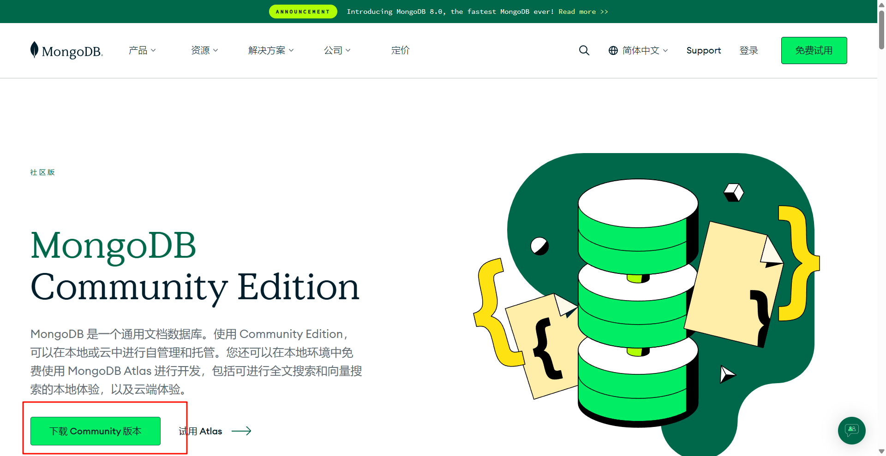
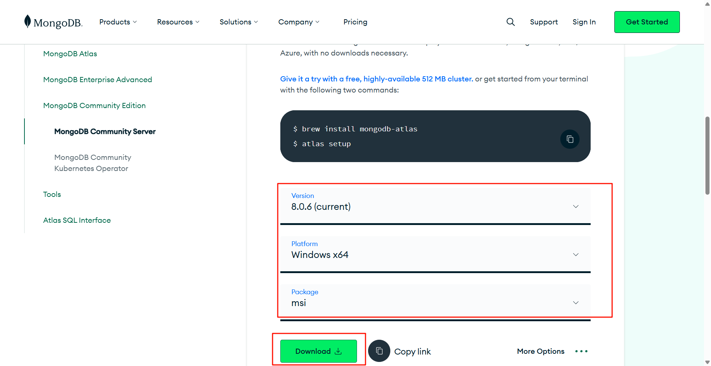
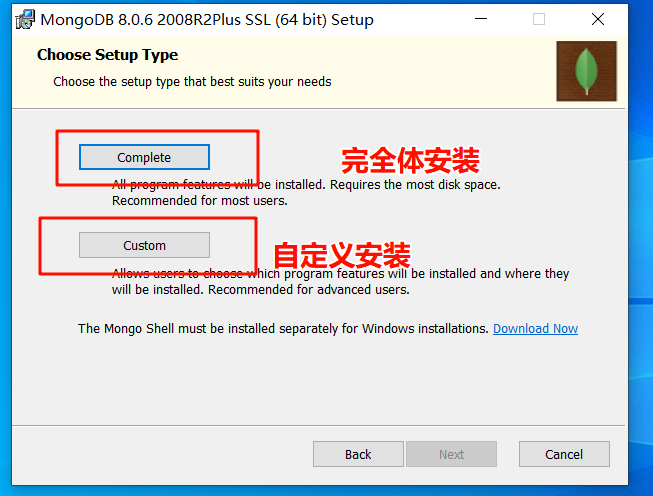
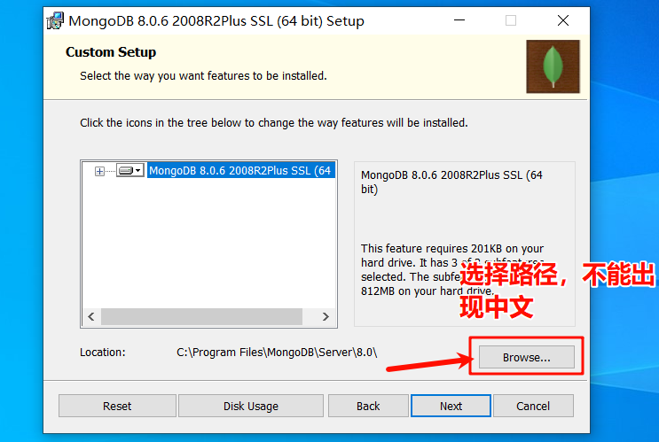
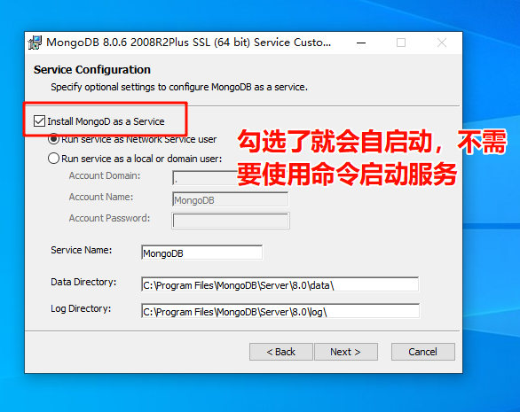
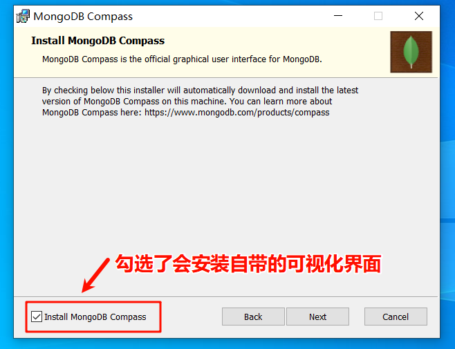
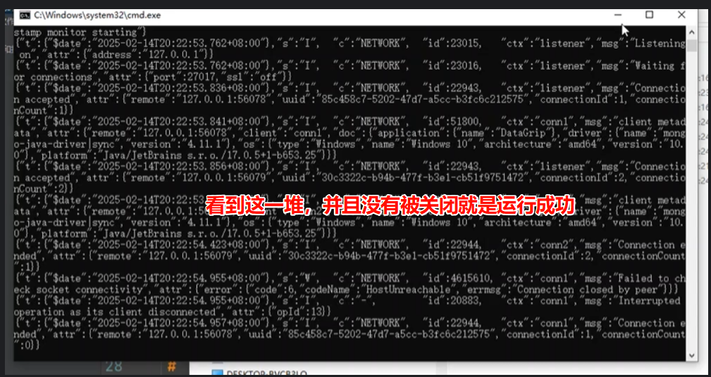
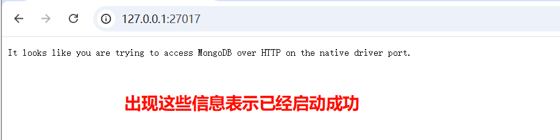

# 官网

**https://www.mongodb.com/zh-cn**

# 第一步


# 第二步



# 第三步

往下翻找到下载版本信息，根据需要下载对应的版本



# 第四步

双击打开安装，这里演示使用自定义安装



# 第五步

尽量安装系统盘以外的，因为可能会权限问题



# 第六步

默认勾选，如果不勾选就不会作为服务启动，后续需要使用就要自己手动启动



# 第七步

默认勾选，如果不勾选就不会安装可视化界面，但是基础的server还在



# 第八步

如果勾选了第六步的就可以忽略    
启动数据库，后续不需要可以关闭

1. 进入到安装路径的 data 目录下，创建一个叫 db 的空目录
2. 进入到安装路径的 bin 目录下，使用 cmd 运行下面代码：根据自己的安装路径更改
    ```shell
    mongod   --dbpath E:\MongoDB\data\db
    ```
   
3. 访问它的端口，看是否成功
   ```
   http://127.0.0.1:27017
   ```
   
4. 如果嫌麻烦可用在任意地方新建bat文件（文本文件改后缀）然后输入命令，下次双击就可以启动,下面命令根据自己的路径更改
   ```shell
   E:\mongodb\bin\mongod.exe --dbpath E:\mongodb\data\db
   ```

# 拓展

如果缺少`shell`可以在官网进行下载: https://www.mongodb.com/try/download/shell