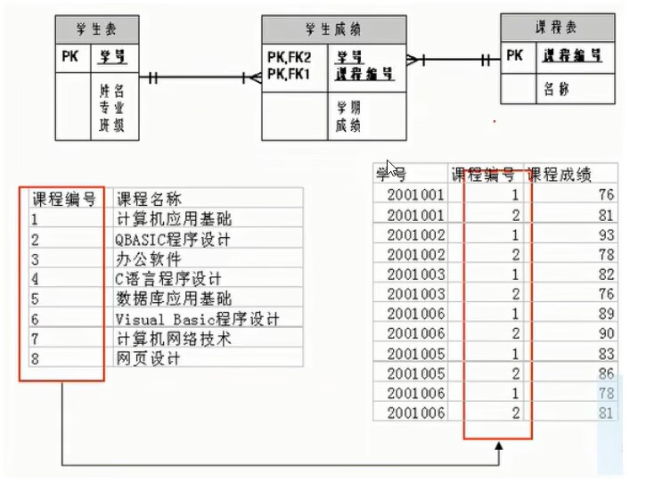

数据库概述

## 数据存储

远古时期：结绳记事 -> 甲骨 -> 竹简 -> 图书

**传统记录数据的缺点:**

- 不易保存
- 备份困难
- 查找不便

**现代化手段----文件**

- 使用简单，例如 python 中的 open 可以打开文件，用 read/write 对文件进行读写，close 关闭文件
- 对于数据容量较大的数据，不能够很好的满足，而且性能较差
- 不易扩展

**现代化手段----数据库**

- 持久化存储
- 读写速度极高
- 保证数据的有效性
- 对程序支持性非常好，容易扩展

## 为什么要使用数据库

- 持久化(persistence)：把数据保存到可掉电式存储设备中以供之后使用。大多数情况下，特别是企业级应用，数据持久化意味着将内存中的数据保存到硬盘上加以”固化”，而持久化的实现过程大多通过各种关系数据库来完成。
- 持久化的主要作用是将内存中的数据存储在关系型数据库中，当然也可以存储在磁盘文件、XML数据文件中。


**生活中的例子：**

真实的仓库是这样的:


我们看到的是这个样子的


顾客看到的是这个样子的:


## 数据库与数据库管理系统

**数据库的相关概念**

| 名词                                                 | 意思                                                         |
| :--------------------------------------------------- | :----------------------------------------------------------- |
| DB：数据库（Database）                               | 即存储数据的“仓库”，其本质是一个文件系统。它保存了一系列有组织的数据。 |
| DBMS： 数据库管理系统 （Database Management System） | 是一种操纵和管理数据库的大型软件，用于建立、使用和维护数据库，对数据库进行统一管理和控制。用户通过数据库管理系统访问数据库中表内的数据。 |
| SQL：结构化查询语言 （Structured Query Language）    | 专门用来与数据库通信的语言。                                 |

**数据库与数据库管理系统的关系**

数据库管理系统(DBMS)可以管理多个数据库，一般开发人员会针对每一个应用创建一个数据库。为保存应用中实体的数据，一般会在数据库创建多个表，以保存程序中实体用户的数据。

数据库管理系统、数据库和表的关系如图所示：


### 常见的数据库管理系统排名(DBMS)

目前互联网上常见的数据库管理软件有 Oracle、MySQL、MS SQL Server、DB2、PostgreSQL、Access、Sybase、Informix 这几种。以下是2021年 **DB-Engines Ranking** 对各数据库受欢迎程度进行调查后的统计结果：（查看数据库最新排名:https://db-engines.com/en/ranking ）


。。。


对应的走势图：（https://db-engines.com/en/ranking_trend ）


### 常见的数据库介绍

**Oracle**

1979 年，Oracle 2 诞生，它是第一个商用的 RDBMS（关系型数据库管理系统）。随着 Oracle 软件的名气越来越大，公司也改名叫 Oracle 公司。

2007年，总计85亿美金收购 BEA Systems。

2009年，总计74亿美金收购 SUN。此前的2008年，SUN以10亿美金收购 MySQL。意味着 Oracle 同时拥有了 MySQL 的管理权，至此 Oracle 在数据库领域中成为绝对的领导者。

2013年，甲骨文超越 IBM，成为继 Microsoft 后全球第二大软件公司。

如今 Oracle 的年收入达到了 400 亿美金，足以证明商用（收费）数据库软件的价值。

**SQL Server**

SQL Server 是微软开发的大型商业数据库，诞生于 1989 年。C#、.net等语言常使用，与WinNT完全集成，也可以很好地与 Microsoft BackOffice 产品集成。

**DB2**

IBM 公司的数据库产品,收费的。常应用在银行系统中。

**PostgreSQL**

PostgreSQL 的稳定性极强，最符合 SQL 标准，开放源码，具备商业级 DBMS 质量。PG 对数据量大的文本以及 SQL 处理较快。

**SyBase**

已经淡出历史舞台。提供了一个非常专业数据建模的工具 PowerDesigner 。

**SQLite**

嵌入式的小型数据库，应用在手机端。 零配置，SQlite3 不用安装，不用配置，不用启动，关闭或者配置数据库实例。当系统崩溃后不用做任何恢复操作，再下次使用数据库的时候自动恢复。

**informix**

IBM公司出品，取自 Information 和 Unix 的结合，它是第一个被移植到 Linux 上的商业数据库产品。仅运行于 unix/linux 平台，命令行操作。 性能较高，支持集群，适应于安全性要求极高的系统，尤其是银行，证券系统的应用。

## MySQL介绍


**概述**

- MySQL是一个`开放源代码的关系型数据库管理系统`，由瑞典 MySQL AB（创始人Michael Widenius）公司1995年开发，迅速成为开源数据库的 No.1。
- 2008被`Sun`收购（10亿美金），2009年Sun被`Oracle`收购。`MariaDB`应运而生。（MySQL 的创造者担心 MySQL 有闭源的风险，因此创建了 MySQL 的分支项目 MariaDB）
- MySQL6.x 版本之后分为`社区版`和`商业版`。
- MySQL是一种关联数据库管理系统，将数据保存在不同的表中，而不是将所有数据放在一个大仓库内，这样就增加了速度并提高了灵活性。
- MySQL是开源的，所以你不需要支付额外的费用。
- MySQL是可以定制的，采用了`GPL（GNU General Public License）`协议，你可以修改源码来开发自己的MySQL系统。
- MySQL支持大型的数据库。可以处理拥有上千万条记录的大型数据库。
- MySQL支持大型数据库，支持5000万条记录的数据仓库，32位系统表文件最大可支持`4GB`，64位系统支持最大的表文件为`8TB`。
- MySQL使用`标准的SQL数据语言`形式。
- MySQL可以允许运行于多个系统上，并且支持多种语言。这些编程语言包括C、C++、Python、Java、Perl、PHP和Ruby等。

### MySQL发展史重大事件

MySQL 的历史就是整个互联网的发展史。互联网业务从社交领域、电商领域到金融领域的发展，推动着应用对数据库的需求提升，对传统的数据库服务能力提出了挑战。高并发、高性能、高可用、轻资源、易维护、易扩展的需求，促进了MySQL的长足发展。


### 关于 MySQL 8.0


`MySQL从5.7版本直接跳跃发布了8.0版本`，可见这是一个令人兴奋的里程碑版本。MySQL 8 版本在功能上做了显著的改进与增强，开发者对 MySQL 的源代码进行了重构，最突出的一点是多 MySQL Optimizer 优化器进行了改进。不仅在速度上得到了改善，还为用户带来了更好的性能和更棒的体验。

### Why choose MySQL?


为什么如此多的厂商要选用 MySQL ？大概总结的原因主要有以下几点：

1. 开放源代码，使用成本低。
2. 性能卓越，服务稳定。
3. 软件体积小，使用简单，并且易于维护。
4. 历史悠久，社区用户非常活跃，遇到问题可以寻求帮助。
5. 许多互联网公司在用，经过了时间的验证。

### Oracle vs MySQL

Oracle 更适合大型跨国企业的使用，因为他们对费用不敏感，但是对性能要求以及安全性有更高的要求。

MySQL 由于其体积小、速度快、总体拥有成本低，可处理上千万条记录的大型数据库，尤其是开放源码这一特点，使得很多互联网公司、中小型网站选择了 MySQL 作为网站数据库 （Facebook，Twitter，YouTube，阿里巴巴/蚂蚁金服，去哪儿，美团外卖，腾讯）。

## RDBMS 与 非RDBMS

从排名中我们能看出来，关系型数据库绝对是 DBMS 的主流，其中使用最多的 DBMS 分别是 Oracle、MySQL 和 SQL Server。这些都是关系型数据库（RDBMS）。

### 关系型数据库(RDBMS)

**实质**

- 这种类型的数据库是`最古老`的数据库类型，关系型数据库模型是把复杂的数据结构归结为简单的`二元关系`（即二维表格形式）。

  

- 关系型数据库以`行(row)`和`列(column)`的形式存储数据，以便于用户理解。这一系列的行和列被称为`表(table)` ，一组表组成了一个库(`database`)。

- 表与表之间的数据记录有关系(`relationship`)。现实世界中的各种实体以及实体之间的各种联系均用`关系模型` 来表示。关系型数据库，就是建立在`关系模型`基础上的数据库。

- `SQL` 就是关系型数据库的查询语言。


**优势**

- 复杂查询：可以用 `SQL` 语句方便的在一个表以及多个表之间做非常复杂的数据查询。
- 事务支持：使得对于安全性能很高的数据访问要求得以实现。

### 非关系型数据库(非RDBMS)

**介绍**

非关系型数据库，可看成传统关系型数据库的功能`阉割版本`，基于键值对存储数据，不需要经过 `SQL` 层的解析，`性能非常高` 。同时，通过减少不常用的功能，进一步提高性能。

目前基本上大部分主流的非关系型数据库都是免费的。

**有哪些非关系型数据库**

相比于 `SQL`，`NoSQL` 泛指非关系型数据库，包括了榜单上的键值型数据库、文档型数据库、搜索引擎和列存储等，除此以外还包括图形数据库。也只有用 NoSQL 一词才能将这些技术囊括进来。

1、键值型数据库

键值型数据库通过 `Key-Value` 键值的方式来存储数据，其中 `Key` 和 `Value` 可以是简单的对象，也可以是复杂的对象。`Key` 作为唯一的标识符，优点是查找速度快，在这方面明显优于关系型数据库，缺点是无法像关系型数据库一样使用条件过滤（比如 `WHERE`），如果你不知道去哪里找数据，就要遍历所有的键，这就会消耗大量的计算。

键值型数据库典型的使用场景是作为`内存缓存`。`Redis `是最流行的键值型数据库。


2、文档型数据库

此类数据库可存放并获取文档，可以是 `XML`、`JSON` 等格式。在数据库中文档作为处理信息的基本单位，一个文档就相当于一条记录。文档数据库所存放的文档，就相当于键值数据库所存放的“值”。`MongoDB` 是最流行的文档型数据库。此外，还有 `CouchDB` 等。

3、搜索引擎数据库

虽然关系型数据库采用了索引提升检索效率，但是针对全文索引效率却较低。搜索引擎数据库是应用在搜索引擎领域的数据存储形式，由于搜索引擎会爬取大量的数据，并以特定的格式进行存储，这样在检索的时候才能保证性能最优。核心原理是“倒排索引”。

典型产品：`Solr`、`Elasticsearch`、`Splunk` 等。

4、列式数据库

列式数据库是相对于行式存储的数据库，`Oracle`、`MySQL`、`SQL Server` 等数据库都是采用的行式存储（`Row-based`），而列式数据库是将数据按照列存储到数据库中，这样做的好处是可以大量降低系统的 `I/O`，适合于分布式文件系统，不足在于功能相对有限。典型产品：`HBase` 等。


5、图形数据库

图形数据库，利用了图这种数据结构存储了实体（对象）之间的关系。图形数据库最典型的例子就是社交网络中人与人的关系，数据模型主要是以节点和边（关系）来实现，特点在于能高效地解决复杂的关系问题。

图形数据库顾名思义，就是一种存储图形关系的数据库。它利用了图这种数据结构存储了实体（对象）之间的关系。 关系型数据用于存储明确关系的数据，但对于复杂关系的数据存储却有些力不从心。如社交网络中人物之间的关系，如果用关系型数据库则非常复杂，用图形数据库将非常简单。典型产品：`Neo4J`、`InfoGrid` 等。


### NoSQL 的演变

由于 SQL 一直称霸 DBMS，因此许多人在思考是否有一种数据库技术能远离 SQL，于是 NoSQL 诞生了，但是随着发展却发现越来越离不开 SQL。到目前为止 NoSQL 阵营中的 DBMS 都会有实现类似 SQL 的功能。下面是“NoSQL”这个名词在不同时期的诠释，从这些释义的变化中可以看出 `NoSQL 功能的演变`：

1970：NoSQL = We have no SQL

1980：NoSQL = Know SQL

2000：NoSQL = No SQL!

2005：NoSQL = Not only SQL

2013：NoSQL = No, SQL!

NoSQL 对 SQL 做出了很好的补充，比如实际开发中，有很多业务需求，其实并不需要完整的关系型数据库功能，非关系型数据库的功能就足够使用了。这种情况下，使用`性能更高`、`成本更低` 的非关系型数据库当然是更明智的选择。比如：日志收集、排行榜、定时器等。

**小结**

NoSQL 的分类很多，即便如此，在 DBMS 排名中，还是 SQL 阵营的比重更大，影响力前 5 的 DBMS 中有 4 个是关系型数据库，而排名前 20 的 DBMS 中也有 12 个是关系型数据库。所以说，掌握 SQL 是非常有必要的。整套课程将围绕 SQL 展开。

## 关系型数据库设计规则

- 关系型数据库的典型数据结构就是`数据表`，这些数据表的组成都是结构化的（Structured）。
- 将数据放到表中，表再放到库中。
- 一个数据库中可以有多个表，每个表都有一个名字，用来标识自己。表名具有唯一性。
- 表具有一些特性，这些特性定义了数据在表中如何存储，类似Java和Python中 “类”的设计。

### 表、记录、字段

- E-R（entity-relationship，实体-联系）模型中有三个主要概念是：`实体集`、`属性`、`联系集`。
- 

一个实体集（class）对应于数据库中的一个表（table），一个实体（instance）则对应于数据库表中的一行（row），也称为一条记录（record）。一个属性（attribute）对应于数据库表中的一列（column），也称为一个字段（field）。


```
ORM思想 (Object Relational Mapping)体现：
数据库中的一个表  <---> Java或Python中的一个类
表中的一条数据  <---> 类中的一个对象（或实体）
表中的一个列  <----> 类中的一个字段、属性(field)
```


### 表的关联关系

- 表与表之间的数据记录有关系(relationship)。现实世界中的各种实体以及实体之间的各种联系均用关系模型来表示。
- 四种：一对一关联、一对多关联、多对多关联、自我引用

#### 一对一关联（one-to-one）

- 在实际的开发中应用不多，因为一对一可以创建成一张表。

- 举例：设计

  ```
  学生表
  ```

  ：学号、姓名、手机号码、班级、系别、身份证号码、家庭住址、籍贯、紧急联系人、...

  - 拆为两个表：两个表的记录是一一对应关系。
  - `基础信息表`（常用信息）：学号、姓名、手机号码、班级、系别
  - `档案信息表`（不常用信息）：学号、身份证号码、家庭住址、籍贯、紧急联系人、...

- 两种建表原则：

  - 外键唯一：主表的主键和从表的外键（唯一），形成主外键关系，外键唯一。
  - 外键是主键：主表的主键和从表的主键，形成主外键关系。

​             

#### 一对多关系（one-to-many）

- 常见实例场景：`客户表和订单表`，`分类表和商品表`，`部门表和员工表`。
- 举例：
  - 员工表：编号、姓名、...、所属部门
  - 部门表：编号、名称、简介
- 一对多建表原则：在从表(多方)创建一个字段，字段作为外键指向主表(一方)的主键





#### 多对多（many-to-many）

要表示多对多关系，必须创建第三个表，该表通常称为`联接表`，它将多对多关系划分为两个一对多关系。将这两个表的主键都插入到第三个表中。


- **举例1：学生-课程**

  - `学生信息表`：一行代表一个学生的信息（学号、姓名、手机号码、班级、系别...）

  - `课程信息表`：一行代表一个课程的信息（课程编号、授课老师、简介...）

  - `选课信息表`：一个学生可以选多门课，一门课可以被多个学生选择

    

    ```
    学号     课程编号  
    1        1001
    2        1001
    1        1002
    ```

    

- **举例2：产品-订单**

  “订单”表和“产品”表有一种多对多的关系，这种关系是通过与“订单明细”表建立两个一对多关系来定义的。一个订单可以有多个产品，每个产品可以出现在多个订单中。

  - `产品表`：“产品”表中的每条记录表示一个产品。
  - `订单表`：“订单”表中的每条记录表示一个订单。
  - `订单明细表`：每个产品可以与“订单”表中的多条记录对应，即出现在多个订单中。一个订单可以与“产品”表中的多条记录对应，即包含多个产品。


- **举例3：用户-角色**
- 多对多关系建表原则：需要创建第三张表，中间表中至少两个字段，这两个字段分别作为外键指向各自一方的主键。


#### 自我引用(Self reference)


# MySQL 安装

## windows 安装

windows 不建议从官方下载安装包进行安装，那种方式安装配置非常复杂。并且服务器一般是在 Linux 环境安装，而 Windows 环境下顶多是作为开发环境或者学习环境，当然是怎么简单怎么来。

在这里我推荐使用 phpstudy 进行安装，只要用鼠标点几下就能按照，需要使用的时候，启动一下即可。

1、mysql官方下载网址， https://dev.mysql.com/downloads/installer/

2.、安装参考： https://docs.qq.com/doc/DVEZIS0FSY1BtWWNl


## Linux 安装

Ubuntu22.04 安装 MySQL

系统更新

```
sudo apt update
sudo apt upgrade
```


1、MySQL安装

```
sudo apt-get install mysql-server mysql-client
```


2、查看 MySQL 默认用户密码

```
sudo cat /etc/mysql/debian.cnf
```


```
# Automatically generated for Debian scripts. DO NOT TOUCH!
[client]
host     = localhost
user     = debian-sys-maint
password = qGZpZvUEPkCuuXMF
socket   = /var/run/mysqld/mysqld.sock
[mysql_upgrade]
host     = localhost
user     = debian-sys-maint
password = qGZpZvUEPkCuuXMF
socket   = /var/run/mysqld/mysqld.sock
```


3、用默认用户密码登录

```
mysql -u debian-sys-maint -p
```


4、修改 root 远程登录的 ip 为 `%` ，意思是允许所有的 ip 远程访问


```
use
mysql;

update user
set host = '%'
where user = 'root' limit 1;

flush
privileges;
```


4、修改 root 密码


```
update user set plugin='caching_sha2_password' where user='root';
```


### 修改配置文件

打开 mysql 配置文件，注释 3306 端口于本地的绑定


```
sudo vim /etc/mysql/mysql.conf.d/mysqld.cnf

# bind-address = 127.0.0.1
```


### 重启MySQL

```
sudo service mysql status   # 查看状态
sudo service mysql start    # 启动数据库
sudo service mysql stop     # 停止数据库
sudo service mysql restart  # 重启数据库
```


### 目录结构分析

MySQL 安装后的目录结构分析(此结构只针对于使用apt-get install 在线安装情况)

数据库存放目录： /var/lib/mysql/

相关配置文件存放目录： /usr/share/mysql

相关命令存放目录： /usr/bin(mysqladmin mysqldump等命令)

启动脚步存放目录： /etc/rc.d/init.d/

### 添加用户

新建一个用户

```
-- 使用mysql数据库
USE
mysql;

-- 创建用户
create
user 'windows'@'%' identified by 'Zhengxin...123456';

-- 查看用户
SELECT user, host, authentication_string
FROM user
WHERE USER = 'windows';

-- 修改用户密码
update user
set authentication_string=''
where user = 'windows';

ALTER
USER 'windows'@'%' IDENTIFIED BY 'Zhengxin...123456';

-- 删除用户
DROP
USER windows;

-- 查看权限
SHOW
GRANTS FOR windows;

-- 授予权限
-- grant all privileges on databasename.tablename to 'user'@'host' identified by 'password';

-- 授予windows用户全局级全部权限：
-- GRANT ALL PRIVILEGES ON *.* TO 'windows'@'%' IDENTIFIED BY '123456' WITH GRANT OPTION;
GRANT ALL PRIVILEGES ON *.* TO
'windows'@'%' WITH GRANT OPTION;

-- 授予windows用户针对testdb数据库全部权限：
-- GRANT ALL PRIVILEGES ON testdb.* TO 'windows';

GRANT ALL PRIVILEGES ON *.* TO
'windows';

-- 生效(刷新权限)
FLUSH
PRIVILEGES;

-- 撤销权限
-- revoke privileges on databasename.tablename from 'username'@'host';

REVOKE ALL PRIVILEGES FROM windows;

#
windows2 Zhengxin...123456
GRANT ALL PRIVILEGES ON *.* TO 'windows2'@'%' WITH GRANT OPTION;
GRANT ALL PRIVILEGES ON *.* TO
'windows2';
```

**GRANT命令说明：**

- priveleges (权限列表)，可以是 all priveleges , 表示所有权限，也可以是 select、update 等权限，多个权限的名词,相互之间用逗号分开。
- on用来指定权限针对哪些库和表。
- `*.* `中前面的 `*` 号用来指定数据库名，后面的 `*` 号用来指定表名。 to 表示将权限赋予某个用户，@后面接限制的主机，可以是IP，IP段，域名以及%，%表示任何地方。注意：这里%有的版本不包括本地，以前碰到过给某个用户设置了%允许任何地方登录，但是在本地登录不了，这个和版本有关系，遇到这个问题再加一个localhost的用户就可以了。
- identified by 指定用户的登录密码,该项可以省略。
- WITH GRANT OPTION 这个选项表示该用户可以将自己拥有的权限授权给别人。注意：经常有人在创建操作用户的时候不指定 WITH GRANT OPTION 选项导致后来该用户不能使用 GRANT 命令创建用户或者给其它用户授权。

备注：可以使用GRANT重复给用户添加权限，权限叠加，比如你先给用户添加一个select权限，然后又给用户添加一个insert权限，那么该用户就同时拥有了select 和 insert 权限。

**授权原则说明：**

权限控制主要是出于安全因素，因此需要遵循一下几个经验原则：

1. 只授予能满足需要的最小权限，防止用户干坏事。比如用户只是需要查询，那就只给 select 权限就可以了，不要给用户赋予 update、insert 或者 delete 权限。
2. 创建用户的时候限制用户的登录主机，一般是限制成指定 IP 或者内网 IP 段。
3. 初始化数据库的时候删除没有密码的用户。安装完数据库的时候会自动创建一些用户，这些用户默认没有密码。
4. 为每个用户设置满足密码复杂度的密码。
5. 定期清理不需要的用户。回收权限或者删除用户。


# 数据库定义语句

> ```
> Data Definition Language[DDL]
> ```

本节内容中，我们将学习并实践如何对数据库表和表中的内容做修改，删除，重命名等操作。

## SQL 概述

### SQL 背景知识

- 1946 年，世界上第一台电脑诞生，如今，借由这台电脑发展起来的互联网已经自成江湖。在这几十年里，无数的技术、产业在这片江湖里沉浮，有的方兴未艾，有的已经几幕兴衰。但在这片浩荡的波动里，有一门技术从未消失，甚至“老当益壮”，那就是 SQL。
- 1974 年，IBM 研究员发布了一篇揭开数据库技术的论文《SEQUEL：一门结构化的英语查询语言》，直到今天这门结构化的查询语言并没有太大的变化，相比于其他语言，`SQL 的半衰期可以说是非常长` 了。
- 不论是前端工程师，还是后端算法工程师，都一定会和数据打交道，都需要了解如何又快又准确地提取自己想要的数据。更别提数据分析师了，他们的工作就是和数据打交道，整理不同的报告，以便指导业务决策。
- SQL（Structured Query Language，结构化查询语言）是使用关系模型的数据库应用语言，`与数据直接打交道`，由`IBM` 上世纪70年代开发出来。后由美国国家标准局（ANSI）开始着手制定SQL标准，先后有`SQL-86`，`SQL-89`，`SQL-92`，`SQL-99`等标准。
- 不同的数据库生产厂商都支持SQL语句，但都有特有内容。


### SQL 语言排行榜

自从 SQL 加入了 TIOBE 编程语言排行榜，就一直保持在 Top 10。


### SQL 分类

SQL 语言在功能上主要分为如下 3 大类：

- **DDL（Data Definition Languages、数据定义语言）**，这些语句定义了不同的数据库、表、视图、索引等数据库对象，还可以用来创建、删除、修改数据库和数据表的结构。
  - 主要的语句关键字包括`CREATE`、`DROP`、`ALTER`等。
- **DML（Data Manipulation Language、数据操作语言）**，用于添加、删除、更新和查询数据库记录，并检查数据完整性。
  - 主要的语句关键字包括`INSERT`、`DELETE`、`UPDATE`、`SELECT`等。
  - **SELECT 是 SQL 语言的基础，最为重要。**
- **DCL（Data Control Language、数据控制语言）**，用于定义数据库、表、字段、用户的访问权限和安全级别。
  - 主要的语句关键字包括`GRANT`、`REVOKE`、`COMMIT`、`ROLLBACK`、`SAVEPOINT`等。

TIP

因为查询语句使用的非常的频繁，所以很多人把查询语句单拎出来一类：DQL（数据查询语言）。

还有单独将`COMMIT`、`ROLLBACK` 取出来称为TCL （Transaction Control Language，事务控制语言）。

## SQL 规则与规范

### 基本规则

- SQL 可以写在一行或者多行。为了提高可读性，各子句分行写，必要时使用缩进
- 每条命令以 ; 或 \g 或 \G 结束
- 关键字不能被缩写也不能分行
- 关于标点符号
  - 必须保证所有的()、单引号、双引号是成对结束的
  - 必须使用英文状态下的半角输入方式
  - 字符串型和日期时间类型的数据可以使用单引号（' '）表示
  - 列的别名，尽量使用双引号（" "），而且不建议省略as

### SQL大小写规范 （建议遵守）

- **MySQL 在 Windows 环境下是大小写不敏感的**
- MySQL 在 Linux 环境下是大小写敏感的
  - 数据库名、表名、表的别名、变量名是严格区分大小写的
  - 关键字、函数名、列名(或字段名)、列的别名(字段的别名) 是忽略大小写的。
- 推荐采用统一的书写规范：
  - 数据库名、表名、表别名、字段名、字段别名等都小写
  - SQL 关键字、函数名、绑定变量等都大写

### 注 释

可以使用如下格式的注释结构


```
单行注释：# 注释文字(MySQL特有的方式)
单行注释：-- 注释文字(--后面必须包含一个空格。)
多行注释：/* 注释文字  */
```


### 命名规则（暂时了解）

- 数据库、表名不得超过 30 个字符，变量名限制为 29 个
- 必须只能包含 A–Z, a–z, 0–9, _共63个字符
- 数据库名、表名、字段名等对象名中间不要包含空格
- 同一个 MySQL 软件中，数据库不能同名；同一个库中，表不能重名；同一个表中，字段不能重名
- 必须保证你的字段没有和保留字、数据库系统或常用方法冲突。如果坚持使用，请在 SQL 语句中使用 `（着重号、反引号）引起来
- 保持字段名和类型的一致性，在命名字段并为其指定数据类型的时候一定要保证一致性。假如数据类型在一个表里是整数，那在另一个表里可就别变成字符型了
- 对于 web 程序员来讲，重点是数据的 crud（增删改查），必须熟练编写 DQL、DML ，能够编写DDL完成数据库、表的操作，其它语言如 TPL、DCL、CCL 了解即可
- SQL 是一门特殊的语言,专门用来操作关系数据库
- 不区分大小写

## 数据库

**关系型数据库核心元素**

- 数据行(记录)
- 数据列(字段)
- 数据表(数据行的集合)
- 数据库(数据表的集合)


```
excel(office/wps)          sql(mysql/sql server.....)
workbook 一个文件           databases 一个数据库
sheet 一个表                table 一张表
列                          字段
行                          记录
```


### 创建数据库

- 方式1：创建数据库

```
CREATE
DATABASE 数据库名;
```


- 方式2：创建数据库并指定字符集

```
CREATE
DATABASE 数据库名 CHARACTER SET 字符集;
```


- 方式3：判断数据库是否已经存在，不存在则创建数据库（`推荐`）

```
CREATE
DATABASE IF NOT EXISTS 数据库名;
```


如果 MySQL 中已经存在相关的数据库，则忽略创建语句，不再创建数据库。

> 注意：DATABASE 不能改名。一些可视化工具可以改名，它是建新库，把所有表复制到新库，再删旧库完成的。

**案例：**


```
-- 显示数据库
show
databases;

-- 创建数据库 create 创建
create
database python;

-- 删除数据库
drop
database python;

-- 设置数据库的编码
create
database python character set 'utf8mb4';

-- CREATE DATABASE IF NOT EXISTS 库名
-- 如果存在就不创建
-- 设置默认字符集为utf8
CREATE
DATABASE IF NOT EXISTS python CHARACTER SET 'utf8mb4';
```


创建一个数据库，给它一个名字，比如 `python`，以后的几次操作也是对 `python` 这个数据库进行操作。 语句格式为 `CREATE DATABASE <数据库名字>;`，（注意不要漏掉分号 `;`），前面的 CREATE DATABASE 也可以使用小写，具体命令为：


```
-- create database 数据库名 charset=utf8;
-- 例：
create
database python charset = utf8;
```


创建成功后输入命令 `show databases;` （注意不要漏掉`;`）检查一下：

在大多数系统中，SQL 语句都是不区分大小写的，因此以下语句都是合法的：


```
CREATE DATABASE python;
create database python;
CREATE database python;
create DAtabaSE python;
```


但是出于严谨，而且便于区分保留字（**保留字(reserved word)**：指在高级语言中已经定义过的字，使用者不能再将这些字作为变量名或过程名使用。 ）和变量名，我们把保留字大写，把变量和数据小写。

### 使用数据库

- 查看当前所有的数据库

```
SHOW
DATABASES; -- 有一个S，代表多个数据库
```


- 查看当前正在使用的数据库


```
SELECT DATABASE(); -- 使用的一个 mysql 中的全局函数
```


- 查看指定库下所有的表


```
SHOW
TABLES FROM 数据库名;
```


- 查看数据库的创建信息

```
SHOW
CREATE
DATABASE 数据库名;
```

- 使用/切换数据库


```
USE 数据库名;
```

TIP

注意：要操作表格和数据之前必须先说明是对哪个数据库进行操作，否则就要对所有对象加上“数据库名.”。

**案例**

接下来的操作，就在刚才创建的 `python` 中进行，由于一个系统中可能会有多个数据库，要确定当前是对哪一个数据库操作，使用语句 `use <数据库名字>`：

```
-- 查看拥有的数据库
show
databases;

-- 选择数据库
use
python;
```


如图显示，则连接成功：

```
mysql> use python;
Database changed
mysql>
```

输入命令 `show tables;` 可以查看当前数据库里有几张表，现在`python` 里还是空的：


```
mysql> show tables;
Empty set (0.00 sec)
```


### 修改数据库

```
-- 更改数据库的字符集
ALTER
DATABASE 数据库名 CHARACTER SET 字符集; -- 比如：gbk、utf8等
```


### 删除数据库

- 方式1：删除指定的数据库

```
DROP
DATABASE 数据库名;
```


- 方式2：删除指定的数据库（`推荐`）


```
DROP
DATABASE IF EXISTS 数据库名;
```

## 数据表

数据表（`table`）简称表，它是数据库最重要的组成部分之一。数据库只是一个框架，表才是实质内容。

而一个数据库中一般会有多张表，这些各自独立的表通过建立关系被联接起来，才成为可以交叉查阅、一目了然的数据库。

### 新建数据表

1、创建方式 1

在数据库中新建一张表的语句格式为：


```
CREATE TABLE [IF NOT EXISTS] 表名(
	字段1, 数据类型 [约束条件] [默认值],
	字段2, 数据类型 [约束条件] [默认值],
	字段3, 数据类型 [约束条件] [默认值],
	……
	[表约束条件]
);
```

TIP

加上了 IF NOT EXISTS 关键字，则表示：如果当前数据库中不存在要创建的数据表，则创建数据表；如果当前数据库中已经存在要创建的数据表，则忽略建表语句，不再创建数据表。

**案例**

如下便是一张表：

| ID   | name | math | chinese | english | total |
| :--- | :--- | :--- | :------ | :------ | :---- |
| 01   | 张三 | 60   | 60      | 60      | 180   |
| 02   | 李四 | 60   | 60      | 60      | 180   |
| 03   | 王五 | 60   | 60      | 60      | 180   |

我们新建一张表 `student`，包含姓名与学生的成绩，所以语句为：

```
create table student
(
    id      int primary key auto_increment,
    name    char(50),
    math    int,
    chinese int,
    english int,
    total   int
);
```


这时候再 `show tables;` 一下，可以看到刚才添加的两张表：


```
mysql> show tables;
+------------------+
| python		   |
+------------------+
| students         |
+------------------+
1 rows in set (0.00 sec)
```

2、创建方式 2

- 使用 AS subquery 选项，**将创建表和插入数据结合起来**
- 指定的列和子查询中的列要一一对应
- 通过列名和默认值定义列


```
CREATE TABLE emp1 AS
SELECT *
FROM student;

CREATE TABLE emp2 AS
SELECT *
FROM student
WHERE 1 = 2; -- 创建的emp2是空表
```

3、查看数据库结构 在 MySQL 中创建好数据表之后，可以查看数据表的结构。MySQL 支持使用`DESCRIBE/DESC` 语句查看数据表结构，也支持使用`SHOW CREATE TABLE`语句查看数据表结构。

语法格式如下：


```
SHOW
CREATE TABLE 表名;
```


使用 SHOW CREATE TABLE 语句不仅可以查看表创建时的详细语句，还可以查看存储引擎和字符编码。

### 修改表

修改表指的是修改数据库中已经存在的数据表的结构。

**使用 ALTER TABLE 语句可以实现：**

- 向已有的表中添加列
- 修改现有表中的列
- 删除现有表中的列
- 重命名现有表中的列
- 

#### 追加一个列

语法格式如下：

```
ALTER TABLE 表名
    ADD 【COLUMN】 字段名 字段类型 【FIRST| AFTER 字段名】;
```

举例：

```
ALTER TABLE student
    ADD height float;
```

#### 修改一个列

- 可以修改列的数据类型，长度、默认值和位置
- 修改字段数据类型、长度、默认值、位置的语法格式如下：

```
ALTER TABLE 表名
    MODIFY 【COLUMN】 字段名1 字段类型 【DEFAULT 默认值】【FIRST| AFTER 字段名2】;
```


- 举例：

```
ALTER TABLE student
    MODIFY height int;
```

- 对默认值的修改只影响今后对表的修改
- 此外，还可以通过此种方式修改列的约束。这里暂先不讲。

#### 重命名一个列

使用 CHANGE old_column new_column dataType 子句重命名列。语法格式如下：

```
ALTER TABLE 表名
    CHANGE 【column】 列名 新列名 新数据类型;
```

举例：

```
ALTER TABLE student
    CHANGE name username varchar (15);
```

#### 删除一个列

删除表中某个字段的语法格式如下：

```
ALTER TABLE 表名
DROP
COLUMN 字段名;
```

举例：

```
ALTER TABLE student
DROP
COLUMN height;
```

### 重命名表

- 方式一：使用RENAME

```
RENAME
TABLE student
    TO student1;
```

- 方式二：

```
ALTER table student
    RENAME [TO] student1; -- [TO] 可以省略
```


### 删除表

- 在 MySQL 中，当一张数据表 `没有与其他任何数据表形成关联关系` 时，可以将当前数据表直接删除。
- 数据和结构都被删除
- 所有正在运行的相关事务被提交
- 所有相关索引被删除
- 语法格式：

```
DROP TABLE [IF EXISTS] 数据表1 [, 数据表2, …, 数据表n];
```

`IF EXISTS` 的含义为：如果当前数据库中存在相应的数据表，则删除数据表；如果当前数据库中不存在相应的数据表，则忽略删除语句，不再执行删除数据表的操作。

- 举例：

```
DROP TABLE student;
```

注意

DROP TABLE 语句不能回滚，删除之后数据都没了

### 清空表

- TRUNCATE TABLE 语句：
  - 删除表中所有的数据
  - 释放表的存储空间
- 举例：

```
TRUNCATE TABLE student;
```

- TRUNCATE 语句**不能回滚**，而使用 DELETE 语句删除数据，可以回滚

TIP

阿里开发规范：

【参考】TRUNCATE TABLE 比 DELETE 速度快，且使用的系统和事务日志资源少，但 TRUNCATE 无事务且不触发 TRIGGER，有可能造成事故，故不建议在开发代码中使用此语句。

说明：TRUNCATE TABLE 在功能上与不带 WHERE 子句的 DELETE 语句相同。

## 数据类型

在刚才新建表的过程中，我们提到了数据类型，`MySQL` 的数据类型和其他编程语言大同小异，下表是一些 `MySQL` 常用数据类型：

| 数据类型 | 大小(字节) | 用途             | 格式              |
| :------- | :--------- | :--------------- | :---------------- |
| INT      | 4          | 整数             |                   |
| FLOAT    | 4          | 单精度浮点数     |                   |
| DOUBLE   | 8          | 双精度浮点数     |                   |
| ENUM     | --         | 单选,比如性别    | ENUM('a','b','c') |
| SET      | --         | 多选             | SET('1','2','3')  |
| DATE     | 3          | 日期             | YYYY-MM-DD        |
| TIME     | 3          | 时间点或持续时间 | HH:MM:SS          |
| YEAR     | 1          | 年份值           | YYYY              |
| CHAR     | 0~255      | 定长字符串       |                   |
| VARCHAR  | 0~255      | 变长字符串       |                   |
| text     | 0~65535    | 长文本数据       |                   |

整数除了 INT 外，还有 `TINYINT`、`SMALLINT`、`MEDIUMINT`、`BIGINT`。

**`CHAR` 和 `VARCHAR` 的区别:**`CHAR` 的长度是固定的，而 `VARCHAR` 的长度是可以变化的。比如，存储字符串 `"abc"`，对于 `CHAR(10)` ，表示存储的字符将占 10 个字节(包括 7 个空字符)，而同样的 `VARCHAR(12)` 则只占用 4 个字节的长度，`增加一个额外字节来存储字符串本身的长度`，12 只是最大值，当你存储的字符小于 12 时，按实际长度存储。

**ENUM和SET的区别:** ENUM 类型的数据的值，必须是定义时枚举的值的其中之一，即单选，而 SET 类型的值则可以多选。

想要了解更多关于 MySQL 数据类型的信息，可以参考下面两篇博客。

- [数据类型](https://docs.qingdengedu.com/02.advanced/advanced/mysql/data_type.html)
- [MySQL 数据类型](http://www.cnblogs.com/bukudekong/archive/2011/06/27/2091590.html)

## 案例-数据表修改

运行以下指令，在服务器中产生数据。


```
show databases;
drop database if exists python;
create database python character set 'utf8mb4';
use python;

create table employee
(
    id     int primary key auto_increment,
    name   char(20),
    age    int,
    salary float
);

insert into employee
values (0, 'Tom', 26, 2500),
       (0, 'Jack', 24, 2500),
       (0, 'Rose', 26, 2800),
       (0, 'Jim', 35, 3000),
       (0, 'Mary', 21, 3000),
       (0, 'Alex', 21, 3000);
```


对表结构的修改，有时候一些小的错误会造成不可挽回的后果，所以请细心操作。另外需要注意，非必要情况不要修改表结构。

1、现在 employee 表中有 `id、name、age、salaryt` 这 3 个列，尝试加入 `height` (身高)一个列并指定 DEFAULT 约束：

注意

在开始之前需要重新初始化一下数据


```
mysql> select * from employee;
+----+------+------+--------+
| id | name | age  | salary |
+----+------+------+--------+
|  1 | Tom  |   26 |   2500 |
|  2 | Jack |   24 |   2500 |
|  3 | Rose |   26 |   2800 |
|  4 | Jim  |   35 |   3000 |
|  5 | Mary |   21 |   3000 |
|  6 | Alex |   21 |   3000 |
+----+------+------+--------+
6 rows in set (0.00 sec)

mysql> ALTER TABLE employee ADD height INT(4) DEFAULT 170;
Query OK, 6 rows affected (0.09 sec)
Records: 6  Duplicates: 0  Warnings: 0

mysql> select * from employee;
+----+------+------+--------+--------+
| id | name | age  | salary | height |
+----+------+------+--------+--------+
|  1 | Tom  |   26 |   2500 |    170 |
|  2 | Jack |   24 |   2500 |    170 |
|  3 | Rose |   26 |   2800 |    170 |
|  4 | Jim  |   35 |   3000 |    170 |
|  5 | Mary |   21 |   3000 |    170 |
|  6 | Alex |   21 |   3000 |    170 |
+----+------+------+--------+--------+
6 rows in set (0.00 sec)
```


可以发现：新增加的列，被默认放置在这张表的最右边。如果要把增加的列插入在指定位置，则需要在语句的最后使用AFTER关键词(“AFTER 列1” 表示新增的列被放置在 “列1” 的后面)。

> 提醒：语句中的 INT(4) 不是表示整数的字节数，而是表示该值的显示宽度，如果设置填充字符为 0，则 170 显示为 0170

比如我们新增一列 `weight`(体重) 放置在 `age`(年龄) 的后面：


```
mysql> ALTER TABLE employee ADD weight INT(4) DEFAULT 120 AFTER age;
Query OK, 6 rows affected (0.07 sec)
Records: 6  Duplicates: 0  Warnings: 0

mysql> select * from employee;
+----+------+------+--------+--------+--------+
| id | name | age  | weight | salary | height |
+----+------+------+--------+--------+--------+
|  1 | Tom  |   26 |    120 |   2500 |    170 |
|  2 | Jack |   24 |    120 |   2500 |    170 |
|  3 | Rose |   26 |    120 |   2800 |    170 |
|  4 | Jim  |   35 |    120 |   3000 |    170 |
|  5 | Mary |   21 |    120 |   3000 |    170 |
|  6 | Alex |   21 |    120 |   3000 |    170 |
+----+------+------+--------+--------+--------+
6 rows in set (0.00 sec)
```


上面的效果是把新增的列加在某位置的后面，如果想放在第一列的位置，则使用 `FIRST`关键词，如语句：


```
mysql> ALTER TABLE employee ADD test INT(10) DEFAULT 11 FIRST;
Query OK, 6 rows affected (0.15 sec)
Records: 6  Duplicates: 0  Warnings: 0

mysql> select * from employee;
+------+----+------+------+--------+--------+--------+
| test | id | name | age  | weight | salary | height |
+------+----+------+------+--------+--------+--------+
|   11 |  1 | Tom  |   26 |    120 |   2500 |    170 |
|   11 |  2 | Jack |   24 |    120 |   2500 |    170 |
|   11 |  3 | Rose |   26 |    120 |   2800 |    170 |
|   11 |  4 | Jim  |   35 |    120 |   3000 |    170 |
|   11 |  5 | Mary |   21 |    120 |   3000 |    170 |
|   11 |  6 | Alex |   21 |    120 |   3000 |    170 |
+------+----+------+------+--------+--------+--------+
6 rows in set (0.00 sec)
```


2、删除表中的一列和刚才使用的新增一列的语句格式十分相似，只是把关键词 `ADD` 改为 `DROP` ，语句后面不需要有数据类型、约束或位置信息。具体语句格式：

把刚才新增的 `test` 删除：

```
mysql> ALTER TABLE employee DROP test;
Query OK, 6 rows affected (0.14 sec)
Records: 6  Duplicates: 0  Warnings: 0

mysql> select * from employee;
+----+------+------+--------+--------+--------+
| id | name | age  | weight | salary | height |
+----+------+------+--------+--------+--------+
|  1 | Tom  |   26 |    120 |   2500 |    170 |
|  2 | Jack |   24 |    120 |   2500 |    170 |
|  3 | Rose |   26 |    120 |   2800 |    170 |
|  4 | Jim  |   35 |    120 |   3000 |    170 |
|  5 | Mary |   21 |    120 |   3000 |    170 |
|  6 | Alex |   21 |    120 |   3000 |    170 |
+----+------+------+--------+--------+--------+
6 rows in set (0.00 sec)
```


**注意：这条重命名语句后面的 “数据类型” 不能省略，否则重命名失败。**

3、句将 “height” 一列重命名为汉语拼音 “shengao” ，效果如下：

```
mysql> ALTER TABLE employee CHANGE height shengao INT (4) DEFAULT 170;
Query OK, 0 rows affected (0.05 sec)
Records: 0  Duplicates: 0  Warnings: 0

mysql> select * from employee;
+----+------+------+--------+--------+---------+
| id | name | age  | weight | salary | shengao |
+----+------+------+--------+--------+---------+
|  1 | Tom  |   26 |    120 |   2500 |     170 |
|  2 | Jack |   24 |    120 |   2500 |     170 |
|  3 | Rose |   26 |    120 |   2800 |     170 |
|  4 | Jim  |   35 |    120 |   3000 |     170 |
|  5 | Mary |   21 |    120 |   3000 |     170 |
|  6 | Alex |   21 |    120 |   3000 |     170 |
+----+------+------+--------+--------+---------+
6 rows in set (0.00 sec)
```


4、把 Tom 的 age 改为 21，salary 改为 3000：

```
mysql> select * from employee where name = 'Tom';
+----+------+------+--------+--------+---------+
| id | name | age  | weight | salary | shengao |
+----+------+------+--------+--------+---------+
|  1 | Tom  |   26 |    120 |   2500 |     170 |
+----+------+------+--------+--------+---------+
1 row in set (0.00 sec)

mysql> UPDATE employee SET age=21, salary=3000 WHERE name = 'Tom';
Query OK, 1 row affected (0.00 sec)
Rows matched: 1  Changed: 1  Warnings: 0

mysql> select * from employee where name = 'Tom';
+----+------+------+--------+--------+---------+
| id | name | age  | weight | salary | shengao |
+----+------+------+--------+--------+---------+
|  1 | Tom  |   21 |    120 |   3000 |     170 |
+----+------+------+--------+--------+---------+
1 row in set (0.00 sec)
```

注意

一定要有 WHERE 条件，否则会出现你不想看到的后果

5、尝试把 Tom 的数据删除：

运行结果

```
mysql> DELETE FROM employee WHERE name = 'Tom';
Query OK, 1 row affected (0.00 sec)

mysql> select * from employee where name = 'Tom';
Empty set (0.00 sec)
```


# 增删改查

增删改查是数据库最常用的操作

请为下面这些数据新建一个数据表，并将其写入。

```
('秦岚,糸井重里,岛本须美', '龙猫', '2018-12-14', '9.1'),
('张国荣,张曼玉,刘德华', '阿飞正传', '2018-06-25', '8.8'),
('俞承豪,金艺芬,童孝熙', '爱·回家', '2002-04-05', '9.0'),
('雅克·贝汉,姜文,兰斯洛特·佩林', '海洋', '2011-08-12', '9.0'),
('宋在浩,李顺才,尹秀晶', '我爱你', '2011-02-17', '9.0'),
('克林特·伊斯特伍德,李·范·克里夫,埃里·瓦拉赫', '黄金三镖客', '1966-12-23(意大利)', '8.9'),
('雅克·贝汉,Philippe Labro', '迁徙的鸟', '2001-12-12', '9.1'),
('柊瑠美,周冬雨,入野自由', '千与千寻', '2019-06-21', '9.3'),
('蒂姆·罗斯,比尔·努恩,普路特·泰勒·文斯', '海上钢琴师', '2019-11-15', '9.3'),
('菲利浦·诺瓦雷,赛尔乔·卡斯特利托,蒂兹亚娜·罗达托', '天堂电影院', '2019-06-15', '9.2')
```


创建数据表

```
create table maoyan
(
    id      int primary key auto_increment,
    star    varchar(50),
    name    varchar(50),
    publish varchar(50),
    score   varchar(50)
);
```


## 新增数据

**方式1：VALUES的方式添加**

使用这种语法一次只能向表中插入一条数据。

**情况1：** 为表的所有字段按默认顺序插入数据


```
INSERT INTO 表名
VALUES (value1,value2,....);
```


值列表中需要为表的每一个字段指定值，并且值的顺序必须和数据表中字段定义时的顺序相同。

举例：


```
insert into maoyan
values (1, '秦岚,糸井重里,岛本须美', '龙猫', '2018-12-14', '9.1');
```

**情况2：** 为表的指定字段插入数据

```
INSERT INTO 表名(column1 [, column2, …, columnn])
VALUES (value1[, value2, …, valuen]);
```


为表的指定字段插入数据，就是在 INSERT 语句中只向部分字段中插入值，而其他字段的值为表定义时的默认值。

在 `INSERT` 子句中随意列出列名，但是一旦列出，`VALUES` 中要插入的 ·需要与 `column1,...,columnn` 列一一对应。如果类型不同，将无法插入，并且MySQL会产生错误。

举例：

```
insert into maoyan(id, star, name, publish, score)
values (2, '张国荣,张曼玉,刘德华', '阿飞正传', '2018-06-25', '8.8');

-- id 如果给0则是自动填充
insert into maoyan(id, star, name, publish, score)
values (0, '俞承豪,金艺芬,童孝熙', '爱·回家', '2002-04-05', '9.0');

-- 如果不想给 id,可以不给字段
insert into maoyan(star, name, publish, score)
values ('雅克·贝汉,姜文,兰斯洛特·佩林', '海洋', '2011-08-12', '9.0');
```

**情况3：** 同时插入多条记录

INSERT语句可以同时向数据表中插入多条记录，插入时指定多个值列表，每个值列表之间用逗号分隔开，基本语法格式如下：

```
INSERT INTO table_name
VALUES (value1[, value2, …, valuen]),
       (value1[, value2, …, valuen]), ……
       (value1[, value2, …, valuen]);
```


或者


```
INSERT INTO table_name(column1 [, column2, …, columnn])
VALUES (value1[, value2, …, valuen]),
       (value1[, value2, …, valuen]), ……
       (value1[, value2, …, valuen]);
```


举例：


```
insert into maoyan(star, name, publish, score)
values ('宋在浩,李顺才,尹秀晶', '我爱你', '2011-02-17', '9.0'),
       ('克林特·伊斯特伍德,李·范·克里夫,埃里·瓦拉赫', '黄金三镖客', '1966-12-23(意大利)', '8.9'),
       ('雅克·贝汉,Philippe Labro', '迁徙的鸟', '2001-12-12', '9.1');

insert into maoyan(id, star, name, publish, score)
values (0, '柊瑠美,周冬雨,入野自由', '千与千寻', '2019-06-21', '9.3'),
       (0, '蒂姆·罗斯,比尔·努恩,普路特·泰勒·文斯', '海上钢琴师', '2019-11-15', '9.3'),
       (0, '菲利浦·诺瓦雷,赛尔乔·卡斯特利托,蒂兹亚娜·罗达托', '天堂电影院', '2019-06-15', '9.2');
```


使用 INSERT 同时插入多条记录时，MySQL 会返回一些在执行单行插入时没有的额外信息，这些信息的含义如下：

- Records：表明插入的记录条数。
- Duplicates：表明插入时被忽略的记录，原因可能是这些记录包含了重复的主键值。
- Warnings：表明有问题的数据值，例如发生数据类型转换。

TIP

一个同时插入多行记录的INSERT语句等同于多个单行插入的INSERT语句，但是多行的 INSERT 语句在处理过程中`效率更高` 。因为MySQL执行单条INSERT语句插入多行数据比使用多条 INSERT 语句快，所以在插入多条记录时最好选择使用单条INSERT语句的方式插入。

**小结：**

- `VALUES`也可以写成`VALUE`，但是VALUES是标准写法。
- 字符和日期型数据应包含在单引号中。

### 将查询结果插入到表中

INSERT 还可以将 SELECT 语句查询的结果插入到表中，此时不需要把每一条记录的值一个一个输入，只需要使用一条INSERT语句和一条SELECT语句组成的组合语句即可快速地从一个或多个表中向一个表中插入多行。

基本语法格式如下：


```
INSERT INTO 目标表名(tar_column1 [, tar_column2, …, tar_columnn])
SELECT (src_column1[, src_column2, …, src_columnn])
FROM 源表名 [WHERE condition]
```


- 在 INSERT 语句中加入子查询。
- 不必书写 VALUES 子句。
- 子查询中的值列表应与 INSERT 子句中的列名对应。

举例：

```
INSERT INTO maoyan_back
SELECT *
FROM maoyan
WHERE id = 1;
```


## 更新数据

- 使用 UPDATE 语句更新数据。语法如下：


```
UPDATE table_name
SET column1=value1,
    column2=value2, … ,
    column=valuen
        [WHERE condition]
```


- 可以一次更新**多条**数据。
- 如果需要回滚数据，需要保证在DML前，进行设置：**SET AUTOCOMMIT = FALSE;**
- 使用 **WHERE** 子句指定需要更新的数据。
- 如果省略 WHERE 子句，则表中的所有数据都将被更新。

## 删除

- 使用 DELETE 语句从表中删除数据


```
DELETE
FROM table_name [WHERE <condition>];
```


table_name指定要执行删除操作的表； `[WHERE ]` 为可选参数，指定删除条件，如果没有 WHERE 子句，DELETE 语句将删除表中的所有记录。

- 使用 WHERE 子句删除指定的记录。
- 如果省略 WHERE 子句，则表中的全部数据将被删除

## 综合案例

```
-- 1、创建数据库 test01_library

-- 2、创建表 books，表结构如下：
```


| 字段名  | 字段说明 | 数据类型     |
| :------ | :------- | :----------- |
| id      | 书编号   | INT          |
| name    | 书名     | VARCHAR(50)  |
| authors | 作者     | VARCHAR(100) |
| price   | 价格     | FLOAT        |
| pubdate | 出版日期 | YEAR         |
| note    | 说明     | VARCHAR(100) |
| num     | 库存     | INT          |

```
-- 3、向 books 表中插入记录

-- 1）不指定字段名称，插入第一条记录
-- 2）指定所有字段名称，插入第二记录
-- 3）同时插入多条记录（剩下的所有记录）
```


| id   | name          | authors         | price | pubdate | note     | num  |
| :--- | :------------ | :-------------- | :---- | :------ | :------- | :--- |
| 1    | Tal of AAA    | Dickes          | 23    | 1995    | novel    | 11   |
| 2    | EmmaT         | Jane lura       | 35    | 1993    | joke     | 22   |
| 3    | Story of Jane | Jane Tim        | 40    | 2001    | novel    | 0    |
| 4    | Lovey Day     | George Byron    | 20    | 2005    | novel    | 30   |
| 5    | Old land      | Honore Blade    | 30    | 2010    | law      | 0    |
| 6    | The Battle    | Upton Sara      | 30    | 1999    | medicine | 40   |
| 7    | Rose Hood     | Richard haggard | 28    | 2008    | cartoon  | 28   |

sql

```
-- 4、将小说类型(novel)的书的价格都增加5。

-- 5、将名称为 EmmaT 的书的价格改为 40，并将说明改为 drama。

-- 6、删除库存为0的记录。
```


```
-- 7、统计书名中包含a字母的书

-- 8、统计书名中包含a字母的书的数量和库存总量

-- 9、找出“novel”类型的书，按照价格降序排列

-- 10、查询图书信息，按照库存量降序排列，如果库存量相同的按照note升序排列

-- 11、按照note分类统计书的数量

-- 12、按照note分类统计书的库存量，显示库存量超过30本的

-- 13、查询所有图书，每页显示5本，显示第二页

-- 14、按照note分类统计书的库存量，显示库存量最多的

-- 15、查询书名达到10个字符的书，不包括里面的空格

-- 16、查询书名和类型，其中note值为novel显示小说，law显示法律，medicine显示医药，cartoon显示卡通，joke显示笑话

-- 17、查询书名、库存，其中num值超过30本的，显示滞销，大于0并低于10的，显示畅销，为0的显示需要无货

-- 18、统计每一种note的库存量，并合计总量

-- 19、统计每一种note的数量，并合计总量

-- 20、统计库存量前三名的图书

-- 21、找出最早出版的一本书

-- 22、找出novel中价格最高的一本书

-- 23、找出书名中字数最多的一本书，不含空格
```


答案：

```
-- 1、创建数据库test01_library
CREATE
DATABASE IF NOT EXISTS test01_library CHARACTER SET 'utf8';

-- 指定使用哪个数据库
USE
test01_library;

-- 2、创建表 books
CREATE TABLE books
(
    id        INT,
    name      VARCHAR(50),
    `authors` VARCHAR(100),
    price     FLOAT,
    pubdate YEAR,
    note      VARCHAR(100),
    num       INT
);

-- 3、向books表中插入记录
-- 1）不指定字段名称，插入第一条记录
INSERT INTO books
VALUES (1, 'Tal of AAA', 'Dickes', 23, 1995, 'novel', 11);
-- 2）指定所有字段名称，插入第二记录
INSERT INTO books (id, name, `authors`, price, pubdate, note, num)
VALUES (2, 'EmmaT', 'Jane lura', 35, 1993, 'Joke', 22);
-- 3）同时插入多条记录（剩下的所有记录）
INSERT INTO books (id, name, `authors`, price, pubdate, note, num)
VALUES (3, 'Story of Jane', 'Jane Tim', 40, 2001, 'novel', 0),
       (4, 'Lovey Day', 'George Byron', 20, 2005, 'novel', 30),
       (5, 'Old land', 'Honore Blade', 30, 2010, 'Law', 0),
       (6, 'The Battle', 'Upton Sara', 30, 1999, 'medicine', 40),
       (7, 'Rose Hood', 'Richard haggard', 28, 2008, 'cartoon', 28);

-- 4、将小说类型(novel)的书的价格都增加5。
UPDATE books
SET price=price + 5
WHERE note = 'novel';

-- 5、将名称为EmmaT的书的价格改为40，并将说明改为drama。
UPDATE books
SET price=40,
    note='drama'
WHERE name = 'EmmaT';

-- 6、删除库存为0的记录。
DELETE
FROM books
WHERE num = 0;
```


```
-- 7、统计书名中包含a字母的书
SELECT *
FROM books
WHERE name LIKE '%a%';

-- 8、统计书名中包含a字母的书的数量和库存总量
SELECT COUNT(*), SUM(num)
FROM books
WHERE name LIKE '%a%';

-- 9、找出“novel”类型的书，按照价格降序排列
SELECT *
FROM books
WHERE note = 'novel'
ORDER BY price DESC;

-- 10、查询图书信息，按照库存量降序排列，如果库存量相同的按照note升序排列
SELECT *
FROM books
ORDER BY num DESC, note ASC;

-- 11、按照note分类统计书的数量
SELECT note, COUNT(*)
FROM books
GROUP BY note;

-- 12、按照note分类统计书的库存量，显示库存量超过30本的
SELECT note, SUM(num)
FROM books
GROUP BY note
HAVING SUM(num) > 30;

-- 13、查询所有图书，每页显示5本，显示第二页
SELECT *
FROM books LIMIT 5,5;

-- 14、按照note分类统计书的库存量，显示库存量最多的
SELECT note, SUM(num) sum_num
FROM books
GROUP BY note
ORDER BY sum_num DESC LIMIT 0,1;

-- 15、查询书名达到10个字符的书，不包括里面的空格
SELECT *
FROM books
WHERE CHAR_LENGTH(REPLACE(name, ' ', '')) >= 10;

/*
16、查询书名和类型，
 其中note值为 novel显示小说，law显示法律，medicine显示医药，cartoon显示卡通，joke显示笑话
*/
SELECT name    AS "书名",
       note,
       CASE note
           WHEN 'novel' THEN '小说'
           WHEN 'law' THEN '法律'
           WHEN 'medicine' THEN '医药'
           WHEN 'cartoon' THEN '卡通'
           WHEN 'joke' THEN '笑话'
           END AS "类型"
FROM books;


-- 17、查询书名、库存，其中num值超过30本的，显示滞销，大于0并低于10的，显示畅销，为0的显示需要无货
SELECT name,
       num,
       CASE
           WHEN num > 30 THEN '滞销'
           WHEN num > 0 AND num < 10 THEN '畅销'
           WHEN num = 0 THEN '无货'
           ELSE '正常'
           END AS "库存状态"
FROM books;

-- 18、统计每一种note的库存量，并合计总量
SELECT IFNULL(note, '合计总库存量') AS note, SUM(num)
FROM books
GROUP BY note WITH ROLLUP;

-- 19、统计每一种note的数量，并合计总量
SELECT IFNULL(note, '合计总数') AS note, COUNT(*)
FROM books
GROUP BY note WITH ROLLUP;

-- 20、统计库存量前三名的图书
SELECT *
FROM books
ORDER BY num DESC LIMIT 0,3;

-- 21、找出最早出版的一本书
SELECT *
FROM books
ORDER BY pubdate ASC LIMIT 0,1;

-- 22、找出novel中价格最高的一本书
SELECT *
FROM books
WHERE note = 'novel'
ORDER BY price DESC LIMIT 0,1;

-- 23、找出书名中字数最多的一本书，不含空格
SELECT *
FROM books
ORDER BY CHAR_LENGTH(REPLACE(name, ' ', '')) DESC LIMIT 0,1;
```


# MySQL数据类型精讲

## MySQL中的数据类型

| 类型             | 类型举例                                                     |
| :--------------- | :----------------------------------------------------------- |
| 整数类型         | TINYINT、SMALLINT、MEDIUMINT、INT(或INTEGER)、BIGINT         |
| 浮点类型         | FLOAT、DOUBLE                                                |
| 定点数类型       | DECIMAL                                                      |
| 位类型           | BIT                                                          |
| 日期时间类型     | YEAR、TIME、DATE、DATETIME、TIMESTAMP                        |
| 文本字符串类型   | CHAR、VARCHAR、TINYTEXT、TEXT、MEDIUMTEXT、LONGTEXT          |
| 枚举类型         | ENUM                                                         |
| 集合类型         | SET                                                          |
| 二进制字符串类型 | BINARY、VARBINARY、TINYBLOB、BLOB、MEDIUMBLOB、LONGBLOB      |
| JSON类型         | JSON对象、JSON数组                                           |
| 空间数据类型     | 单值类型：GEOMETRY、POINT、LINESTRING、POLYGON； 集合类型：MULTIPOINT、MULTILINESTRING、MULTIPOLYGON、GEOMETRYCOLLECTION |

常见数据类型的属性，如下：

| MySQL关键字        | 含义                     |
| :----------------- | :----------------------- |
| NULL               | 数据列可包含NULL值       |
| NOT NULL           | 数据列不允许包含NULL值   |
| DEFAULT            | 默认值                   |
| PRIMARY KEY        | 主键                     |
| AUTO_INCREMENT     | 自动递增，适用于整数类型 |
| UNSIGNED           | 无符号                   |
| CHARACTER SET name | 指定一个字符集           |

## 整数类型

### 类型介绍

整数类型一共有 5 种，包括 TINYINT、SMALLINT、MEDIUMINT、INT（INTEGER）和 BIGINT。

它们的区别如下表所示：

| **整数类型** | **字节** | 有符号数取值范围                         | 无符号数取值范围       |
| :----------- | :------- | :--------------------------------------- | :--------------------- |
| TINYINT      | 1        | -128~127                                 | 0~255                  |
| SMALLINT     | 2        | -32768~32767                             | 0~65535                |
| MEDIUMINT    | 3        | -8388608~8388607                         | 0~16777215             |
| INT、INTEGER | 4        | -2147483648~2147483647                   | 0~4294967295           |
| BIGINT       | 8        | -9223372036854775808~9223372036854775807 | 0~18446744073709551615 |

### 可选属性

**整数类型的可选属性有三个：**

#### M

`M`: 表示显示宽度，M 的取值范围是(0, 255)。例如，int(5) ：当数据宽度小于5位的时候在数字前面需要用字符填满宽度。该项功能需要配合“`ZEROFILL`”使用，表示用“0”填满宽度，否则指定显示宽度无效。

如果设置了显示宽度，那么插入的数据宽度超过显示宽度限制，会不会截断或插入失败？

答案：不会对插入的数据有任何影响，还是按照类型的实际宽度进行保存，即`显示宽度与类型可以存储的值范围无关`。**从MySQL 8.0.17开始，整数数据类型不推荐使用显示宽度属性。**

整型数据类型可以在定义表结构时指定所需要的显示宽度，如果不指定，则系统为每一种类型指定默认的宽度值。

举例：


```
CREATE TABLE test_int1
(
    x  TINYINT,
    　y SMALLINT,
    　z MEDIUMINT,
    　m INT,
    　n BIGINT
);
```


查看表结构 （MySQL5.7中显式如下，MySQL8中不再显式范围）


```
mysql>
desc test_int1;
+-------+--------------+------+-----+---------+-------+
| Field | Type         | Null | Key | Default | Extra |
+-------+--------------+------+-----+---------+-------+
|   x   | tinyint(4)   | YES  |     | NULL    |       |
| 　y   | smallint(6)  | YES  |     | NULL    |       |
| 　z   | mediumint(9) | YES  |     | NULL    |       |
| 　m   | int(11)      | YES  |     | NULL    |       |
| 　n   | bigint(20)   | YES  |     | NULL    |       |
+-------+--------------+------+-----+---------+-------+
5 rows in set
(0.00 sec)
```


TINYINT有符号数和无符号数的取值范围分别为-128~127和0~255，由于负号占了一个数字位，因此TINYINT默认的显示宽度为4。同理，其他整数类型的默认显示宽度与其有符号数的最小值的宽度相同。

举例：

```
CREATE TABLE test_int2
(
    f1 INT,
    f2 INT(5),
    f3 INT(5) ZEROFILL
);

DESC test_int2;

INSERT INTO test_int2(f1, f2, f3)
VALUES (1, 123, 123);

INSERT INTO test_int2(f1, f2)
VALUES (123456, 123456);

INSERT INTO test_int2(f1, f2, f3)
VALUES (123456, 123456, 123456);
```


```
mysql>
SELECT *
FROM test_int2;
+--------+--------+--------+
| f1     | f2     | f3     |
+--------+--------+--------+
|      1 |    123 |  00123 |
| 123456 | 123456 |   NULL |
| 123456 | 123456 | 123456 |
+--------+--------+--------+
3 rows in set
(0.00 sec)
```


#### UNSIGNED

`UNSIGNED`: 无符号类型（非负），所有的整数类型都有一个可选的属性UNSIGNED（无符号属性），无符号整数类型的最小取值为0。所以，如果需要在MySQL数据库中保存非负整数值时，可以将整数类型设置为无符号类型。

int类型默认显示宽度为int(11)，无符号int类型默认显示宽度为int(10)。

```
CREATE TABLE test_int3
(
    f1 INT UNSIGNED
);
```


```
mysql> desc test_int3;
+-------+------------------+------+-----+---------+-------+
| Field | Type             | Null | Key | Default | Extra |
+-------+------------------+------+-----+---------+-------+
| f1    | int(10) unsigned | YES  |     | NULL    |       |
+-------+------------------+------+-----+---------+-------+
1 row in set
(0.00 sec)
```

#### EROFILL

`ZEROFILL`: 0填充,（如果某列是ZEROFILL，那么MySQL会自动为当前列添加UNSIGNED属性），如果指定了ZEROFILL只是表示不够M位时，用0在左边填充，如果超过M位，只要不超过数据存储范围即可。

原来，在 int(M) 中，M 的值跟 int(M) 所占多少存储空间并无任何关系。 int(3)、int(4)、int(8) 在磁盘上都是占用 4 bytes 的存储空间。也就是说，**int(M)，必须和UNSIGNED ZEROFILL一起使用才有意义。**如果整数值超过M位，就按照实际位数存储。只是无须再用字符 0 进行填充。

### 适用场景

`TINYINT`：一般用于枚举数据，比如系统设定取值范围很小且固定的场景。

`SMALLINT`：可以用于较小范围的统计数据，比如统计工厂的固定资产库存数量等。

`MEDIUMINT`：用于较大整数的计算，比如车站每日的客流量等。

`INT、INTEGER`：取值范围足够大，一般情况下不用考虑超限问题，用得最多。比如商品编号。

`BIGINT`：只有当你处理特别巨大的整数时才会用到。比如双十一的交易量、大型门户网站点击量、证券公司衍生产品持仓等。

### 如何选择？

在评估用哪种整数类型的时候，你需要考虑`存储空间`和`可靠性`的平衡问题：一方 面，用占用字节数少的整数类型可以节省存储空间；另一方面，要是为了节省存储空间， 使用的整数类型取值范围太小，一旦遇到超出取值范围的情况，就可能引起`系统错误`，影响可靠性。

举个例子，商品编号采用的数据类型是 INT。原因就在于，客户门店中流通的商品种类较多，而且，每天都有旧商品下架，新商品上架，这样不断迭代，日积月累。

如果使用 SMALLINT 类型，虽然占用字节数比 INT 类型的整数少，但是却不能保证数据不会超出范围 65535。相反，使用 INT，就能确保有足够大的取值范围，不用担心数据超出范围影响可靠性的问题。

你要注意的是，在实际工作中，**系统故障产生的成本远远超过增加几个字段存储空间所产生的成本** 。因此，我建议你首先确保数据不会超过取值范围，在这个前提之下，再去考虑如何节省存储空间。

## 浮点类型

### 类型介绍

浮点数和定点数类型的特点是可以`处理小数`，你可以把整数看成小数的一个特例。因此，浮点数和定点数的使用场景，比整数大多了。 MySQL支持的浮点数类型，分别是 FLOAT、DOUBLE、REAL。

- FLOAT 表示单精度浮点数；
- DOUBLE 表示双精度浮点数；


- REAL默认就是 DOUBLE。如果你把 SQL 模式设定为启用“`REAL_AS_FLOAT`”，那 么，MySQL 就认为 REAL 是 FLOAT。如果要启用“REAL_AS_FLOAT”，可以通过以下 SQL 语句实现：

  ```
  SET sql_mode = “REAL_AS_FLOAT”;
  ```

**问题1：**FLOAT 和 DOUBLE 这两种数据类型的区别是啥呢？

FLOAT 占用字节数少，取值范围小；DOUBLE 占用字节数多，取值范围也大。

**问题2：**为什么浮点数类型的无符号数取值范围，只相当于有符号数取值范围的一半，也就是只相当于有符号数取值范围大于等于零的部分呢？

MySQL 存储浮点数的格式为：`符号(S)`、`尾数(M)`和 `阶码(E)`。因此，无论有没有符号，MySQL 的浮点数都会存储表示符号的部分。因此， 所谓的无符号数取值范围，其实就是有符号数取值范围大于等于零的部分。

### 数据精度说明

对于浮点类型，在MySQL中单精度值使用`4`个字节，双精度值使用`8`个字节。

- MySQL允许使用`非标准语法`（其他数据库未必支持，因此如果涉及到数据迁移，则最好不要这么用）：`FLOAT(M,D)`或`DOUBLE(M,D)` 。这里，M称为`精度`，D称为`标度`。(M,D)中 M=整数位+小数位，D=小数位。 D<=M<=255，0<=D<=30。

  例如，定义为FLOAT(5,2)的一个列可以显示为-999.99-999.99。如果超过这个范围会报错。

- FLOAT和DOUBLE类型在不指定(M,D)时，默认会按照实际的精度（由实际的硬件和操作系统决定）来显示。

- 说明：浮点类型，也可以加`UNSIGNED`，但是不会改变数据范围，例如：FLOAT(3,2) UNSIGNED仍然只能表示0-9.99的范围。

- 不管是否显式设置了精度(M,D)，这里MySQL的处理方案如下：

  - 如果存储时，整数部分超出了范围，MySQL就会报错，不允许存这样的值
  - 如果存储时，小数点部分若超出范围，就分以下情况：
    - 若四舍五入后，整数部分没有超出范围，则只警告，但能成功操作并四舍五入删除多余的小数位后保存。例如在FLOAT(5,2) 列内插入999.009，近似结果是999.01。
    - 若四舍五入后，整数部分超出范围，则MySQL报错，并拒绝处理。如FLOAT(5,2)列内插入999.995和-999.995都会报错。

- **从MySQL 8.0.17开始，FLOAT(M,D) 和DOUBLE(M,D)用法在官方文档中已经明确不推荐使用** ，将来可能被移除。另外，关于浮点型FLOAT和DOUBLE的UNSIGNED也不推荐使用了，将来也可能被移除。

- 举例

  

  ```
  CREATE TABLE test_double1(
  f1 FLOAT,
  f2 FLOAT(5,2),
  f3 DOUBLE,
  f4 DOUBLE(5,2)
  );
  
  DESC test_double1;
  
  INSERT INTO test_double1
  VALUES(123.456,123.456,123.4567,123.45);
  
   -- Out of range value for column 'f2' at row 1
  INSERT INTO test_double1
  VALUES(123.456,1234.456,123.4567,123.45); 
  
  SELECT * FROM test_double1;
  ```

  

### 精度误差说明

浮点数类型有个缺陷，就是不精准。下面我来重点解释一下为什么 MySQL 的浮点数不够精准。比如，我们设计一个表，有f1这个字段，插入值分别为0.47,0.44,0.19，我们期待的运行结果是：0.47 + 0.44 + 0.19 = 1.1。而使用sum之后查询：

```
CREATE TABLE test_double2
(
    f1 DOUBLE
);

INSERT INTO test_double2
VALUES (0.47),
       (0.44),
       (0.19);
```


```
mysql>
SELECT SUM(f1)
           ->
FROM test_double2;
+--------------------+
| SUM(f1)            |
+--------------------+
| 1.0999999999999999 |
+--------------------+
1 row in set
(0.00 sec)
```


```
mysql>
SELECT SUM(f1) = 1.1,
       1.1 = 1.1
           ->
FROM test_double2;
+---------------+-----------+
| SUM(f1) = 1.1 | 1.1 = 1.1 |
+---------------+-----------+
|             0 |         1 |
+---------------+-----------+
1 row in set
(0.00 sec)
```


查询结果是 1.0999999999999999。看到了吗？虽然误差很小，但确实有误差。 你也可以尝试把数据类型改成 FLOAT，然后运行求和查询，得到的是， 1.0999999940395355。显然，误差更大了。

那么，为什么会存在这样的误差呢？问题还是出在 MySQL 对浮点类型数据的存储方式上。

MySQL 用 4 个字节存储 FLOAT 类型数据，用 8 个字节来存储 DOUBLE 类型数据。无论哪个，都是采用二进制的方式来进行存储的。比如 9.625，用二进制来表达，就是 1001.101，或者表达成 1.001101×2^3。如果尾数不是 0 或 5（比如 9.624），你就无法用一个二进制数来精确表达。进而，就只好在取值允许的范围内进行四舍五入。

在编程中，如果用到浮点数，要特别注意误差问题，**因为浮点数是不准确的，所以我们要避免使用“=”来判断两个数是否相等。** 同时，在一些对精确度要求较高的项目中，千万不要使用浮点数，不然会导致结果错误，甚至是造成不可挽回的损失。那么，MySQL 有没有精准的数据类型呢？当然有，这就是定点数类型：`DECIMAL`。

## 定点数类型

### 类型介绍

- MySQL中的定点数类型只有 DECIMAL 一种类型。

| 数据类型                 | 字节数  | 含义               |
| :----------------------- | :------ | :----------------- |
| DECIMAL(M,D),DEC,NUMERIC | M+2字节 | 有效范围由M和D决定 |

使用 DECIMAL(M,D) 的方式表示高精度小数。其中，M被称为精度，D被称为标度。0<=M<=65，0<=D<=30，D< M。例如，定义DECIMAL（5,2）的类型，表示该列取值范围是-999.99~999.99。

- **DECIMAL(M,D)的最大取值范围与DOUBLE类型一样**，但是有效的数据范围是由M和D决定的。DECIMAL 的存储空间并不是固定的，由精度值M决定，总共占用的存储空间为M+2个字节。也就是说，在一些对精度要求不高的场景下，比起占用同样字节长度的定点数，浮点数表达的数值范围可以更大一些。

- 定点数在MySQL内部是以`字符串`的形式进行存储，这就决定了它一定是精准的。

- 当DECIMAL类型不指定精度和标度时，其默认为DECIMAL(10,0)。当数据的精度超出了定点数类型的精度范围时，则MySQL同样会进行四舍五入处理。

- **浮点数 vs 定点数**

  - 浮点数相对于定点数的优点是在长度一定的情况下，浮点类型取值范围大，但是不精准，适用于需要取值范围大，又可以容忍微小误差的科学计算场景（比如计算化学、分子建模、流体动力学等）
  - 定点数类型取值范围相对小，但是精准，没有误差，适合于对精度要求极高的场景 （比如涉及金额计算的场景）

- 举例

  

  ```
  CREATE TABLE test_decimal1(
  f1 DECIMAL,
  f2 DECIMAL(5,2)
  );
  
  DESC test_decimal1;
  
  INSERT INTO test_decimal1(f1,f2)
  VALUES(123.123,123.456);
  
  -- Out of range value for column 'f2' at row 1
  INSERT INTO test_decimal1(f2)
  VALUES(1234.34);
  ```

  

  ```
  mysql> SELECT * FROM test_decimal1;
  +------+--------+
  | f1   | f2     |
  +------+--------+
  |  123 | 123.46 |
  +------+--------+
  1 row in set (0.00 sec)
  ```

  

- 举例

  我们运行下面的语句，把test_double2表中字段“f1”的数据类型修改为 DECIMAL(5,2)：

  ```
  ALTER TABLE test_double2
  MODIFY f1 DECIMAL(5,2);
  ```

  

  然后，我们再一次运行求和语句：

  

  ```
  mysql> SELECT SUM(f1)
      -> FROM test_double2;
  +---------+
  | SUM(f1) |
  +---------+
  |    1.10 |
  +---------+
  1 row in set (0.00 sec)
  ```

  

  ```
  mysql> SELECT SUM(f1) = 1.1
      -> FROM test_double2;
  +---------------+
  | SUM(f1) = 1.1 |
  +---------------+
  |             1 |
  +---------------+
  1 row in set (0.00 sec)
  ```

  

### 开发中经验

> “由于 DECIMAL 数据类型的精准性，在我们的项目中，除了极少数（比如商品编号）用到整数类型外，其他的数值都用的是 DECIMAL，原因就是这个项目所处的零售行业，要求精准，一分钱也不能差。 ” ——来自某项目经理

## 位类型：BIT

BIT类型中存储的是二进制值，类似010110。

| 二进制字符串类型 | 长度 | 长度范围     | 占用空间            |
| :--------------- | :--- | :----------- | :------------------ |
| BIT(M)           | M    | 1 <= M <= 64 | 约为(M + 7)/8个字节 |

BIT类型，如果没有指定(M)，默认是1位。这个1位，表示只能存1位的二进制值。这里(M)是表示二进制的位数，位数最小值为1，最大值为64。

```
CREATE TABLE test_bit1
(
    f1 BIT,
    f2 BIT(5),
    f3 BIT(64)
);

INSERT INTO test_bit1(f1)
VALUES (1);

-- Data too long for column 'f1' at row 1
INSERT INTO test_bit1(f1)
VALUES (2);

INSERT INTO test_bit1(f2)
VALUES (23);
```


注意：在向BIT类型的字段中插入数据时，一定要确保插入的数据在BIT类型支持的范围内。

使用SELECT命令查询位字段时，可以用`BIN()`或`HEX()`函数进行读取。


```
mysql>
SELECT *
FROM test_bit1;
+------------+------------+------------+
| f1         | f2         | f3         |
+------------+------------+------------+
| 0x01       | NULL       | NULL       |
| NULL       | 0x17       | NULL       |
+------------+------------+------------+
2 rows in set
    (0.00 sec)
```


```
mysql>
SELECT BIN(f2),
       HEX(f2)
           ->
FROM test_bit1;
+---------+---------+
| BIN(f2) | HEX(f2) |
+---------+---------+
| NULL    | NULL    |
| 10111   | 17      |
+---------+---------+
2 rows in set
    (0.00 sec)
```


```
mysql>
SELECT f2 + 0
    ->
FROM test_bit1;
+--------+
| f2 + 0 |
+--------+
|   NULL |
|     23 |
+--------+
2 rows in set
    (0.00 sec)
```


可以看到，使用b+0查询数据时，可以直接查询出存储的十进制数据的值。

## 日期与时间类型

日期与时间是重要的信息，在我们的系统中，几乎所有的数据表都用得到。原因是客户需要知道数据的时间标签，从而进行数据查询、统计和处理。

MySQL有多种表示日期和时间的数据类型，不同的版本可能有所差异，MySQL8.0版本支持的日期和时间类型主要有：YEAR类型、TIME类型、DATE类型、DATETIME类型和TIMESTAMP类型。

- `YEAR`类型通常用来表示年
- `DATE`类型通常用来表示年、月、日
- `TIME`类型通常用来表示时、分、秒
- `DATETIME`类型通常用来表示年、月、日、时、分、秒
- `TIMESTAMP`类型通常用来表示带时区的年、月、日、时、分、秒

| 类型      | 名称     | 字节 | 日期格式            | 最小值                  | 最大值                 |
| :-------- | :------- | :--- | :------------------ | :---------------------- | :--------------------- |
| YEAR      | 年       | 1    | YYYY或YY            | 1901                    | 2155                   |
| TIME      | 时间     | 3    | HH:MM:SS            | -838:59:59              | 838:59:59              |
| DATE      | 日期     | 3    | YYYY-MM-DD          | 1000-01-01              | 9999-12-03             |
| DATETIME  | 日期时间 | 8    | YYYY-MM-DD HH:MM:SS | 1000-01-01 00:00:00     | 9999-12-31 23:59:59    |
| TIMESTAMP | 日期时间 | 4    | YYYY-MM-DD HH:MM:SS | 1970-01-01 00:00:00 UTC | 2038-01-19 03:14:07UTC |

可以看到，不同数据类型表示的时间内容不同、取值范围不同，而且占用的字节数也不一样，你要根据实际需要灵活选取。

为什么时间类型 TIME 的取值范围不是 -23:59:59～23:59:59 呢？原因是 MySQL 设计的 TIME 类型，不光表示一天之内的时间，而且可以用来表示一个时间间隔，这个时间间隔可以超过 24 小时。

### YEAR类型

YEAR类型用来表示年份，在所有的日期时间类型中所占用的存储空间最小，只需要`1个字节`的存储空间。

在MySQL中，YEAR有以下几种存储格式：

- 以4位字符串或数字格式表示YEAR类型，其格式为YYYY，最小值为1901，最大值为2155。
- 以2位字符串格式表示YEAR类型，最小值为00，最大值为99。
  - 当取值为01到69时，表示2001到2069；
  - 当取值为70到99时，表示1970到1999；
  - 当取值整数的0或00添加的话，那么是0000年；
  - 当取值是日期/字符串的'0'添加的话，是2000年。

**从MySQL5.5.27开始，2位格式的YEAR已经不推荐使用**。YEAR默认格式就是“YYYY”，没必要写成YEAR(4)，从MySQL 8.0.19开始，不推荐使用指定显示宽度的YEAR(4)数据类型。


```
CREATE TABLE test_year
(
    f1 YEAR,
    f2 YEAR(4)
);
```


```
mysql>
DESC test_year;
+-------+---------+------+-----+---------+-------+
| Field | Type    | Null | Key | Default | Extra |
+-------+---------+------+-----+---------+-------+
| f1    | year(4) | YES  |     | NULL    |       |
| f2    | year(4) | YES  |     | NULL    |       |
+-------+---------+------+-----+---------+-------+
2 rows in set
    (0.00 sec)
```


```
INSERT INTO test_year
VALUES ('2020', '2021');

mysql>
SELECT *
FROM test_year;
+------+------+
| f1   | f2   |
+------+------+
| 2020 | 2021 |
+------+------+
1 rows in set
    (0.00 sec)
```


```
INSERT INTO test_year
VALUES ('45', '71');

INSERT INTO test_year
VALUES (0, '0');

mysql>
SELECT *
FROM test_year;
+------+------+
| f1   | f2   |
+------+------+
| 2020 | 2021 |
| 2045 | 1971 |
| 0000 | 2000 |
+------+------+
3 rows in set
    (0.00 sec)
```


### DATE类型

DATE类型表示日期，没有时间部分，格式为`YYYY-MM-DD`，其中，YYYY表示年份，MM表示月份，DD表示日期。需要`3个字节` 的存储空间。在向DATE类型的字段插入数据时，同样需要满足一定的格式条件。

- 以`YYYY-MM-DD`格式或者`YYYYMMDD`格式表示的字符串日期，其最小取值为1000-01-01，最大取值为9999-12-03。YYYYMMDD格式会被转化为YYYY-MM-DD格式。
- 以`YY-MM-DD`格式或者`YYMMDD` 格式表示的字符串日期，此格式中，年份为两位数值或字符串满足YEAR类型的格式条件为：当年份取值为00到69时，会被转化为2000到2069；当年份取值为70到99时，会被转化为1970到1999。
- 使用`CURRENT_DATE()`或者`NOW()`函数，会插入当前系统的日期。

**举例：**

创建数据表，表中只包含一个DATE类型的字段f1。


```
CREATE TABLE test_date1
(
    f1 DATE
);
Query OK, 0 rows affected (0.13 sec)
```


插入数据：


```
INSERT INTO test_date1
VALUES ('2020-10-01'),
       ('20201001'),
       (20201001);

INSERT INTO test_date1
VALUES ('00-01-01'),
       ('000101'),
       ('69-10-01'),
       ('691001'),
       ('70-01-01'),
       ('700101'),
       ('99-01-01'),
       ('990101');

INSERT INTO test_date1
VALUES (000301),
       (690301),
       (700301),
       (990301);

INSERT INTO test_date1
VALUES (CURRENT_DATE()),
       (NOW());

SELECT *
FROM test_date1;
```


### TIME类型

TIME类型用来表示时间，不包含日期部分。在MySQL中，需要`3个字节`的存储空间来存储TIME类型的数据，可以使用“HH:MM: SS”格式来表示TIME类型，其中，HH表示小时，MM表示分钟，SS表示秒。

在MySQL中，向TIME类型的字段插入数据时，也可以使用几种不同的格式。 （1）可以使用带有冒号的字符串，比如'`D HH:MM:SS'`、'`HH:MM:SS`'、'`HH:MM`'、'`D HH:MM`'、'`D HH`'或'`SS`' 格式，都能被正确地插入TIME类型的字段中。其中D表示天，其最小值为0，最大值为34。如果使用带有D格式的字符串插入TIME类型的字段时，D会被转化为小时，计算格式为D* 24+HH。当使用带有冒号并且不带D的字符串表示时间时，表示当天的时间，比如12:10表示12:10:00，而不是00:12:10。 （2）可以使用不带有冒号的字符串或者数字，格式为'`HHMMSS`'或者`HHMMSS` 。如果插入一个不合法的字符串或者数字，MySQL在存储数据时，会将其自动转化为00:00: 00进行存储。比如1210，MySQL会将最右边的两位解析成秒，表示00:12:10，而不是12:10:00。 （3）使用`CURRENT_TIME()`或者`NOW()`，会插入当前系统的时间。

**举例：**

创建数据表，表中包含一个TIME类型的字段f1。


```
CREATE TABLE test_time1
(
    f1 TIME
);
Query OK, 0 rows affected (0.02 sec)
```


```
INSERT INTO test_time1
VALUES ('2 12:30:29'),
       ('12:35:29'),
       ('12:40'),
       ('2 12:40'),
       ('1 05'),
       ('45');

INSERT INTO test_time1
VALUES ('123520'),
       (124011),
       (1210);

INSERT INTO test_time1
VALUES (NOW()),
       (CURRENT_TIME());

SELECT *
FROM test_time1;
```


### DATETIME类型

DATETIME类型在所有的日期时间类型中占用的存储空间最大，总共需要`8` 个字节的存储空间。在格式上为DATE类型和TIME类型的组合，可以表示为`YYYY-MM-DD HH:MM:SS` ，其中YYYY表示年份，MM表示月份，DD表示日期，HH表示小时，MM表示分钟，SS表示秒。

在向DATETIME类型的字段插入数据时，同样需要满足一定的格式条件。

- 以

  ```
  YYYY-MM-DD HH:MM:SS
  ```

  格式或者

  ```
  YYYYMMDDHHMMSS
  ```

  格式的字符串插入DATETIME类型的字段时，最小值为1000-01-01 00:00: 00，最大值为9999-12-03 23:59:59。

  - 以YYYYMMDDHHMMSS格式的数字插入DATETIME类型的字段时，会被转化为YYYY-MM-DD HH:MM:SS格式。

- 以`YY-MM-DD HH:MM:SS`格式或者`YYMMDDHHMMSS` 格式的字符串插入DATETIME类型的字段时，两位数的年份规则符合YEAR类型的规则，00到69表示2000到2069；70到99表示1970到1999。

- 使用函数`CURRENT_TIMESTAMP()`和`NOW()`，可以向DATETIME类型的字段插入系统的当前日期和时间。

**举例：**

创建数据表，表中包含一个DATETIME类型的字段dt。

sql

```
CREATE TABLE test_datetime1
(
    dt DATETIME
);
Query OK, 0 rows affected (0.02 sec)
```


插入数据：


```
INSERT INTO test_datetime1
VALUES ('2021-01-01 06:50:30'),
       ('20210101065030');

INSERT INTO test_datetime1
VALUES ('99-01-01 00:00:00'),
       ('990101000000'),
       ('20-01-01 00:00:00'),
       ('200101000000');

INSERT INTO test_datetime1
VALUES (20200101000000),
       (200101000000),
       (19990101000000),
       (990101000000);

INSERT INTO test_datetime1
VALUES (CURRENT_TIMESTAMP()),
       (NOW());
```


### TIMESTAMP类型

TIMESTAMP 类型也可以表示日期时间，其显示格式与 DATETIME 类型相同，都是`YYYY-MM-DD HH:MM:SS` ，需要4个字节的存储空间。但是 TIMESTAMP 存储的时间范围比 DATETIME 要小很多，只能存储“1970-01-01 00:00:01 UTC”到“2038-01-19 03: 14:07 UTC”之间的时间。其中，UTC表示世界统一时间，也叫作世界标准时间。

- **存储数据的时候需要对当前时间所在的时区进行转换，查询数据的时候再将时间转换回当前的时区。因此，使用TIMESTAMP存储的同一个时间值，在不同的时区查询时会显示不同的时间。 **

向TIMESTAMP类型的字段插入数据时，当插入的数据格式满足YY-MM-DD HH:MM: SS和YYMMDDHHMMSS时，两位数值的年份同样符合YEAR类型的规则条件，只不过表示的时间范围要小很多。

如果向TIMESTAMP类型的字段插入的时间超出了TIMESTAMP类型的范围，则MySQL会抛出错误信息。

**举例：**

创建数据表，表中包含一个TIMESTAMP类型的字段ts。


```
CREATE TABLE test_timestamp1
(
    ts TIMESTAMP
);
```


插入数据：

```
INSERT INTO test_timestamp1
VALUES ('1999-01-01 03:04:50'),
       ('19990101030405'),
       ('99-01-01 03:04:05'),
       ('990101030405');

INSERT INTO test_timestamp1
VALUES ('2020@01@01@00@00@00'),
       ('20@01@01@00@00@00');

INSERT INTO test_timestamp1
VALUES (CURRENT_TIMESTAMP()),
       (NOW());

-- Incorrect datetime value
INSERT INTO test_timestamp1
VALUES ('2038-01-20 03:14:07');
```


**TIMESTAMP和DATETIME的区别：**

- TIMESTAMP存储空间比较小，表示的日期时间范围也比较小

- 底层存储方式不同，TIMESTAMP底层存储的是毫秒值，距离1970-1-1 0:0:0 0毫秒的毫秒值。

- 两个日期比较大小或日期计算时，TIMESTAMP更方便、更快。

- TIMESTAMP和时区有关。TIMESTAMP会根据用户的时区不同，显示不同的结果。而DATETIME则只能反映出插入时当地的时区，其他时区的人查看数据必然会有误差的。

  sql

  ```
  CREATE TABLE temp_time(
  d1 DATETIME,
  d2 TIMESTAMP
  );
  ```

  

  ```
  INSERT INTO temp_time VALUES('2021-9-2 14:45:52','2021-9-2 14:45:52');
  
  INSERT INTO temp_time VALUES(NOW(),NOW());
  ```

  

  ```
  mysql> SELECT * FROM temp_time;
  +---------------------+---------------------+
  | d1                  | d2                  |
  +---------------------+---------------------+
  | 2021-09-02 14:45:52 | 2021-09-02 14:45:52 |
  | 2021-11-03 17:38:17 | 2021-11-03 17:38:17 |
  +---------------------+---------------------+
  2 rows in set (0.00 sec)
  ```

  

  ```
  #修改当前的时区
  SET time_zone = '+9:00';
  ```

  

  ```
  mysql> SELECT * FROM temp_time;
  +---------------------+---------------------+
  | d1                  | d2                  |
  +---------------------+---------------------+
  | 2021-09-02 14:45:52 | 2021-09-02 15:45:52 |
  | 2021-11-03 17:38:17 | 2021-11-03 18:38:17 |
  +---------------------+---------------------+
  2 rows in set (0.00 sec)
  ```

  

### 开发中经验

用得最多的日期时间类型，就是 `DATETIME`。虽然 MySQL 也支持 YEAR（年）、 TIME（时间）、DATE（日期），以及 TIMESTAMP 类型，但是在实际项目中，尽量用 DATETIME 类型。因为这个数据类型包括了完整的日期和时间信息，取值范围也最大，使用起来比较方便。毕竟，如果日期时间信息分散在好几个字段，很不容易记，而且查询的时候，SQL 语句也会更加复杂。

此外，一般存注册时间、商品发布时间等，不建议使用DATETIME存储，而是使用`时间戳`，因为DATETIME虽然直观，但不便于计算。


```
mysql>
SELECT UNIX_TIMESTAMP();
+------------------+
| UNIX_TIMESTAMP() |
+------------------+
|       1635932762 |
+------------------+
1 row in set
    (0.00 sec)
```


## 文本字符串类型

在实际的项目中，我们还经常遇到一种数据，就是字符串数据。

MySQL中，文本字符串总体上分为`CHAR`、`VARCHAR`、`TINYTEXT`、`TEXT`、`MEDIUMTEXT`、`LONGTEXT`、`ENUM`、`SET`等类型。


### CHAR与VARCHAR类型

CHAR和VARCHAR类型都可以存储比较短的字符串。

| 字符串(文本)类型 | 特点     | 长度 | 长度范围        | 占用的存储空间        |
| :--------------- | :------- | :--- | :-------------- | :-------------------- |
| CHAR(M)          | 固定长度 | M    | 0 <= M <= 255   | M个字节               |
| VARCHAR(M)       | 可变长度 | M    | 0 <= M <= 65535 | (实际长度 + 1) 个字节 |

**CHAR类型：**

- CHAR(M) 类型一般需要预先定义字符串长度。如果不指定(M)，则表示长度默认是1个字符。
- 如果保存时，数据的实际长度比CHAR类型声明的长度小，则会在`右侧填充`空格以达到指定的长度。当MySQL检索CHAR类型的数据时，CHAR类型的字段会去除尾部的空格。
- 定义CHAR类型字段时，声明的字段长度即为CHAR类型字段所占的存储空间的字节数。

```
CREATE TABLE test_char1
(
    c1 CHAR,
    c2 CHAR(5)
);

DESC test_char1;
```


```
INSERT INTO test_char1
VALUES ('a', 'Tom');

SELECT c1, CONCAT(c2, '***')
FROM test_char1;
```


```
INSERT INTO test_char1(c2)
VALUES ('a  ');

SELECT CHAR_LENGTH(c2)
FROM test_char1;
```


**VARCHAR类型：**

- VARCHAR(M) 定义时，`必须指定`长度M，否则报错。
- MySQL4.0版本以下，varchar(20)：指的是20字节，如果存放UTF8汉字时，只能存6个（每个汉字3字节） ；MySQL5.0版本以上，varchar(20) ：指的是20字符。
- 检索VARCHAR类型的字段数据时，会保留数据尾部的空格。VARCHAR类型的字段所占用的存储空间为字符串实际长度加1个字节。

```
CREATE TABLE test_varchar1
(
    NAME VARCHAR -- 错误
);
```


```
-- Column length too big for column 'NAME' (max = 21845);
CREATE TABLE test_varchar2
(
    NAME VARCHAR(65535) -- 错误
);
```


```
CREATE TABLE test_varchar3
(
    NAME VARCHAR(5)
);
```


**哪些情况使用 CHAR 或 VARCHAR 更好**

| 类型       | 特点     | 空间上       | 时间上 | 适用场景             |
| :--------- | :------- | :----------- | :----- | :------------------- |
| CHAR(M)    | 固定长度 | 浪费存储空间 | 效率高 | 存储不大，速度要求高 |
| VARCHAR(M) | 可变长度 | 节省存储空间 | 效率低 | 非CHAR的情况         |

情况1：存储很短的信息。比如门牌号码101，201……这样很短的信息应该用char，因为varchar还要占个byte用于存储信息长度，本来打算节约存储的，结果得不偿失。

情况2：固定长度的。比如使用uuid作为主键，那用char应该更合适。因为他固定长度，varchar动态根据长度的特性就消失了，而且还要占个长度信息。

情况3：十分频繁改变的column。因为varchar每次存储都要有额外的计算，得到长度等工作，如果一个非常频繁改变的，那就要有很多的精力用于计算，而这些对于char来说是不需要的。

情况4：具体存储引擎中的情况：

- `MyISAM` 数据存储引擎和数据列：MyISAM数据表，最好使用固定长度(CHAR)的数据列代替可变长度(VARCHAR) 的数据列。这样使得整个表静态化，从而使`数据检索更快`，用空间换时间。
- `MEMORY` 存储引擎和数据列：MEMORY数据表目前都使用固定长度的数据行存储，因此无论使用CHAR或VARCHAR列都没有关系，两者都是作为CHAR类型处理的。
- `InnoDB`存储引擎，建议使用VARCHAR类型。因为对于InnoDB数据表，内部的行存储格式并没有区分固定长度和可变长度列（所有数据行都使用指向数据列值的头指针），而且 **主要影响性能的因素是数据行使用的存储总量**，由于char平均占用的空间多于varchar，所以除了简短并且固定长度的，其他考虑varchar。这样节省空间，对磁盘I/O和数据存储总量比较好。

### TEXT类型

在MySQL中，TEXT用来保存文本类型的字符串，总共包含4种类型，分别为TINYTEXT、TEXT、MEDIUMTEXT 和 LONGTEXT 类型。

在向TEXT类型的字段保存和查询数据时，系统自动按照实际长度存储，不需要预先定义长度。这一点和 VARCHAR类型相同。

每种TEXT类型保存的数据长度和所占用的存储空间不同，如下：

| 文本字符串类型 | 特点               | 长度 | 长度范围                         | 占用的存储空间 |
| :------------- | :----------------- | :--- | :------------------------------- | :------------- |
| TINYTEXT       | 小文本、可变长度   | L    | 0 <= L <= 255                    | L + 2 个字节   |
| TEXT           | 文本、可变长度     | L    | 0 <= L <= 65535                  | L + 2 个字节   |
| MEDIUMTEXT     | 中等文本、可变长度 | L    | 0 <= L <= 16777215               | L + 3 个字节   |
| LONGTEXT       | 大文本、可变长度   | L    | 0 <= L<= 4294967295（相当于4GB） | L + 4 个字节   |

**由于实际存储的长度不确定，MySQL 不允许 TEXT 类型的字段做主键**。遇到这种情况，你只能采用 CHAR(M)，或者 VARCHAR(M)。

**举例：**

创建数据表：

```
CREATE TABLE test_text
(
    tx TEXT
);
```


```
INSERT INTO test_text
VALUES ('atguigu   ');

SELECT CHAR_LENGTH(tx)
FROM test_text;
-- 10
```


说明在保存和查询数据时，并没有删除TEXT类型的数据尾部的空格。

**开发中经验：**

TEXT文本类型，可以存比较大的文本段，搜索速度稍慢，因此如果不是特别大的内容，建议使用CHAR，VARCHAR来代替。还有TEXT类型不用加默认值，加了也没用。而且text和blob类型的数据删除后容易导致“空洞”，使得文件碎片比较多，所以频繁使用的表不建议包含TEXT类型字段，建议单独分出去，单独用一个表。

## ENUM类型

ENUM类型也叫作枚举类型，ENUM类型的取值范围需要在定义字段时进行指定。设置字段值时，ENUM类型只允许从成员中选取单个值，不能一次选取多个值。

其所需要的存储空间由定义ENUM类型时指定的成员个数决定。

| 文本字符串类型 | 长度 | 长度范围        | 占用的存储空间 |
| :------------- | :--- | :-------------- | :------------- |
| ENUM           | L    | 1 <= L <= 65535 | 1或2个字节     |

- 当ENUM类型包含1～255个成员时，需要1个字节的存储空间；
- 当ENUM类型包含256～65535个成员时，需要2个字节的存储空间。
- ENUM类型的成员个数的上限为65535个。

举例：

创建表如下：


```
CREATE TABLE test_enum
(
    season ENUM ('春','夏','秋','冬','unknow')
);
```


添加数据：

```
INSERT INTO test_enum
VALUES ('春'),
       ('秋');

-- 忽略大小写
INSERT INTO test_enum
VALUES ('UNKNOW');

-- 允许按照角标的方式获取指定索引位置的枚举值
INSERT INTO test_enum
VALUES ('1'),
       (3);

-- Data truncated for column 'season' at row 1
INSERT INTO test_enum
VALUES ('ab');

-- 当ENUM类型的字段没有声明为NOT NULL时，插入NULL也是有效的
INSERT INTO test_enum
VALUES (NULL);
```


## 9. SET类型

SET表示一个字符串对象，可以包含0个或多个成员，但成员个数的上限为`64`。设置字段值时，可以取取值范围内的 0 个或多个值。

当SET类型包含的成员个数不同时，其所占用的存储空间也是不同的，具体如下：

| 成员个数范围（L表示实际成员个数） | 占用的存储空间 |
| :-------------------------------- | :------------- |
| 1 <= L <= 8                       | 1个字节        |
| 9 <= L <= 16                      | 2个字节        |
| 17 <= L <= 24                     | 3个字节        |
| 25 <= L <= 32                     | 4个字节        |
| 33 <= L <= 64                     | 8个字节        |

SET类型在存储数据时成员个数越多，其占用的存储空间越大。注意：SET类型在选取成员时，可以一次选择多个成员，这一点与ENUM类型不同。

举例：

创建表：

```
CREATE TABLE test_set
(
    s SET ('A', 'B', 'C')
);
```


向表中插入数据：

```
INSERT INTO test_set (s)
VALUES ('A'),
       ('A,B');

#插入重复的SET类型成员时，MySQL会自动删除重复的成员
INSERT INTO test_set (s)
VALUES ('A,B,C,A');

#向SET类型的字段插入SET成员中不存在的值时，MySQL会抛出错误。
INSERT INTO test_set (s)
VALUES ('A,B,C,D');

SELECT *
FROM test_set;
```


举例：

```
CREATE TABLE temp_mul
(
    gender ENUM ('男','女'),
    hobby  SET ('吃饭','睡觉','打豆豆','写代码')
);
```


```
INSERT INTO temp_mul
VALUES ('男', '睡觉,打豆豆');
#成功

# Data truncated for column 'gender' at row 1
INSERT INTO temp_mul
VALUES ('男,女', '睡觉,写代码');
#失败

# Data truncated for column 'gender' at row 1
INSERT INTO temp_mul
VALUES ('妖', '睡觉,写代码');#失败


INSERT INTO temp_mul
VALUES ('男', '睡觉,写代码,吃饭'); #成功
```


## 二进制字符串类型

MySQL中的二进制字符串类型主要存储一些二进制数据，比如可以存储图片、音频和视频等二进制数据。

MySQL中支持的二进制字符串类型主要包括BINARY、VARBINARY、TINYBLOB、BLOB、MEDIUMBLOB 和 LONGBLOB类型。

#### BINARY与VARBINARY类型

BINARY和VARBINARY类似于CHAR和VARCHAR，只是它们存储的是二进制字符串。

BINARY (M)为固定长度的二进制字符串，M表示最多能存储的字节数，取值范围是0~255个字符。如果未指定(M)，表示只能存储`1个字节` 。例如BINARY (8)，表示最多能存储8个字节，如果字段值不足(M)个字节，将在右边填充'\0'以补齐指定长度。

VARBINARY (M) 为可变长度的二进制字符串，M表示最多能存储的字节数，总字节数不能超过行的字节长度限制65535，另外还要考虑额外字节开销，VARBINARY类型的数据除了存储数据本身外，还需要1或2个字节来存储数据的字节数。VARBINARY类型`必须指定(M)` ，否则报错。

| 二进制字符串类型 | 特点     | 值的长度             | 占用空间  |
| :--------------- | :------- | :------------------- | :-------- |
| BINARY(M)        | 固定长度 | M （0 <= M <= 255）  | M个字节   |
| VARBINARY(M)     | 可变长度 | M（0 <= M <= 65535） | M+1个字节 |

举例：

创建表：


```
CREATE TABLE test_binary1
(
    f1 BINARY,
    f2 BINARY(3),
# f3 VARBINARY,
    f4 VARBINARY(10)
);
```


添加数据：

```
INSERT INTO test_binary1(f1, f2)
VALUES ('a', 'a');

INSERT INTO test_binary1(f1, f2)
VALUES ('尚', '尚'); -- 失败
```


```
INSERT INTO test_binary1(f2, f4)
VALUES ('ab', 'ab');

mysql>
SELECT LENGTH(f2),
       LENGTH(f4)
           ->
FROM test_binary1;
+------------+------------+
| LENGTH(f2) | LENGTH(f4) |
+------------+------------+
|          3 |       NULL |
|          3 |          2 |
+------------+------------+
2 rows in set
    (0.00 sec)
```


#### BLOB类型

BLOB是一个`二进制大对象`，可以容纳可变数量的数据。

MySQL中的BLOB类型包括TINYBLOB、BLOB、MEDIUMBLOB和LONGBLOB 4种类型，它们可容纳值的最大长度不同。可以存储一个二进制的大对象，比如`图片`、`音频`和`视频`等。

需要注意的是，在实际工作中，往往不会在MySQL数据库中使用BLOB类型存储大对象数据，通常会将图片、音频和视频文件存储到`服务器的磁盘上` ，并将图片、音频和视频的访问路径存储到MySQL中。

| 二进制字符串类型 | 值的长度 | 长度范围                          | 占用空间     |
| :--------------- | :------- | :-------------------------------- | :----------- |
| TINYBLOB         | L        | 0 <= L <= 255                     | L + 1 个字节 |
| BLOB             | L        | 0 <= L <= 65535（相当于64KB）     | L + 2 个字节 |
| MEDIUMBLOB       | L        | 0 <= L <= 16777215 （相当于16MB） | L + 3 个字节 |
| LONGBLOB         | L        | 0 <= L <= 4294967295（相当于4GB） | L + 4 个字节 |

举例：

```
CREATE TABLE test_blob1
(
    id  INT,
    img MEDIUMBLOB
);
```

**TEXT和BLOB的使用注意事项：**

在使用text和blob字段类型时要注意以下几点，以便更好的发挥数据库的性能。

① BLOB和TEXT值也会引起自己的一些问题，特别是执行了大量的删除或更新操作的时候。删除这种值会在数据表中留下很大的"`空洞`" ，以后填入这些"空洞"的记录可能长度不同。为了提高性能，建议定期使用 OPTIMIZE TABLE 功能对这类表进行`碎片整理`。

② 如果需要对大文本字段进行模糊查询，MySQL 提供了`前缀索引` 。但是仍然要在不必要的时候避免检索大型的BLOB或TEXT值。例如，SELECT * 查询就不是很好的想法，除非你能够确定作为约束条件的WHERE子句只会找到所需要的数据行。否则，你可能毫无目的地在网络上传输大量的值。

③ 把BLOB或TEXT列`分离到单独的表` 中。在某些环境中，如果把这些数据列移动到第二张数据表中，可以让你把原数据表中的数据列转换为固定长度的数据行格式，那么它就是有意义的。这会`减少主表中的碎片` ，使你得到固定长度数据行的性能优势。它还使你在主数据表上运行 SELECT * 查询的时候不会通过网络传输大量的BLOB或TEXT值。

## JSON 类型

JSON（JavaScript Object Notation）是一种轻量级的`数据交换格式`。简洁和清晰的层次结构使得 JSON 成为理想的数据交换语言。它易于人阅读和编写，同时也易于机器解析和生成，并有效地提升网络传输效率。**JSON 可以将 JavaScript 对象中表示的一组数据转换为字符串，然后就可以在网络或者程序之间轻松地传递这个字符串，并在需要的时候将它还原为各编程语言所支持的数据格式。 **

在MySQL 5.7中，就已经支持JSON数据类型。在MySQL 8.x版本中，JSON类型提供了可以进行自动验证的JSON文档和优化的存储结构，使得在MySQL中存储和读取JSON类型的数据更加方便和高效。 创建数据表，表中包含一个JSON类型的字段 js 。

```
CREATE TABLE test_json
(
    js json

);
```


向表中插入JSON数据。

```
INSERT INTO test_json (js)
VALUES ('{"name":"songhk", "age":18, "address":{"province":"beijing", "city":"beijing"}}');
```


查询t19表中的数据。


```
mysql>
SELECT *
           ->
FROM test_json;
```

![image-20211104192516324](data:image/png;base64,iVBORw0KGgoAAAANSUhEUgAAA4EAAACBCAYAAAB+Qr9RAAAKy0lEQVR4nO3dbY6rNhQAUKaahbGkLCiLYWfTH1VGDDWJAX/ic6SnvtJbG2xDuLEDX4/H4+f5fE7Qi2VZfv8+z3PFPQEAgP58194BOEriBwAA5/1TewcAAAAoRxIIAAAwEEkgAADAQCSBAAAAAwkmgcuy/HkCIwAAAGXlysvMBAIAAAxEEggAADCQ3/cEhqYZ917KvTcluX1/mzhx4sSJEydOnDhx4sSJi487kpedZSYQAABgIF+Px+Pn+Xz+2fjKNFNkmQAAAByXKy8zEwgAADAQSSAAAMBAvkMbLQMFAACoK1deZiYQAABgIJJAAACAgUgCAQAABiIJBAAAGIgkEAAAYCCSQAAAgIFIAgEAAAYiCQQAABiIJBAAAGAgxZLAZVmmZVlKVQcAAEBAMAmUsAEAANSVKy/7Tl7ijnmeS1UFAADADr8JBAAAGEj2mcDt9OXejGBsHAAAAOc1MRMYWufqN4kAAADpZZ8JfM3o7SV1r+3bmb/XjyDNCAIAAKTTxEzgNIWXg0oAAQAA0ir2dNA98zz/JoB+FwgAAJBX9SRwmsJLQV//lAgCAACkU305aOgFiBI/AACAPKrPBL6Wg4YeHCMZBAAASKv6TOA0hZM9CSAAAEB61WcCXyR9AAAA+QWTwNQJmRe/AwAAHJNroizrTKAHvgAAALSl2G8CJYAAAAD1ZZ0JlPgBAAC0pYmngwIAAFCGJBAAAGAgkkAAAICBSAIBAAAGEkwCl2Xxbj8AAICKcuVlZgIBAAAGIgkEAAAYyO97AkPTjOtt63f+7U1Jbt8LKE6cOHHixIkTJ06cOHHi4uOO5GVnmQkEAAAYyNfj8fh5Pp9/Nr4yzRRZJgAAAMflysvMBAIAAAxEEggAADCQ79BGy0ABAADqypWXmQkEAAAYiCQQAABgIJJAAACAgUgCAQAABiIJBAAAGIgkEAAAYCCSQAAAgIFIAgEAAAYiCQQAABiIJBAATlqWZVqWpfZu3N6Rdo6J1W990m9tcV727Tu08dUB8zwnq2jdqdtyt/XlqP+K2vsXU9/2pCmxb7XbJZVax3GH9ovd5yPHduf+yNFerWhhPLf6OZOyrpbPjx7HbSkt9xvXtdy/+nxfbL+9+2w5E3d1P1MJJoGpGYDnHPl2JbRNewOjqPU54zpbxpF2jonVb33Sb20Z5bxcJ4nv7q9j41qRfTmoBDCv7bcOoW9/AO7M5wwAuW1nDK/G1fb1eDx+ns/nn405l66kKGttr9zY5ZE1llEe9a4NP01d1z6e9X58miaP6d9Qea+/x5RZuz3OSjWej/RHyvLutETl7HVoO2aPxO218179qa9/rZ9HqcdSzPGebbtQfOvX8Vipry+xManLy3EcLTtzHU9xHToy7mv22yj9u41/FzfyeVnjZx25Pgu6fzDM3lLIlNtaFvq2ocUbh227Xlnqut3++ntMHb317zTlGc9n2+pKeaH/3tIYvSKmrVK0Xcz4LXFN7PE8ijXa8eaQ+vpSy12OI9bZa1ZsTKl2Sdlvo/VvD8d7l+NoQVdJ4Gu54/rPNIUTgnV86L/Fxp2xLGWfbrRdg7ze1pJP7RzTv+vY0N9DZffcv+v+TDHu11KfH7FxLY/RGFevQ2uxcZ/2Iaa8vS+KYo4j9rw8ovR1MsaRcR/bX9tr1ZF+TqFWO6e6vpw5L67GvIsvdR9Ry5HjuHodurJfR+NHv098cV72eV7m0lUS+Dpp1n/2fEoSjsa1rIdvPGLa+Uj/pqy3B7EX4NTjPnVc7wngNNW/Dp1JPPbEjqsrNwA9qp249e4un793OY5Yta5DqZ3tt6ufq627y3i+y3G0IOvTQVPe8OVKanKUW/pb3m29r23L0v6TiV70735d6/6stR8p9brf01T/y5XYtvu0n7HjKuf4SzUO7vDFQk4tt0vt84lzWh5TOfR+H3GU8/K91+fip3vs2LiasiaBORpgW47B+p+9G7fe6N//22uTli8s79zhpv0O4zR2XLU+/nr4oAXgHmLvYXq41ynynsAa1jcEMd+K9+7I8Y6m5/4NXUTeJfmpx0Hq8tZljXDTHtt+Oc7fo8tyQ+Pq6Pi7i73+yD1e73Id9/nbp9KfH6EvcEreOB85z0cbp6Md76i6SwKvLHOKjbs6+EtexM4cR8vfTqS8Ab5T/+59gG7j1vsXijtab6i8FFLO3tQYzyWuQ2ccXeYZO64+xZ3R4nXoyHkUkzBv7d1o5jzfarVzqmXGZ9r5yH5dKW+0fot1pH9D15hQnaX6rdRy+Bb713k5nm4eDHNkIIQuMrFltnRDEusOx5Fjf+/QLtMUfxypjzf2PLpafk8X6RLXoavtnHq83OU8ipXjeGP+/9znW0kxx3KXcTVav50t611520SkhBGvf85Ltrp6Wfwd9qMVIyzFI71WzyPjeWytjsur7npcudVut1T1l7qu1W4vxlB7nKU8L2PK6SGXCs4EznO6x2G38G1/TzMNJbhh5oxWzyPjmRY+Z2hD7TGQqn7XNe7kTuflNJVNAF/l5LgeBGcCcyj94/oQF1SI5zyiNyU/Z1Jzvl2T+jdbZ+stXX8KtWdouK+7nJexny29fQYVezBM7caoXT/cgfOIlt1tfN7teEqp3W6164cW1T4vUv/GNXUdNRSbCQQAAKC+bp4OCgAAwHWSQAAAgIFIAgEAAAYiCQQAABhIMAlclqX6Oz0AAABGlisvMxMIAAAwEEkgAADAQH5fFh+aZlxvW78AcW9KcvuSRHHixIkTJ06cOHHixIkTFx93JC87y0wgAADAQL4ej8fP8/n8s/GVaabIMgEAADguV15mJhAAAGAgkkAAAICBfIc2WgYKAABQV668zEwgAADAQCSBAAAAA5EEAgAADEQSCAAAMBBJIAAAwEAkgQAAAAORBAIAAAxEEggAADAQSSAAAMBAJIHTNC3LMi3LUns3mqRt8tG2AADU8B3a+Loxnee56M5wXo4+iylzm8RcrT+2vNT11jDP828i2OP+AwDQpz8zgaPOTMzz7CZ840wCuLftaJ2ptvXg1b697j8AAP2xHJRdsQngNok+k9DElpe63hb4AgIAgJL+LAdNOSuxnkkKlbe98f20vG9vZurKMsiYJYV7x9HSssd3SVKKfXtnXcdeXx8RW17qelMvQz2zXNWyUAAASsg+Exhzc97D8r7t/lj2eB+p+0O/AQDQsuCDYXKImTHZzkTmnhk5OvOZYv/ezWiuyzvSLuuZsBozSanrji0vRb2p+6PmeAYAgBhFfhMYc+O7TWreqfEAmyP7FyO0XDBUbup6CUvdH9s4Dx8CAKAV2WcC3fj+tZ61O/p7v1al7uPY8lLUe8f+AACAd4otB01l7yEoPdl7uI3lgnXoDwAARtJMErj3u6q7Cf0G7dPTLVtORFL3W2x5qerN1R+fficIAAC1fD0ej5/n8/lnY84HbryL3dp7B1yqm+sj9eZ8NUWo3iNxe7FXXxER+2CW2Ho/lZujXWKkrvfM/tV8sA8AAGNp4mXxnx7Asf730IM5ertxjjneI9vebT/jym/yruxHjnapUe/Z/ettHAMA0KfgTCCYmSpHWwMAUFITM4G0Z4TfZ7ZAAggAQGmSQHZJBPOSAAIAUEMzTwelTRKUfLQtAAA1mAkEAAAYiCQQAABgIJJAAACAgUgCAQAABiIJBAAAGIgkEAAAYCCSQAAAgIFIAgEAAAbyL96tj/owq4hCAAAAAElFTkSuQmCC)

当需要检索JSON类型的字段中数据的某个具体值时，可以使用“->”和“->>”符号。

```
mysql>
SELECT js -> '$.name'             AS NAME,
       js -> '$.age'              AS age,
       js -> '$.address.province' AS province,
       js -> '$.address.city'     AS city ->
FROM test_json;
+----------+------+-----------+-----------+
| NAME     | age  | province  | city      |
+----------+------+-----------+-----------+
| "songhk" | 18   | "beijing" | "beijing" |
+----------+------+-----------+-----------+
1 row in set
    (0.00 sec)
```


通过“->”和“->>”符号，从JSON字段中正确查询出了指定的JSON数据的值。
