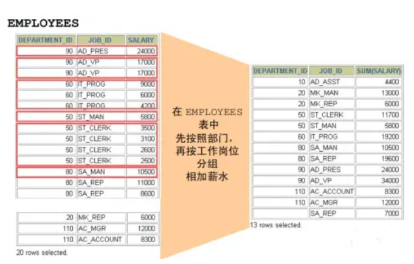
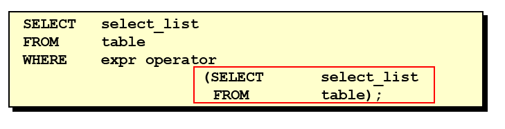

# 查询

先下载 [sql 数据文件](https://wwzt.lanzoul.com/iSjqX1ix6wde) 放到项目的根目录下， 然后在命令行客户端登录 mysql，使用 source 指令导入

```
mysql> source zhengxinonly_db.sql
```


```
mysql> desc employees;
+----------------+-------------+------+-----+---------+-------+
| Field          | Type        | Null | Key | Default | Extra |
+----------------+-------------+------+-----+---------+-------+
| employee_id    | int(6)      | NO   | PRI | 0       |       |
| first_name     | varchar(20) | YES  |     | NULL    |       |
| last_name      | varchar(25) | NO   |     | NULL    |       |
| email          | varchar(25) | NO   | UNI | NULL    |       |
| phone_number   | varchar(20) | YES  |     | NULL    |       |
| hire_date      | date        | NO   |     | NULL    |       |
| job_id         | varchar(10) | NO   | MUL | NULL    |       |
| salary         | double(8,2) | YES  |     | NULL    |       |
| commission_pct | double(2,2) | YES  |     | NULL    |       |
| manager_id     | int(6)      | YES  | MUL | NULL    |       |
| department_id  | int(4)      | YES  | MUL | NULL    |       |
+----------------+-------------+------+-----+---------+-------+
11 rows in set (0.00 sec)
```


## 基本的 SELECT 语句

### SELECT

```
SELECT 1; -- 没有任何子句
SELECT 9 / 2; -- 没有任何子句
```


### SELECT ... FROM

- 语法：

```
SELECT 标识选择哪些列
FROM 标识从哪个表中选择
```


- 选择全部列：


```
SELECT *
FROM departments;
```

一般情况下，除非需要使用表中所有的字段数据，最好不要使用通配符`'*'` 。使用通配符虽然可以节省输入查询语句的时间，但是获取不需要的列数据通常会降低查询和所使用的应用程序的效率。 通配符的优势是，当不知道所需要的列的名称时，可以通过它获取它们。在生产环境下，不推荐你直接使用 `SELECT *` 进行查询。

- 选择特定的列：

```
SELECT department_id, location_id
FROM department;
```

### 列的别名

- 重命名一个列
- 便于计算
- 紧跟列名，也可以在列名和别名之间加入关键字AS，别名使用双引号，以便在别名中包含空格或特殊的字符并区分大小写。
- AS 可以省略
- 建议别名简短，见名知意

**举例**

```
SELECT last_name AS name, commission_pct comm
FROM employees;
```

获取姓名、年薪


```
SELECT last_name "Name", salary * 12 "Annual Salary"
FROM employees;
```

### 去除重复行

默认情况下，查询会返回全部行，包括重复行。

```
SELECT department_id
FROM employees;
```

在SELECT语句中使用关键字 DISTINCT 去除重复行


```
SELECT DISTINCT department_id
FROM employees;
```


针对于：

```
SELECT DISTINCT department_id, salary
FROM employees;
```


这里有两点需要注意：

1. `DISTINCT` 需要放到所有列名的前面，如果写成 `SELECT salary, DISTINCT department_id FROM employees` 会报错。
2. `DISTINCT` 其实是对后面所有列名的组合进行去重，你能看到最后的结果是 74 条，因为这 74 个部门 id 不同，都有 `salary` 这个属性值。如果你想要看都有哪些不同的部门（`department_id`），只需要写`DISTINCT department_id`即可，后面不需要再加其他的列名了。

### 空值参与运算

- 所有运算符或列值遇到 null 值，运算的结果都为 null

```
SELECT employee_id,
       salary,
       commission_pct,
       12 * salary * (1 + commission_pct) "annual_sal"
FROM employees;
```


这里你一定要注意，在 MySQL 里面， 空值不等于空字符串。一个空字符串的长度是 0，而一个空值的长度是空。而且，在 MySQL 里面，空值是占用空间的。

### 着重号

- 错误的


```
mysql> SELECT * FROM ORDER;
ERROR 1064 (42000): You have an error in your SQL syntax; check the manual that corresponds to your MySQL server version for the right syntax to use near 'ORDER' at line 1
```


- 正确的


```
mysql> SELECT * FROM `ORDER`;
+----------+------------+
| order_id | order_name |
+----------+------------+
|        1 | shkstart   |
|        2 | tomcat     |
|        3 | dubbo      |
+----------+------------+
3 rows in set (0.00 sec)

mysql> SELECT * FROM `order`;
+----------+------------+
| order_id | order_name |
+----------+------------+
|        1 | shkstart   |
|        2 | tomcat     |
|        3 | dubbo      |
+----------+------------+
3 rows in set (0.00 sec)
```


- 结论

我们需要保证表中的字段、表名等没有和保留字、数据库系统或常用方法冲突。如果真的相同，请在SQL语句中使用一对 ``（着重号）引起来。

### 查询常数

SELECT 查询还可以对常数进行查询。对的，就是在 SELECT 查询结果中增加一列固定的常数列。这列的取值是我们指定的，而不是从数据表中动态取出的。

你可能会问为什么我们还要对常数进行查询呢？

SQL 中的 SELECT 语法的确提供了这个功能，一般来说我们只从一个表中查询数据，通常不需要增加一个固定的常数列，但如果我们想整合不同的数据源，用常数列作为这个表的标记，就需要查询常数。

比如说，我们想对 employees 数据表中的员工姓名进行查询，同时增加一列字段`corporation`，这个字段固定值为“青灯教育-正心”，可以这样写：


```
SELECT '青灯教育' as company, last_name
FROM employees;
```


## 显示表结构

使用 DESCRIBE 或 DESC 命令，表示表结构。


```
DESCRIBE employees;
-- 或
DESC employees;
```


```
mysql> desc employees;
+----------------+-------------+------+-----+---------+-------+
| Field          | Type        | Null | Key | Default | Extra |
+----------------+-------------+------+-----+---------+-------+
| employee_id    | int(6)      | NO   | PRI | 0       |       |
| first_name     | varchar(20) | YES  |     | NULL    |       |
| last_name      | varchar(25) | NO   |     | NULL    |       |
| email          | varchar(25) | NO   | UNI | NULL    |       |
| phone_number   | varchar(20) | YES  |     | NULL    |       |
| hire_date      | date        | NO   |     | NULL    |       |
| job_id         | varchar(10) | NO   | MUL | NULL    |       |
| salary         | double(8,2) | YES  |     | NULL    |       |
| commission_pct | double(2,2) | YES  |     | NULL    |       |
| manager_id     | int(6)      | YES  | MUL | NULL    |       |
| department_id  | int(4)      | YES  | MUL | NULL    |       |
+----------------+-------------+------+-----+---------+-------+
11 rows in set (0.00 sec)
```


其中，各个字段的含义分别解释如下：

- Field：表示字段名称。
- Type：表示字段类型。
- Null：表示该列是否可以存储 NULL 值。
- Key：表示该列是否已编制索引。PRI 表示该列是表主键的一部分；`UNI` 表示该列是 `UNIQUE` 索引的一部分；`MUL` 表示在列中某个给定值允许出现多次。
- Default：表示该列是否有默认值，如果有，那么值是多少。
- Extra：表示可以获取的与给定列有关的附加信息，例如 `AUTO_INCREMENT` 等。

## 过滤查询

- 语法：

  ```
  SELECT 字段1,字段2
  FROM 表名
  WHERE 过滤条件
  ```

  

  - 使用WHERE 子句，将不满足条件的行过滤掉
  - **WHERE子句紧随 FROM子句**

- 举例

  ```
  SELECT employee_id, last_name, job_id, department_id
  FROM employees
  WHERE department_id = 90;
  ```


# 运算符

## 算术运算符

算术运算符主要用于数学运算，其可以连接运算符前后的两个数值或表达式，对数值或表达式进行加（+）、减（-）、乘（*）、除（/）和取模（%）运算。


**1．加法与减法运算符**


```
mysql> SELECT 100, 100 + 0, 100 - 0, 100 + 50, 100 + 50 -30, 100 + 35.5, 100 - 35.5 FROM dual;
+-----+---------+---------+----------+--------------+------------+------------+
| 100 | 100 + 0 | 100 - 0 | 100 + 50 | 100 + 50 -30 | 100 + 35.5 | 100 - 35.5 |
+-----+---------+---------+----------+--------------+------------+------------+
| 100 |     100 |     100 |      150 |          120 |      135.5 |       64.5 |
+-----+---------+---------+----------+--------------+------------+------------+
1 row in set (0.00 sec)
```


由运算结果可以得出如下结论：

> - 一个整数类型的值对整数进行加法和减法操作，结果还是一个整数；
> - 一个整数类型的值对浮点数进行加法和减法操作，结果是一个浮点数；
> - 加法和减法的优先级相同，进行先加后减操作与进行先减后加操作的结果是一样的；
> - 在Java中，+的左右两边如果有字符串，那么表示字符串的拼接。但是在 MySQ L中 + 只表示数值相加。如果遇到非数值类型，先尝试转成数值，如果转失败，就按0计算。（补充：MySQL中字符串拼接要使用字符串函数 CONCAT() 实现）

**2．乘法与除法运算符**


```
mysql> SELECT 100, 100 * 1, 100 * 1.0, 100 / 1.0, 100 / 2,100 + 2 * 5 / 2,100 /3, 100 DIV 0 FROM dual;
+-----+---------+-----------+-----------+---------+-----------------+---------+-----------+
| 100 | 100 * 1 | 100 * 1.0 | 100 / 1.0 | 100 / 2 | 100 + 2 * 5 / 2 | 100 /3  | 100 DIV 0 |
+-----+---------+-----------+-----------+---------+-----------------+---------+-----------+
| 100 |     100 |     100.0 |  100.0000 | 50.0000 |        105.0000 | 33.3333 |      NULL |
+-----+---------+-----------+-----------+---------+-----------------+---------+-----------+
1 row in set (0.00 sec)
```


```
#计算出员工的年基本工资
SELECT employee_id, salary, salary * 12 annual_sal
FROM employees;
```


由运算结果可以得出如下结论：

> - 一个数乘以整数1和除以整数1后仍得原数；
> - 一个数乘以浮点数1和除以浮点数1后变成浮点数，数值与原数相等；
> - 一个数除以整数后，不管是否能除尽，结果都为一个浮点数；
> - 一个数除以另一个数，除不尽时，结果为一个浮点数，并保留到小数点后4位；
> - 乘法和除法的优先级相同，进行先乘后除操作与先除后乘操作，得出的结果相同。
> - 在数学运算中，0不能用作除数，在MySQL中，一个数除以0为NULL。

**3．求模（求余）运算符** 将t22表中的字段i对3和5进行求模（求余）运算。


```
mysql> SELECT 12 % 3, 12 MOD 5 FROM dual;
+--------+----------+
| 12 % 3 | 12 MOD 5 |
+--------+----------+
|      0 |        2 |
+--------+----------+
1 row in set (0.00 sec)
```


```
-- 筛选出 employee_id 是偶数的员工
SELECT *
FROM employees
WHERE employee_id MOD 2 = 0;
```


可以看到，100 对 3 求模后的结果为 3 ，对5求模后的结果为 0。

## 比较运算符

比较运算符用来对表达式左边的操作数和右边的操作数进行比较，比较的结果为真则返回1，比较的结果为假则返回0，其他情况则返回NULL。

比较运算符经常被用来作为SELECT查询语句的条件来使用，返回符合条件的结果记录。


### 等号运算符

- 等号运算符（=）判断等号两边的值、字符串或表达式是否相等，如果相等则返回1，不相等则返回0。
- 在使用等号运算符时，遵循如下规则：
  - 如果等号两边的值、字符串或表达式都为字符串，则MySQL会按照字符串进行比较，其比较的是每个字符串中字符的ANSI编码是否相等。
  - 如果等号两边的值都是整数，则MySQL会按照整数来比较两个值的大小。
  - 如果等号两边的值一个是整数，另一个是字符串，则MySQL会将字符串转化为数字进行比较。
  - 如果等号两边的值、字符串或表达式中有一个为NULL，则比较结果为NULL。
- 对比：SQL中赋值符号使用 :=


```
mysql> SELECT 1 = 1, 1 = '1', 1 = 0, 'a' = 'a', (5 + 3) = (2 + 6), '' = NULL , NULL = NULL; 
+-------+---------+-------+-----------+-------------------+-----------+-------------+
| 1 = 1 | 1 = '1' | 1 = 0 | 'a' = 'a' | (5 + 3) = (2 + 6) | '' = NULL | NULL = NULL |
+-------+---------+-------+-----------+-------------------+-----------+-------------+
|    1  |     1   |   0   |      1    |             1     |    NULL   |        NULL  |
+-------+---------+-------+-----------+-------------------+-----------+-------------+
1 row in set (0.00 sec)
```


```
mysql> SELECT 1 = 2, 0 = 'abc', 1 = 'abc' FROM dual;
+-------+-----------+-----------+
| 1 = 2 | 0 = 'abc' | 1 = 'abc' |
+-------+-----------+-----------+
|     0 |         1 |         0 |
+-------+-----------+-----------+
1 row in set, 2 warnings (0.00 sec)
```


```
-- 查询 salary=10000，注意在其他编程语言中比较是 ==
SELECT employee_id, salary
FROM employees
WHERE salary = 10000;
```


### 安全等于运算符

安全等于运算符（<=>）与等于运算符（=）的作用是相似的，`唯一的区别`是‘<=> ’可以用来对 NULL 进行判断。在两个操作数均为 NULL 时，其返回值为1，而不为 NULL ；当一个操作数为 NULL 时，其返回值为0，而不为 NULL 。


```
mysql> SELECT 1 <=> '1', 1 <=> 0, 'a' <=> 'a', (5 + 3) <=> (2 + 6), '' <=> NULL,NULL <=> NULL FROM dual;
+-----------+---------+-------------+---------------------+-------------+---------------+
| 1 <=> '1' | 1 <=> 0 | 'a' <=> 'a' | (5 + 3) <=> (2 + 6) | '' <=> NULL | NULL <=> NULL |
+-----------+---------+-------------+---------------------+-------------+---------------+
|         1 |       0 |           1 |                   1 |           0 |             1 |
+-----------+---------+-------------+---------------------+-------------+---------------+
1 row in set (0.00 sec)
```


```
-- 查询 commission_pct 等于 0.40
SELECT employee_id, commission_pct
FROM employees
WHERE commission_pct = 0.40;

SELECT employee_id, commission_pct
FROM employees
WHERE commission_pct <=> 0.40;


-- 如果把 0.40 改成 NULL 呢 ？
```


可以看到，使用安全等于运算符时，两边的操作数的值都为NULL时，返回的结果为1而不是NULL，其他返回结果与等于运算符相同。

### 不等于运算符

不等于运算符（<>和!=）用于判断两边的数字、字符串或者表达式的值是否不相等，如果不相等则返回1，相等则返回0。不等于运算符不能判断NULL值。如果两边的值有任意一个为NULL，或两边都为NULL，则结果为NULL。 SQL语句示例如下：


```
mysql> SELECT 1 <> 1, 1 != 2, 'a' != 'b', (3+4) <> (2+6), 'a' != NULL, NULL <> NULL; 
+--------+--------+------------+----------------+-------------+--------------+
| 1 <> 1 | 1 != 2 | 'a' != 'b' | (3+4) <> (2+6) | 'a' != NULL | NULL <> NULL |
+--------+--------+------------+----------------+-------------+--------------+
|      0 |   1    |       1    |            1   |     NULL    |         NULL |
+--------+--------+------------+----------------+-------------+--------------+
1 row in set (0.00 sec)
```


### 空运算符

空运算符（IS NULL或者ISNULL）判断一个值是否为NULL，如果为NULL则返回1，否则返回0。 SQL语句示例如下：


```
mysql> SELECT NULL IS NULL, ISNULL(NULL), ISNULL('a'), 1 IS NULL;
+--------------+--------------+-------------+-----------+
| NULL IS NULL | ISNULL(NULL) | ISNULL('a') | 1 IS NULL |
+--------------+--------------+-------------+-----------+
|            1 |            1 |           0 |         0 |
+--------------+--------------+-------------+-----------+
1 row in set (0.00 sec)
```


```
-- 查询 commission_pct 等于 NULL 。比较如下的四种写法
SELECT employee_id, commission_pct
FROM employees
WHERE commission_pct IS NULL;

SELECT employee_id, commission_pct
FROM employees
WHERE commission_pct <=> NULL;

SELECT employee_id, commission_pct
FROM employees
WHERE ISNULL(commission_pct);

SELECT employee_id, commission_pct
FROM employees
WHERE commission_pct = NULL;
```


```
SELECT last_name, manager_id
FROM employees
WHERE manager_id IS NULL;
```


### 非空运算符

非空运算符（IS NOT NULL）判断一个值是否不为 NULL，如果不为 NULL 则返回1，否则返回0。 SQL 语句示例如下：


```
mysql> SELECT NULL IS NOT NULL, 'a' IS NOT NULL,  1 IS NOT NULL; 
+------------------+-----------------+---------------+
| NULL IS NOT NULL | 'a' IS NOT NULL | 1 IS NOT NULL |
+------------------+-----------------+---------------+
|                0 |               1 |             1 |
+------------------+-----------------+---------------+
1 row in set (0.01 sec)
```


```
-- 查询 commission_pct 不等于 NULL
SELECT employee_id, commission_pct
FROM employees
WHERE commission_pct IS NOT NULL;

SELECT employee_id, commission_pct
FROM employees
WHERE NOT commission_pct <=> NULL;

SELECT employee_id, commission_pct
FROM employees
WHERE NOT ISNULL(commission_pct);
```


### BETWEEN AND 运算符

BETWEEN运算符使用的格式通常为SELECT D FROM TABLE WHERE C BETWEEN A AND B，此时，当C大于或等于A，并且C小于或等于B时，结果为1，否则结果为0。


```
mysql> SELECT 1 BETWEEN 0 AND 1, 10 BETWEEN 11 AND 12, 'b' BETWEEN 'a' AND 'c';
+-------------------+----------------------+-------------------------+
| 1 BETWEEN 0 AND 1 | 10 BETWEEN 11 AND 12 | 'b' BETWEEN 'a' AND 'c' |
+-------------------+----------------------+-------------------------+
|                 1 |                    0 |                       1 |
+-------------------+----------------------+-------------------------+
1 row in set (0.00 sec)
```


```
SELECT last_name, salary
FROM employees
WHERE salary BETWEEN 2500 AND 3500;
```


### IN 运算符

IN运算符用于判断给定的值是否是IN列表中的一个值，如果是则返回1，否则返回0。如果给定的值为NULL，或者IN列表中存在NULL，则结果为NULL。


```
mysql> SELECT 'a' IN ('a','b','c'), 1 IN (2,3), NULL IN ('a','b'), 'a' IN ('a', NULL);
+----------------------+------------+-------------------+--------------------+
| 'a' IN ('a','b','c') | 1 IN (2,3) | NULL IN ('a','b') | 'a' IN ('a', NULL) |
+----------------------+------------+-------------------+--------------------+
|            1         |        0   |         NULL      |         1          |
+----------------------+------------+-------------------+--------------------+
1 row in set (0.00 sec)
```


```
SELECT employee_id, last_name, salary, manager_id
FROM employees
WHERE manager_id IN (100, 101, 201);
```


### NOT IN 运算符

NOT IN运算符用于判断给定的值是否不是IN列表中的一个值，如果不是IN列表中的一个值，则返回1，否则返回0。


```
mysql> SELECT 'a' NOT IN ('a','b','c'), 1 NOT IN (2,3);
+--------------------------+----------------+
| 'a' NOT IN ('a','b','c') | 1 NOT IN (2,3) |
+--------------------------+----------------+
|                 0        |            1   |
+--------------------------+----------------+
1 row in set (0.00 sec)
```


### LIKE 运算符

LIKE 运算符主要用来匹配字符串，通常用于模糊匹配，如果满足条件则返回1，否则返回0。如果给定的值或者匹配条件为NULL，则返回结果为NULL。

LIKE 运算符通常使用如下通配符：


```
“%”：匹配0个或多个字符。
“_”：只能匹配一个字符。
```


SQL语句示例如下：


```
mysql> SELECT NULL LIKE 'abc', 'abc' LIKE NULL;  
+-----------------+-----------------+
| NULL LIKE 'abc' | 'abc' LIKE NULL |
+-----------------+-----------------+
|          NULL   |          NULL   |
+-----------------+-----------------+
1 row in set (0.00 sec)
```


```
SELECT first_name
FROM employees
WHERE first_name LIKE 'S%';
```


```
SELECT last_name
FROM employees
WHERE last_name LIKE '_o%';
```


**ESCAPE**

- 回避特殊符号的：**使用转义符**。例如：将 `[%]` 转为 `[$%]`、`[]` 转为`[$]`，然后再加上 `[ESCAPE'$']` 即可。


```
SELECT job_id
FROM jobs
WHERE job_id LIKE 'IT\_%';
```


- 如果使用\表示转义，要省略ESCAPE。如果不是\，则要加上ESCAPE。


```
SELECT job_id
FROM jobs
WHERE job_id LIKE 'IT$_ % ' escape '$';
```


### REGEXP 运算符

REGEXP运算符用来匹配字符串，语法格式为：`expr REGEXP 匹配条件`。如果expr满足匹配条件，返回1；如果不满足，则返回0。若expr或匹配条件任意一个为NULL，则结果为NULL。

REGEXP运算符在进行匹配时，常用的有下面几种通配符：


```
（1）‘^’匹配以该字符后面的字符开头的字符串。
（2）‘$’匹配以该字符前面的字符结尾的字符串。
（3）‘.’匹配任何一个单字符。
（4）“[...]”匹配在方括号内的任何字符。例如，“[abc]”匹配“a”或“b”或“c”。为了命名字符的范围，使用一个‘-’。“[a-z]”匹配任何字母，而“[0-9]”匹配任何数字。
（5）‘*’匹配零个或多个在它前面的字符。例如，“x*”匹配任何数量的‘x’字符，“[0-9]*”匹配任何数量的数字，而“*”匹配任何数量的任何字符。
```


SQL语句示例如下：


```
mysql> SELECT 'shkstart' REGEXP '^s', 'shkstart' REGEXP 't$', 'shkstart' REGEXP 'hk';
+------------------------+------------------------+-------------------------+
| 'shkstart' REGEXP '^s' | 'shkstart' REGEXP 't$' | 'shkstart' REGEXP 'hk'  |
+------------------------+------------------------+-------------------------+
|                      1 |                      1 |                       1 |
+------------------------+------------------------+-------------------------+
1 row in set (0.01 sec)
```


```
mysql> SELECT 'atguigu' REGEXP 'gu.gu', 'atguigu' REGEXP '[ab]';
+--------------------------+-------------------------+
| 'atguigu' REGEXP 'gu.gu' | 'atguigu' REGEXP '[ab]' |
+--------------------------+-------------------------+
|                        1 |                       1 |
+--------------------------+-------------------------+
1 row in set (0.00 sec)
```


## 逻辑运算符

逻辑运算符主要用来判断表达式的真假，在MySQL中，逻辑运算符的返回结果为1、0或者NULL。

MySQL中支持4种逻辑运算符如下：


**1．逻辑非运算符** 逻辑非（NOT或!）运算符表示当给定的值为0时返回1；当给定的值为非0值时返回0；当给定的值为NULL时，返回NULL。


```
mysql> SELECT NOT 1, NOT 0, NOT(1+1), NOT !1, NOT NULL;    
+-------+-------+----------+--------+----------+
| NOT 1 | NOT 0 | NOT(1+1) | NOT !1 | NOT NULL |
+-------+-------+----------+--------+----------+
|     0 |     1 |        0 |      1 |     NULL |
+-------+-------+----------+--------+----------+
1 row in set, 1 warning (0.00 sec)
```


```
SELECT last_name, job_id
FROM   employees
WHERE  job_id NOT IN ('IT_PROG', 'ST_CLERK', 'SA_REP');
```


**2．逻辑与运算符** 逻辑与（AND或&&）运算符是当给定的所有值均为非0值，并且都不为NULL时，返回1；当给定的一个值或者多个值为0时则返回0；否则返回NULL。


```
mysql> SELECT 1 AND -1, 0 AND 1, 0 AND NULL, 1 AND NULL;
+----------+---------+------------+------------+
| 1 AND -1 | 0 AND 1 | 0 AND NULL | 1 AND NULL |
+----------+---------+------------+------------+
|        1 |       0 |          0 |       NULL |
+----------+---------+------------+------------+
1 row in set (0.00 sec)
```


```
SELECT employee_id, last_name, job_id, salary
FROM employees
WHERE salary >= 10000
  AND job_id LIKE '%MAN%';
```


**3．逻辑或运算符** 逻辑或（OR或||）运算符是当给定的值都不为NULL，并且任何一个值为非0值时，则返回1，否则返回0；当一个值为NULL，并且另一个值为非0值时，返回1，否则返回NULL；当两个值都为NULL时，返回NULL。


```
mysql> SELECT 1 OR -1, 1 OR 0, 1 OR NULL, 0 || NULL, NULL || NULL;     
+---------+--------+-----------+-----------+--------------+
| 1 OR -1 | 1 OR 0 | 1 OR NULL | 0 || NULL | NULL || NULL |
+---------+--------+-----------+-----------+--------------+
|       1 |      1 |         1 |    NULL   |       NULL   |
+---------+--------+-----------+-----------+--------------+
1 row in set, 2 warnings (0.00 sec)
```


```
#
查询基本薪资不在 9000-12000 之间的员工编号和基本薪资
SELECT employee_id, salary
FROM employees
WHERE NOT (salary >= 9000 AND salary <= 12000);

SELECT employee_id, salary
FROM employees
WHERE salary < 9000
   OR salary > 12000;

SELECT employee_id, salary
FROM employees
WHERE salary NOT BETWEEN 9000 AND 12000;
```


```
SELECT employee_id, last_name, job_id, salary
FROM employees
WHERE salary >= 10000
   OR job_id LIKE '%MAN%';
```


> 注意：
>
> OR可以和AND一起使用，但是在使用时要注意两者的优先级，由于AND的优先级高于OR，因此先对AND两边的操作数进行操作，再与OR中的操作数结合。

**4．逻辑异或运算符** 逻辑异或（XOR）运算符是当给定的值中任意一个值为NULL时，则返回NULL；如果两个非NULL的值都是0或者都不等于0时，则返回0；如果一个值为0，另一个值不为0时，则返回1。


```
mysql> SELECT 1 XOR -1, 1 XOR 0, 0 XOR 0, 1 XOR NULL, 1 XOR 1 XOR 1, 0 XOR 0 XOR 0;
+----------+---------+---------+------------+---------------+---------------+
| 1 XOR -1 | 1 XOR 0 | 0 XOR 0 | 1 XOR NULL | 1 XOR 1 XOR 1 | 0 XOR 0 XOR 0 |
+----------+---------+---------+------------+---------------+---------------+
|        0 |       1 |       0 |       NULL |             1 |             0 |
+----------+---------+---------+------------+---------------+---------------+
1 row in set (0.00 sec)
```


```
select last_name, department_id, salary
from employees
where department_id in (10, 20) XOR salary > 8000;
```


## 位运算符(了解)

位运算符是在二进制数上进行计算的运算符。位运算符会先将操作数变成二进制数，然后进行位运算，最后将计算结果从二进制变回十进制数。

MySQL支持的位运算符如下：


**1．按位与运算符** 按位与（&）运算符将给定值对应的二进制数逐位进行逻辑与运算。当给定值对应的二进制位的数值都为1时，则该位返回1，否则返回0。


```
mysql> SELECT 1 & 10, 20 & 30;
+--------+---------+
| 1 & 10 | 20 & 30 |
+--------+---------+
|      0 |      20 |
+--------+---------+
1 row in set (0.00 sec)
```


1的二进制数为0001，10的二进制数为1010，所以1 & 10的结果为0000，对应的十进制数为0。20的二进制数为10100，30的二进制数为11110，所以20 & 30的结果为10100，对应的十进制数为20。

**2. 按位或运算符** 按位或（|）运算符将给定的值对应的二进制数逐位进行逻辑或运算。当给定值对应的二进制位的数值有一个或两个为1时，则该位返回1，否则返回0。


```
mysql> SELECT 1 | 10, 20 | 30; 
+--------+---------+
| 1 | 10 | 20 | 30 |
+--------+---------+
|     11 |      30 |
+--------+---------+
1 row in set (0.00 sec)
```


1的二进制数为0001，10的二进制数为1010，所以1 | 10的结果为1011，对应的十进制数为11。20的二进制数为10100，30的二进制数为11110，所以20 | 30的结果为11110，对应的十进制数为30。

**3. 按位异或运算符** 按位异或（^）运算符将给定的值对应的二进制数逐位进行逻辑异或运算。当给定值对应的二进制位的数值不同时，则该位返回1，否则返回0。


```
mysql> SELECT 1 ^ 10, 20 ^ 30; 
+--------+---------+
| 1 ^ 10 | 20 ^ 30 |
+--------+---------+
|     11 |      10 |
+--------+---------+
1 row in set (0.00 sec)
```


1的二进制数为0001，10的二进制数为1010，所以1 ^ 10的结果为1011，对应的十进制数为11。20的二进制数为10100，30的二进制数为11110，所以20 ^ 30的结果为01010，对应的十进制数为10。

再举例：


```
mysql> SELECT 12 & 5, 12 | 5,12 ^ 5 FROM DUAL;
+--------+--------+--------+
| 12 & 5 | 12 | 5 | 12 ^ 5 |
+--------+--------+--------+
|      4 |     13 |      9 |
+--------+--------+--------+
1 row in set (0.00 sec)
```


**4. 按位取反运算符** 按位取反（~）运算符将给定的值的二进制数逐位进行取反操作，即将1变为0，将0变为1。


```
mysql> SELECT 10 & ~1;
+---------+
| 10 & ~1 |
+---------+
|      10 |
+---------+
1 row in set (0.00 sec)
```


由于按位取反（~）运算符的优先级高于按位与（&）运算符的优先级，所以10 & ~ 1，首先，对数字1进行按位取反操作，结果除了最低位为0，其他位都为1，然后与10进行按位与操作，结果为10。

**5. 按位右移运算符** 按位右移（>>）运算符将给定的值的二进制数的所有位右移指定的位数。右移指定的位数后，右边低位的数值被移出并丢弃，左边高位空出的位置用0补齐。


```
mysql> SELECT 1 >> 2, 4 >> 2;
+--------+--------+
| 1 >> 2 | 4 >> 2 |
+--------+--------+
|      0 |      1 |
+--------+--------+
1 row in set (0.00 sec)
```


1的二进制数为0000 0001，右移2位为0000 0000，对应的十进制数为0。4的二进制数为0000 0100，右移2位为0000 0001，对应的十进制数为1。

**6. 按位左移运算符** 按位左移（<<）运算符将给定的值的二进制数的所有位左移指定的位数。左移指定的位数后，左边高位的数值被移出并丢弃，右边低位空出的位置用0补齐。


```
mysql> SELECT 1 << 2, 4 << 2;  
+--------+--------+
| 1 << 2 | 4 << 2 |
+--------+--------+
|      4 |     16 |
+--------+--------+
1 row in set (0.00 sec)
```


1的二进制数为0000 0001，左移两位为0000 0100，对应的十进制数为4。4的二进制数为0000 0100，左移两位为0001 0000，对应的十进制数为16。

## 运算符的优先级


数字编号越大，优先级越高，优先级高的运算符先进行计算。可以看到，赋值运算符的优先级最低，使用“()”括起来的表达式的优先级最高。


# 排序与分页

## 排序

### 排序规则

- 使用 ORDER BY 子句排序
  - **ASC（ascend）: 升序**
  - **DESC（descend）:降序**
- **ORDER BY 子句在SELECT语句的结尾。**

### 单列排序

```
SELECT last_name, job_id, department_id, hire_date
FROM employees
ORDER BY hire_date;
```


```
SELECT last_name, job_id, department_id, hire_date
FROM employees
ORDER BY hire_date DESC;
```


```
SELECT employee_id, last_name, salary * 12 annsal
FROM employees
ORDER BY annsal;
```


### 多列排序

```
SELECT last_name, department_id, salary
FROM employees
ORDER BY department_id, salary DESC;
```


- 可以使用不在SELECT列表中的列排序。
- 在对多列进行排序的时候，首先排序的第一列必须有相同的列值，才会对第二列进行排序。如果第一列数据中所有值都是唯一的，将不再对第二列进行排序。

## 分页

### 背景

背景1：查询返回的记录太多了，查看起来很不方便，怎么样能够实现分页查询呢？

背景2：表里有 4 条数据，我们只想要显示第 2、3 条数据怎么办呢？

### 实现规则

- 分页原理

  所谓分页显示，就是将数据库中的结果集，一段一段显示出来需要的条件。

- **MySQL中使用 LIMIT 实现分页**

- 格式：


```
LIMIT [位置偏移量,] 行数
```

第一个“位置偏移量”参数指示MySQL从哪一行开始显示，是一个可选参数，如果不指定“位置偏移量”，将会从表中的第一条记录开始（第一条记录的位置偏移量是0，第二条记录的位置偏移量是1，以此类推）；第二个参数“行数”指示返回的记录条数。

- 举例


```
-- 前 10 条记录：
SELECT * FROM 表名 LIMIT 0, 10;
或者
SELECT * FROM 表名 LIMIT 10;

-- 第 11 至 20 条记录：
SELECT * FROM 表名 LIMIT 10, 10;

-- 第 21 至 30 条记录： 
SELECT * FROM 表名 LIMIT 20, 10;
```


> MySQL 8.0中可以使用“LIMIT 3 OFFSET 4”，意思是获取从第5条记录开始后面的3条记录，和“LIMIT 4,3;”返回的结果相同。

- 分页显式公式**：（当前页数-1）*每页条数，每页条数**


```
SELECT * FROM table 
LIMIT (PageNo - 1) * PageSize, PageSize;
```


- **注意：LIMIT 子句必须放在整个SELECT语句的最后！**
- 使用 LIMIT 的好处

约束返回结果的数量可以`减少数据表的网络传输量`，也可以`提升查询效率`。如果我们知道返回结果只有 1 条，就可以使用`LIMIT 1`，告诉 SELECT 语句只需要返回一条记录即可。这样的好处就是 SELECT 不需要扫描完整的表，只需要检索到一条符合条件的记录即可返回。


# 单行函数

## 函数的理解

### 什么是函数

函数在计算机语言的使用中贯穿始终，函数的作用是什么呢？它可以把我们经常使用的代码封装起来，需要的时候直接调用即可。这样既`提高了代码效率` ，又`提高了可维护性`。在 SQL 中我们也可以使用函数对检索出来的数据进行函数操作。使用这些函数，可以极大地`提高用户对数据库的管理效率`。


​                                      y = f（x1，.......，xn)

从函数定义的角度出发，我们可以将函数分成`内置函数`和`自定义函数`。在 SQL 语言中，同样也包括了内置函数和自定义函数。内置函数是系统内置的通用函数，而自定义函数是我们根据自己的需要编写的，本章及下一章讲解的是 SQL 的内置函数。

### 不同DBMS函数的差异

我们在使用 SQL 语言的时候，不是直接和这门语言打交道，而是通过它使用不同的数据库软件，即 DBMS。**DBMS 之间的差异性很大，远大于同一个语言不同版本之间的差异。\**实际上，只有很少的函数是被 DBMS 同时支持的。比如，大多数 DBMS 使用（||）或者（+）来做拼接符，而在 MySQL 中的字符串拼接函数为concat()。大部分 DBMS 会有自己特定的函数，这就意味着\**采用 SQL 函数的代码可移植性是很差的**，因此在使用函数的时候需要特别注意。

### MySQL的内置函数及分类

MySQL提供了丰富的内置函数，这些函数使得数据的维护与管理更加方便，能够更好地提供数据的分析与统计功能，在一定程度上提高了开发人员进行数据分析与统计的效率。

MySQL提供的内置函数从`实现的功能角度` 可以分为数值函数、字符串函数、日期和时间函数、流程控制函数、加密与解密函数、获取MySQL信息函数、聚合函数等。这里，我将这些丰富的内置函数再分为两类：`单行函数`、`聚合函数（或分组函数）`。

**两种SQL函数**


**单行函数**

- 操作数据对象
- 接受参数返回一个结果
- **只对一行进行变换**
- **每行返回一个结果**
- 可以嵌套
- 参数可以是一列或一个值

## 数值函数

### 基本函数

| 函数                | 用法                                                         |
| :------------------ | :----------------------------------------------------------- |
| ABS(x)              | 返回x的绝对值                                                |
| SIGN(X)             | 返回X的符号。正数返回1，负数返回-1，0返回0                   |
| PI()                | 返回圆周率的值                                               |
| CEIL(x)，CEILING(x) | 返回大于或等于某个值的最小整数                               |
| FLOOR(x)            | 返回小于或等于某个值的最大整数                               |
| LEAST(e1,e2,e3…)    | 返回列表中的最小值                                           |
| GREATEST(e1,e2,e3…) | 返回列表中的最大值                                           |
| MOD(x,y)            | 返回X除以Y后的余数                                           |
| RAND()              | 返回0~1的随机值                                              |
| RAND(x)             | 返回0~1的随机值，其中x的值用作种子值，相同的X值会产生相同的随机数 |
| ROUND(x)            | 返回一个对x的值进行四舍五入后，最接近于X的整数               |
| ROUND(x,y)          | 返回一个对x的值进行四舍五入后最接近X的值，并保留到小数点后面Y位 |
| TRUNCATE(x,y)       | 返回数字x截断为y位小数的结果                                 |
| SQRT(x)             | 返回x的平方根。当X的值为负数时，返回NULL                     |

举例：

```
SELECT ABS(-123),
       ABS(32),
       SIGN(-23),
       SIGN(43),
       PI(),
       CEIL(32.32),
       CEILING(-43.23),
       FLOOR(32.32),
       FLOOR(-43.23),
       MOD(12, 5)
FROM DUAL;
```


执行结果

```
mysql> SELECT ABS(-123),
    ->        ABS(32),
    ->        SIGN(-23),
    ->        SIGN(43),
    ->        PI(),
    ->        CEIL(32.32),
    ->        CEILING(-43.23),
    ->        FLOOR(32.32),
    ->        FLOOR(-43.23),
    ->        MOD(12, 5)
    -> FROM DUAL;
+-----------+---------+-----------+----------+----------+-------------+-----------------+--------------+---------------+------------+
| ABS(-123) | ABS(32) | SIGN(-23) | SIGN(43) | PI()     | CEIL(32.32) | CEILING(-43.23) | FLOOR(32.32) | FLOOR(-43.23) | MOD(12, 5) |
+-----------+---------+-----------+----------+----------+-------------+-----------------+--------------+---------------+------------+
|       123 |      32 |        -1 |        1 | 3.141593 |          33 |             -43 |           32 |           -44 |          2 |
+-----------+---------+-----------+----------+----------+-------------+-----------------+--------------+---------------+------------+
1 row in set (0.00 sec)
```


```
SELECT RAND(), RAND(), RAND(10), RAND(10), RAND(-1), RAND(-1)
FROM DUAL;
```

执行结果

```
mysql> SELECT RAND(), RAND(), RAND(10), RAND(10), RAND(-1), RAND(-1)
    -> FROM DUAL;
+--------------------+--------------------+--------------------+--------------------+--------------------+--------------------+
| RAND()             | RAND()             | RAND(10)           | RAND(10)           | RAND(-1)           | RAND(-1)           |
+--------------------+--------------------+--------------------+--------------------+--------------------+--------------------+
| 0.2871312799743668 | 0.0759608327187233 | 0.6570515219653505 | 0.6570515219653505 | 0.9050373219931845 | 0.9050373219931845 |
+--------------------+--------------------+--------------------+--------------------+--------------------+--------------------+
1 row in set (0.00 sec)
```


```
SELECT ROUND(12.33), ROUND(12.343, 2), ROUND(12.324, -1), TRUNCATE(12.66, 1), TRUNCATE(12.66, -1)
FROM DUAL;
```


```
mysql> SELECT ROUND(12.33), ROUND(12.343, 2), ROUND(12.324, -1), TRUNCATE(12.66, 1), TRUNCATE(12.66, -1)
    -> FROM DUAL;
+--------------+------------------+-------------------+--------------------+---------------------+
| ROUND(12.33) | ROUND(12.343, 2) | ROUND(12.324, -1) | TRUNCATE(12.66, 1) | TRUNCATE(12.66, -1) |
+--------------+------------------+-------------------+--------------------+---------------------+
|           12 |            12.34 |                10 |               12.6 |                  10 |
+--------------+------------------+-------------------+--------------------+---------------------+
1 row in set (0.00 sec)
```


### 角度与弧度互换函数

| 函数       | 用法                                  |
| :--------- | :------------------------------------ |
| RADIANS(x) | 将角度转化为弧度，其中，参数x为角度值 |
| DEGREES(x) | 将弧度转化为角度，其中，参数x为弧度值 |

```
SELECT RADIANS(30), RADIANS(60), RADIANS(90), DEGREES(2 * PI()), DEGREES(RADIANS(90))
FROM DUAL;
```

### 三角函数

| 函数       | 用法                                                         |
| :--------- | :----------------------------------------------------------- |
| SIN(x)     | 返回x的正弦值，其中，参数x为弧度值                           |
| ASIN(x)    | 返回x的反正弦值，即获取正弦为x的值。如果x的值不在-1到1之间，则返回NULL |
| COS(x)     | 返回x的余弦值，其中，参数x为弧度值                           |
| ACOS(x)    | 返回x的反余弦值，即获取余弦为x的值。如果x的值不在-1到1之间，则返回NULL |
| TAN(x)     | 返回x的正切值，其中，参数x为弧度值                           |
| ATAN(x)    | 返回x的反正切值，即返回正切值为x的值                         |
| ATAN2(m,n) | 返回两个参数的反正切值                                       |
| COT(x)     | 返回x的余切值，其中，X为弧度值                               |

### 指数与对数

| 函数                 | 用法                                                 |
| :------------------- | :--------------------------------------------------- |
| POW(x,y)，POWER(X,Y) | 返回x的y次方                                         |
| EXP(X)               | 返回e的X次方，其中e是一个常数，2.718281828459045     |
| LN(X)，LOG(X)        | 返回以e为底的X的对数，当X <= 0 时，返回的结果为NULL  |
| LOG10(X)             | 返回以10为底的X的对数，当X <= 0 时，返回的结果为NULL |
| LOG2(X)              | 返回以2为底的X的对数，当X <= 0 时，返回NULL          |

### 进制间的转换

| 函数          | 用法                     |
| :------------ | :----------------------- |
| BIN(x)        | 返回x的二进制编码        |
| HEX(x)        | 返回x的十六进制编码      |
| OCT(x)        | 返回x的八进制编码        |
| CONV(x,f1,f2) | 返回f1进制数变成f2进制数 |


```
mysql> SELECT BIN(10), HEX(10), OCT(10), CONV(10, 2, 8)
    -> FROM DUAL;
+---------+---------+---------+----------------+
| BIN(10) | HEX(10) | OCT(10) | CONV(10, 2, 8) |
+---------+---------+---------+----------------+
| 1010    | A       | 12      | 2              |
+---------+---------+---------+----------------+
1 row in set (0.00 sec)
```


## 字符串函数

| 函数                              | 用法                                                         |
| :-------------------------------- | :----------------------------------------------------------- |
| ASCII(S)                          | 返回字符串S中的第一个字符的ASCII码值                         |
| CHAR_LENGTH(s)                    | 返回字符串s的字符数。作用与CHARACTER_LENGTH(s)相同           |
| LENGTH(s)                         | 返回字符串s的字节数，和字符集有关                            |
| CONCAT(s1,s2,......,sn)           | 连接s1,s2,......,sn为一个字符串                              |
| CONCAT_WS(x, s1,s2,......,sn)     | 同CONCAT(s1,s2,...)函数，但是每个字符串之间要加上x           |
| INSERT(str, idx, len, replacestr) | 将字符串str从第idx位置开始，len个字符长的子串替换为字符串replacestr |
| REPLACE(str, a, b)                | 用字符串b替换字符串str中所有出现的字符串a                    |
| UPPER(s) 或 UCASE(s)              | 将字符串s的所有字母转成大写字母                              |
| LOWER(s) 或LCASE(s)               | 将字符串s的所有字母转成小写字母                              |
| LEFT(str,n)                       | 返回字符串str最左边的n个字符                                 |
| RIGHT(str,n)                      | 返回字符串str最右边的n个字符                                 |
| LPAD(str, len, pad)               | 用字符串pad对str最左边进行填充，直到str的长度为len个字符     |
| RPAD(str ,len, pad)               | 用字符串pad对str最右边进行填充，直到str的长度为len个字符     |
| LTRIM(s)                          | 去掉字符串s左侧的空格                                        |
| RTRIM(s)                          | 去掉字符串s右侧的空格                                        |
| TRIM(s)                           | 去掉字符串s开始与结尾的空格                                  |
| TRIM(s1 FROM s)                   | 去掉字符串s开始与结尾的s1                                    |
| TRIM(LEADING s1 FROM s)           | 去掉字符串s开始处的s1                                        |
| TRIM(TRAILING s1 FROM s)          | 去掉字符串s结尾处的s1                                        |
| REPEAT(str, n)                    | 返回str重复n次的结果                                         |
| SPACE(n)                          | 返回n个空格                                                  |
| STRCMP(s1,s2)                     | 比较字符串s1,s2的ASCII码值的大小                             |
| SUBSTR(s,index,len)               | 返回从字符串s的index位置其len个字符，作用与SUBSTRING(s,n,len)、MID(s,n,len)相同 |
| LOCATE(substr,str)                | 返回字符串substr在字符串str中首次出现的位置，作用于POSITION(substr IN str)、INSTR(str,substr)相同。未找到，返回0 |
| ELT(m,s1,s2,…,sn)                 | 返回指定位置的字符串，如果m=1，则返回s1，如果m=2，则返回s2，如果m=n，则返回sn |
| FIELD(s,s1,s2,…,sn)               | 返回字符串s在字符串列表中第一次出现的位置                    |
| FIND_IN_SET(s1,s2)                | 返回字符串s1在字符串s2中出现的位置。其中，字符串s2是一个以逗号分隔的字符串 |
| REVERSE(s)                        | 返回s反转后的字符串                                          |
| NULLIF(value1,value2)             | 比较两个字符串，如果value1与value2相等，则返回NULL，否则返回value1 |

> 注意：MySQL中，字符串的位置是从1开始的。

举例：


```
mysql> SELECT FIELD('mm', 'hello', 'msm', 'amma'), FIND_IN_SET('mm', 'hello,mm,amma')
    -> FROM DUAL;
+-------------------------------------+------------------------------------+
| FIELD('mm', 'hello', 'msm', 'amma') | FIND_IN_SET('mm', 'hello,mm,amma') |
+-------------------------------------+------------------------------------+
|                                   0 |                                  2 |
+-------------------------------------+------------------------------------+
1 row in set (0.00 sec)
```


```
mysql> SELECT NULLIF('mysql', 'mysql'), NULLIF('mysql', '');
+--------------------------+---------------------+
| NULLIF('mysql', 'mysql') | NULLIF('mysql', '') |
+--------------------------+---------------------+
| NULL                     | mysql               |
+--------------------------+---------------------+
1 row in set (0.00 sec)
```


## 日期和时间函数[

### 获取日期、时间

| 函数                                                         | 用法                           |
| :----------------------------------------------------------- | :----------------------------- |
| CURDATE() ，CURRENT_DATE()                                   | 返回当前日期，只包含年、月、日 |
| CURTIME() ， CURRENT_TIME()                                  | 返回当前时间，只包含时、分、秒 |
| NOW() / SYSDATE() / CURRENT_TIMESTAMP() / LOCALTIME() / LOCALTIMESTAMP() | 返回当前系统日期和时间         |
| UTC_DATE()                                                   | 返回UTC（世界标准时间）日期    |
| UTC_TIME()                                                   | 返回UTC（世界标准时间）时间    |

举例：

```
SELECT CURDATE(),
       CURTIME(),
       NOW(),
       SYSDATE() + 0,
       UTC_DATE(),
       UTC_DATE() + 0,
       UTC_TIME(),
       UTC_TIME() + 0
FROM DUAL;
```


```
mysql> SELECT CURDATE(),
    ->        CURTIME(),
    ->        NOW(),
    ->        SYSDATE() + 0,
    ->        UTC_DATE(),
    ->        UTC_DATE() + 0,
    ->        UTC_TIME(),
    ->        UTC_TIME() + 0
    -> FROM DUAL;
+------------+-----------+---------------------+----------------+------------+----------------+------------+----------------+
| CURDATE()  | CURTIME() | NOW()               | SYSDATE() + 0  | UTC_DATE() | UTC_DATE() + 0 | UTC_TIME() | UTC_TIME() + 0 |
+------------+-----------+---------------------+----------------+------------+----------------+------------+----------------+
| 2023-07-06 | 22:04:41  | 2023-07-06 22:04:41 | 20230706220441 | 2023-07-06 |       20230706 | 14:04:41   |         140441 |
+------------+-----------+---------------------+----------------+------------+----------------+------------+----------------+
1 row in set (0.00 sec)
```


### 日期与时间戳的转换

| 函数                     | 用法                                                         |
| :----------------------- | :----------------------------------------------------------- |
| UNIX_TIMESTAMP()         | 以UNIX时间戳的形式返回当前时间。SELECT UNIX_TIMESTAMP() ->1634348884 |
| UNIX_TIMESTAMP(date)     | 将时间date以UNIX时间戳的形式返回。                           |
| FROM_UNIXTIME(timestamp) | 将UNIX时间戳的时间转换为普通格式的时间                       |

```
SELECT UNIX_TIMESTAMP(now());
```

举例：


```
mysql> SELECT UNIX_TIMESTAMP(now());
+-----------------------+
| UNIX_TIMESTAMP(now()) |
+-----------------------+
|            1688652325 |
+-----------------------+
1 row in set (0.00 sec)

mysql> SELECT UNIX_TIMESTAMP(CURDATE());
+---------------------------+
| UNIX_TIMESTAMP(CURDATE()) |
+---------------------------+
|                1688572800 |
+---------------------------+
1 row in set (0.00 sec)

mysql> SELECT UNIX_TIMESTAMP(CURTIME());
+---------------------------+
| UNIX_TIMESTAMP(CURTIME()) |
+---------------------------+
|                1688652349 |
+---------------------------+
1 row in set (0.00 sec)

mysql> SELECT UNIX_TIMESTAMP('2011-11-11 11:11:11');
+---------------------------------------+
| UNIX_TIMESTAMP('2011-11-11 11:11:11') |
+---------------------------------------+
|                            1320981071 |
+---------------------------------------+
1 row in set (0.00 sec)
```


```
mysql> SELECT FROM_UNIXTIME(1576380910);
+---------------------------+
| FROM_UNIXTIME(1576380910) |
+---------------------------+
| 2019-12-15 11:35:10       |
+---------------------------+
1 row in set (0.00 sec)
```


### 获取月份、星期、星期数、天数等函数

| 函数                                     | 用法                                            |
| :--------------------------------------- | :---------------------------------------------- |
| YEAR(date) / MONTH(date) / DAY(date)     | 返回具体的日期值                                |
| HOUR(time) / MINUTE(time) / SECOND(time) | 返回具体的时间值                                |
| MONTHNAME(date)                          | 返回月份：January，...                          |
| DAYNAME(date)                            | 返回星期几：MONDAY，TUESDAY.....SUNDAY          |
| WEEKDAY(date)                            | 返回周几，注意，周1是0，周2是1，。。。周日是6   |
| QUARTER(date)                            | 返回日期对应的季度，范围为1～4                  |
| WEEK(date) ， WEEKOFYEAR(date)           | 返回一年中的第几周                              |
| DAYOFYEAR(date)                          | 返回日期是一年中的第几天                        |
| DAYOFMONTH(date)                         | 返回日期位于所在月份的第几天                    |
| DAYOFWEEK(date)                          | 返回周几，注意：周日是1，周一是2，。。。周六是7 |

举例：

```
SELECT YEAR (CURDATE()), MONTH (CURDATE()), DAY (CURDATE()), HOUR (CURTIME()), MINUTE (NOW()), SECOND (SYSDATE())
FROM DUAL;
```


```
mysql> SELECT YEAR (CURDATE()), MONTH (CURDATE()), DAY (CURDATE()), HOUR (CURTIME()), MINUTE (NOW()), SECOND (SYSDATE())
    -> FROM DUAL;
+------------------+-------------------+-----------------+------------------+----------------+--------------------+
| YEAR (CURDATE()) | MONTH (CURDATE()) | DAY (CURDATE()) | HOUR (CURTIME()) | MINUTE (NOW()) | SECOND (SYSDATE()) |
+------------------+-------------------+-----------------+------------------+----------------+--------------------+
|             2023 |                 7 |               6 |               22 |              6 |                 42 |
+------------------+-------------------+-----------------+------------------+----------------+--------------------+
1 row in set (0.00 sec)
```


```
SELECT MONTHNAME('2021-10-26'),
       DAYNAME('2021-10-26'),
       WEEKDAY('2021-10-26'),
       QUARTER(CURDATE()),
       WEEK(CURDATE()),
       DAYOFYEAR(NOW()),
       DAYOFMONTH(NOW()),
       DAYOFWEEK(NOW())
FROM DUAL;
```


```
mysql> SELECT MONTHNAME('2021-10-26'),
    ->        DAYNAME('2021-10-26'),
    ->        WEEKDAY('2021-10-26'),
    ->        QUARTER(CURDATE()),
    ->        WEEK(CURDATE()),
    ->        DAYOFYEAR(NOW()),
    ->        DAYOFMONTH(NOW()),
    ->        DAYOFWEEK(NOW())
    -> FROM DUAL;
+-------------------------+-----------------------+-----------------------+--------------------+-----------------+------------------+-------------------+------------------+
| MONTHNAME('2021-10-26') | DAYNAME('2021-10-26') | WEEKDAY('2021-10-26') | QUARTER(CURDATE()) | WEEK(CURDATE()) | DAYOFYEAR(NOW()) | DAYOFMONTH(NOW()) | DAYOFWEEK(NOW()) |
+-------------------------+-----------------------+-----------------------+--------------------+-----------------+------------------+-------------------+------------------+
| October                 | Tuesday               |                     1 |                  3 |              27 |              187 |                 6 |                5 |
+-------------------------+-----------------------+-----------------------+--------------------+-----------------+------------------+-------------------+------------------+
1 row in set (0.00 sec)
```


### 日期的操作函数

| 函数                    | 用法                                       |
| :---------------------- | :----------------------------------------- |
| EXTRACT(type FROM date) | 返回指定日期中特定的部分，type指定返回的值 |

EXTRACT(type FROM date) 函数中type的取值与含义：


sql

```
SELECT EXTRACT(MINUTE FROM NOW()),
       EXTRACT(WEEK FROM NOW()),
       EXTRACT(QUARTER FROM NOW()),
       EXTRACT(MINUTE_SECOND FROM NOW())
FROM DUAL;
```


```
mysql> SELECT EXTRACT(MINUTE FROM NOW()),
    ->        EXTRACT(WEEK FROM NOW()),
    ->        EXTRACT(QUARTER FROM NOW()),
    ->        EXTRACT(MINUTE_SECOND FROM NOW())
    -> FROM DUAL;
+----------------------------+--------------------------+-----------------------------+-----------------------------------+
| EXTRACT(MINUTE FROM NOW()) | EXTRACT(WEEK FROM NOW()) | EXTRACT(QUARTER FROM NOW()) | EXTRACT(MINUTE_SECOND FROM NOW()) |
+----------------------------+--------------------------+-----------------------------+-----------------------------------+
|                          7 |                       27 |                           3 |                               753 |
+----------------------------+--------------------------+-----------------------------+-----------------------------------+
1 row in set (0.00 sec)
```


### 时间和秒钟转换的函数

| 函数                 | 用法                                                         |
| :------------------- | :----------------------------------------------------------- |
| TIME_TO_SEC(time)    | 将 time 转化为秒并返回结果值。转化的公式为：`小时*3600+分钟*60+秒` |
| SEC_TO_TIME(seconds) | 将 seconds 描述转化为包含小时、分钟和秒的时间                |

举例：


```
mysql> SELECT TIME_TO_SEC(NOW());
+--------------------+
| TIME_TO_SEC(NOW()) |
+--------------------+
|              79712 |
+--------------------+
1 row in set (0.00 sec)
```


```
mysql> SELECT SEC_TO_TIME(78774);
+--------------------+
| SEC_TO_TIME(78774) |
+--------------------+
| 21:52:54           |
+--------------------+
1 row in set (0.00 sec)
```


### 计算日期和时间的函数

**第1组：**

| 函数                                                         | 用法                                             |
| :----------------------------------------------------------- | :----------------------------------------------- |
| DATE_ADD(datetime, INTERVAL expr type)， ADDDATE(date,INTERVAL expr type) | 返回与给定日期时间相差 INTERVAL 时间段的日期时间 |
| DATE_SUB(date,INTERVAL expr type)， SUBDATE(date,INTERVAL expr type) | 返回与 date 相差 INTERVAL 时间间隔的日期         |

举例：

```
SELECT DATE_ADD(NOW(), INTERVAL 1 DAY)                               AS col1,
       DATE_ADD('2021-10-21 23:32:12', INTERVAL 1 SECOND)            AS col2,
       ADDDATE('2021-10-21 23:32:12', INTERVAL 1 SECOND)             AS col3,
       DATE_ADD('2021-10-21 23:32:12', INTERVAL '1_1' MINUTE_SECOND) AS col4,
       DATE_ADD(NOW(), INTERVAL -1 YEAR)                             AS col5, -- 可以是负数
       DATE_ADD(NOW(), INTERVAL '1_1' YEAR_MONTH)                    AS col6  -- 需要单引号
FROM DUAL;
```

```
mysql> SELECT DATE_ADD(NOW(), INTERVAL 1 DAY)                               AS col1,
    ->        DATE_ADD('2021-10-21 23:32:12', INTERVAL 1 SECOND)            AS col2,
    ->        ADDDATE('2021-10-21 23:32:12', INTERVAL 1 SECOND)             AS col3,
    ->        DATE_ADD('2021-10-21 23:32:12', INTERVAL '1_1' MINUTE_SECOND) AS col4,
    ->        DATE_ADD(NOW(), INTERVAL -1 YEAR)                             AS col5, -- 可以是负数
    ->        DATE_ADD(NOW(), INTERVAL '1_1' YEAR_MONTH)                    AS col6  -- 需要单引号
    -> FROM DUAL;
+---------------------+---------------------+---------------------+---------------------+---------------------+---------------------+
| col1                | col2                | col3                | col4                | col5                | col6                |
+---------------------+---------------------+---------------------+---------------------+---------------------+---------------------+
| 2023-07-07 22:10:38 | 2021-10-21 23:32:13 | 2021-10-21 23:32:13 | 2021-10-21 23:33:13 | 2022-07-06 22:10:38 | 2024-08-06 22:10:38 |
+---------------------+---------------------+---------------------+---------------------+---------------------+---------------------+
1 row in set (0.00 sec)
```


```
SELECT DATE_SUB('2021-01-21', INTERVAL 31 DAY)                  AS col1,
       SUBDATE('2021-01-21', INTERVAL 31 DAY)                   AS col2,
       DATE_SUB('2021-01-21 02:01:01', INTERVAL '1 1' DAY_HOUR) AS col3
FROM DUAL;
```


```
mysql> SELECT DATE_SUB('2021-01-21', INTERVAL 31 DAY)                  AS col1,
    ->        SUBDATE('2021-01-21', INTERVAL 31 DAY)                   AS col2,
    ->        DATE_SUB('2021-01-21 02:01:01', INTERVAL '1 1' DAY_HOUR) AS col3
    -> FROM DUAL;
+------------+------------+---------------------+
| col1       | col2       | col3                |
+------------+------------+---------------------+
| 2020-12-21 | 2020-12-21 | 2021-01-20 01:01:01 |
+------------+------------+---------------------+
1 row in set (0.00 sec)
```


**第2组：**

| 函数                         | 用法                                                         |
| :--------------------------- | :----------------------------------------------------------- |
| ADDTIME(time1,time2)         | 返回time1加上time2的时间。当time2为一个数字时，代表的是`秒`，可以为负数 |
| SUBTIME(time1,time2)         | 返回time1减去time2后的时间。当time2为一个数字时，代表的是`秒`，可以为负数 |
| DATEDIFF(date1,date2)        | 返回date1 - date2的日期间隔天数                              |
| TIMEDIFF(time1, time2)       | 返回time1 - time2的时间间隔                                  |
| FROM_DAYS(N)                 | 返回从0000年1月1日起，N天以后的日期                          |
| TO_DAYS(date)                | 返回日期date距离0000年1月1日的天数                           |
| LAST_DAY(date)               | 返回date所在月份的最后一天的日期                             |
| MAKEDATE(year,n)             | 针对给定年份与所在年份中的天数返回一个日期                   |
| MAKETIME(hour,minute,second) | 将给定的小时、分钟和秒组合成时间并返回                       |
| PERIOD_ADD(time,n)           | 返回time加上n后的时间                                        |

举例：

```
SELECT ADDTIME(NOW(), 20),
       SUBTIME(NOW(), 30),
       SUBTIME(NOW(), '1:1:3'),
       DATEDIFF(NOW(), '2021-10-01'),
       TIMEDIFF(NOW(), '2021-10-25 22:10:10'),
       FROM_DAYS(365),
       TO_DAYS('0000-12-25'),
       LAST_DAY(NOW()),
       MAKEDATE(YEAR(NOW()),12),
       MAKETIME(10, 21, 23)
FROM DUAL;
```


```
mysql> SELECT ADDTIME(NOW(), 50);
+---------------------+
| ADDTIME(NOW(), 50)  |
+---------------------+
| 2023-07-06 22:14:30 |
+---------------------+
1 row in set (0.00 sec)

mysql> SELECT ADDTIME(NOW(), '1:1:1');
+-------------------------+
| ADDTIME(NOW(), '1:1:1') |
+-------------------------+
| 2023-07-06 23:14:53     |
+-------------------------+
1 row in set (0.00 sec)
```


```
mysql> SELECT SUBTIME(NOW(), '1:1:1');
+-------------------------+
| SUBTIME(NOW(), '1:1:1') |
+-------------------------+
| 2023-07-06 21:13:05     |
+-------------------------+
1 row in set (0.00 sec)


mysql> SELECT SUBTIME(NOW(), '-1:-1:-1');
+----------------------------+
| SUBTIME(NOW(), '-1:-1:-1') |
+----------------------------+
| 2023-07-06 22:14:18        |
+----------------------------+
1 row in set, 1 warning (0.00 sec)
```


```
mysql> SELECT FROM_DAYS(366);
+----------------+
| FROM_DAYS(366) |
+----------------+
| 0001-01-01     |
+----------------+
1 row in set (0.00 sec)
```


```
mysql> SELECT MAKEDATE(2020,1);
+------------------+
| MAKEDATE(2020,1) |
+------------------+
| 2020-01-01       |
+------------------+
1 row in set (0.00 sec)

mysql> SELECT MAKEDATE(2020,32);
+-------------------+
| MAKEDATE(2020,32) |
+-------------------+
| 2020-02-01        |
+-------------------+
1 row in set (0.00 sec)
```


```
mysql> SELECT MAKETIME(1,1,1);
+-----------------+
| MAKETIME(1,1,1) |
+-----------------+
| 01:01:01        |
+-----------------+
1 row in set (0.00 sec)
```


```
mysql> SELECT PERIOD_ADD(20200101010101,1);
+------------------------------+
| PERIOD_ADD(20200101010101,1) |
+------------------------------+
|               20200101010102 |
+------------------------------+
1 row in set (0.00 sec)
```


```
mysql> SELECT TO_DAYS(NOW());
+----------------+
| TO_DAYS(NOW()) |
+----------------+
|         739072 |
+----------------+
1 row in set (0.00 sec)
```


举例：查询 7 天内的新增用户数有多少？


```
SELECT COUNT(*) as num
FROM new_user
WHERE TO_DAYS(NOW()) - TO_DAYS(regist_time) <= 7;
```

### 期的格式化与解析

| 函数                              | 用法                                       |
| :-------------------------------- | :----------------------------------------- |
| DATE_FORMAT(date,fmt)             | 按照字符串fmt格式化日期date值              |
| TIME_FORMAT(time,fmt)             | 按照字符串fmt格式化时间time值              |
| GET_FORMAT(date_type,format_type) | 返回日期字符串的显示格式                   |
| STR_TO_DATE(str, fmt)             | 按照字符串fmt对str进行解析，解析为一个日期 |

上述`非GET_FORMAT` 函数中 fmt 参数常用的格式符：

| 格式符 | 说明                                                        | 格式符 | 说明                                                        |
| :----- | :---------------------------------------------------------- | :----- | :---------------------------------------------------------- |
| %Y     | 4位数字表示年份                                             | %y     | 表示两位数字表示年份                                        |
| %M     | 月名表示月份（January,....）                                | %m     | 两位数字表示月份（01,02,03。。。）                          |
| %b     | 缩写的月名（Jan.，Feb.，....）                              | %c     | 数字表示月份（1,2,3,...）                                   |
| %D     | 英文后缀表示月中的天数（1st,2nd,3rd,...）                   | %d     | 两位数字表示月中的天数(01,02...)                            |
| %e     | 数字形式表示月中的天数（1,2,3,4,5.....）                    |        |                                                             |
| %H     | 两位数字表示小数，24小时制（01,02..）                       | %h和%I | 两位数字表示小时，12小时制（01,02..）                       |
| %k     | 数字形式的小时，24小时制(1,2,3)                             | %l     | 数字形式表示小时，12小时制（1,2,3,4....）                   |
| %i     | 两位数字表示分钟（00,01,02）                                | %S和%s | 两位数字表示秒(00,01,02...)                                 |
| %W     | 一周中的星期名称（Sunday...）                               | %a     | 一周中的星期缩写（Sun.，Mon.,Tues.，..）                    |
| %w     | 以数字表示周中的天数(0=Sunday,1=Monday....)                 |        |                                                             |
| %j     | 以3位数字表示年中的天数(001,002...)                         | %U     | 以数字表示年中的第几周，（1,2,3。。）其中Sunday为周中第一天 |
| %u     | 以数字表示年中的第几周，（1,2,3。。）其中Monday为周中第一天 |        |                                                             |
| %T     | 24小时制                                                    | %r     | 12小时制                                                    |
| %p     | AM或PM                                                      | %%     | 表示%                                                       |

GET_FORMAT 函数中 date_type 和 format_type 参数取值如下：


举例：


```
mysql> SELECT DATE_FORMAT(NOW(), '%H:%i:%s');
+--------------------------------+
| DATE_FORMAT(NOW(), '%H:%i:%s') |
+--------------------------------+
| 22:57:34                        |
+--------------------------------+
1 row in set (0.00 sec)
```


```
mysql> SELECT DATE_FORMAT(NOW(), '%H:%i:%s');
+--------------------------------+
| DATE_FORMAT(NOW(), '%H:%i:%s') |
+--------------------------------+
| 22:17:06                       |
+--------------------------------+
1 row in set (0.00 sec)
```


```
SELECT STR_TO_DATE('09/01/2009', '%m/%d/%Y')
FROM DUAL;

SELECT STR_TO_DATE('20140422154706', '%Y%m%d%H%i%s')
FROM DUAL;

SELECT STR_TO_DATE('2014-04-22 15:47:06', '%Y-%m-%d %H:%i:%s')
FROM DUAL;

SELECT DATE_FORMAT(NOW(), GET_FORMAT(DATE, 'USA')),
FROM DUAL;
```


```
mysql> SELECT GET_FORMAT(DATE, 'USA');
+-------------------------+
| GET_FORMAT(DATE, 'USA') |
+-------------------------+
| %m.%d.%Y                |
+-------------------------+
1 row in set (0.00 sec)
```


```
mysql> SELECT STR_TO_DATE('2020-01-01 00:00:00','%Y-%m-%d'); 
+-----------------------------------------------+
| STR_TO_DATE('2020-01-01 00:00:00','%Y-%m-%d') |
+-----------------------------------------------+
| 2020-01-01                                    |
+-----------------------------------------------+
1 row in set, 1 warning (0.00 sec)
```


## 流程控制函数

流程处理函数可以根据不同的条件，执行不同的处理流程，可以在SQL语句中实现不同的条件选择。MySQL中的流程处理函数主要包括IF() 、IFNULL()和CASE()函数。

| 函数                                                         | 用法                                            |
| :----------------------------------------------------------- | :---------------------------------------------- |
| IF(value,value1,value2)                                      | 如果value的值为TRUE，返回value1，否则返回value2 |
| IFNULL(value1, value2)                                       | 如果value1不为NULL，返回value1，否则返回value2  |
| CASE WHEN 条件1 THEN 结果1 WHEN 条件2 THEN 结果2 .... [ELSE resultn] END | 相当于Java的if...else if...else...              |
| CASE expr WHEN 常量值1 THEN 值1 WHEN 常量值1 THEN 值1 .... [ELSE 值n] END | 相当于Java的switch...case...                    |


```
SELECT IF(1 > 0, '正确', '错误');
```


```
mysql> SELECT IF(1 > 0, '正确', '错误');
+-------------------------------+
| IF(1 > 0, '正确', '错误')     |
+-------------------------------+
| 正确                          |
+-------------------------------+
1 row in set (0.00 sec)
```


```
SELECT IFNULL(null, 'Hello Word');
```


```
mysql> SELECT IFNULL(null,'Hello Word');
+---------------------------+
| IFNULL(null,'Hello Word') |
+---------------------------+
| Hello Word                |
+---------------------------+
1 row in set (0.00 sec)
```


```
SELECT CASE 
　　WHEN 1 > 0 THEN '1 > 0'
　　WHEN 2 > 0 THEN '2 > 0'
　　ELSE '3 > 0'
　　END
-> 1 > 0
```


```
SELECT CASE 1 
　　WHEN 1 THEN '我是1'
　　WHEN 2 THEN '我是2'
ELSE '你是谁'
```


```
SELECT employee_id,
       salary,
       CASE
           WHEN salary >= 15000 THEN '高薪'
           WHEN salary >= 10000 THEN '潜力股'
           WHEN salary >= 8000 THEN '屌丝'
           ELSE '草根' END "描述"
FROM employees;
```


```
SELECT oid,
       `status`,
       CASE `status`
           WHEN 1 THEN '未付款'
           WHEN 2 THEN '已付款'
           WHEN 3 THEN '已发货'
           WHEN 4 THEN '确认收货'
           ELSE '无效订单' END
FROM t_order;
```


```
mysql> SELECT CASE WHEN 1 > 0 THEN 'yes' WHEN 1 <= 0 THEN 'no' ELSE 'unknown' END;
+---------------------------------------------------------------------+
| CASE WHEN 1 > 0 THEN 'yes' WHEN 1 <= 0 THEN 'no' ELSE 'unknown' END |
+---------------------------------------------------------------------+
| yes                                                                  |
+---------------------------------------------------------------------+
1 row in set (0.00 sec)

mysql> SELECT CASE WHEN 1 < 0 THEN 'yes' WHEN 1 = 0 THEN 'no' ELSE 'unknown' END;  
+--------------------------------------------------------------------+
| CASE WHEN 1 < 0 THEN 'yes' WHEN 1 = 0 THEN 'no' ELSE 'unknown' END |
+--------------------------------------------------------------------+
| unknown                                                             |
+--------------------------------------------------------------------+
1 row in set (0.00 sec)
```


```
mysql> SELECT CASE 1 WHEN 0 THEN 0 WHEN 1 THEN 1 ELSE -1 END;
+------------------------------------------------+
| CASE 1 WHEN 0 THEN 0 WHEN 1 THEN 1 ELSE -1 END |
+------------------------------------------------+
|                                               1 |
+------------------------------------------------+
1 row in set (0.00 sec)

mysql> SELECT CASE -1 WHEN 0 THEN 0 WHEN 1 THEN 1 ELSE -1 END;
+-------------------------------------------------+
| CASE -1 WHEN 0 THEN 0 WHEN 1 THEN 1 ELSE -1 END |
+-------------------------------------------------+
|                                               -1 |
+-------------------------------------------------+
1 row in set (0.00 sec)
```


```
SELECT employee_id, 12 * salary * (1 + IFNULL(commission_pct, 0))
FROM employees;
```


```
SELECT last_name,
       job_id,
       salary,
       CASE job_id
           WHEN 'IT_PROG' THEN 1.10 * salary
           WHEN 'ST_CLERK' THEN 1.15 * salary
           WHEN 'SA_REP' THEN 1.20 * salary
           ELSE salary END "REVISED_SALARY"
FROM employees limit 10;
```


```
mysql> SELECT last_name,
    ->        job_id,
    ->        salary,
    ->        CASE job_id
    ->            WHEN 'IT_PROG' THEN 1.10 * salary
    ->            WHEN 'ST_CLERK' THEN 1.15 * salary
    ->            WHEN 'SA_REP' THEN 1.20 * salary
    ->            ELSE salary END "REVISED_SALARY"
    -> FROM employees limit 10;
+--------------+------------+----------+----------------+
| last_name    | job_id     | salary   | REVISED_SALARY |
+--------------+------------+----------+----------------+
| 金           | AD_PRES    | 24000.00 |       24000.00 |
| 科赫哈       | AD_VP      | 17000.00 |       17000.00 |
| 德哈恩       | AD_VP      | 17000.00 |       17000.00 |
| 胡诺德       | IT_PROG    |  9000.00 |        9900.00 |
| 恩斯特       | IT_PROG    |  6000.00 |        6600.00 |
| 奥斯汀       | IT_PROG    |  4800.00 |        5280.00 |
| 帕塔巴拉     | IT_PROG    |  4800.00 |        5280.00 |
| 洛伦兹       | IT_PROG    |  4200.00 |        4620.00 |
| 格林伯格     | FI_MGR     | 12000.00 |       12000.00 |
| 法维特       | FI_ACCOUNT |  9000.00 |        9000.00 |
+--------------+------------+----------+----------------+
10 rows in set (0.00 sec)
```


**练习：查询部门号为 10,20, 30 的员工信息, 若部门号为 10, 则打印其工资的 1.1 倍, 20 号部门, 则打印其工资的 1.2 倍, 30 号部门打印其工资的 1.3 倍数。**

## MySQL 信息函数

MySQL中内置了一些可以查询MySQL信息的函数，这些函数主要用于帮助数据库开发或运维人员更好地对数据库进行维护工作。

| 函数                                                  | 用法                                                     |
| :---------------------------------------------------- | :------------------------------------------------------- |
| VERSION()                                             | 返回当前MySQL的版本号                                    |
| CONNECTION_ID()                                       | 返回当前MySQL服务器的连接数                              |
| DATABASE()，SCHEMA()                                  | 返回MySQL命令行当前所在的数据库                          |
| USER()，CURRENT_USER()、SYSTEM_USER()，SESSION_USER() | 返回当前连接MySQL的用户名，返回结果格式为“主机名@用户名” |
| CHARSET(value)                                        | 返回字符串value自变量的字符集                            |
| COLLATION(value)                                      | 返回字符串value的比较规则                                |

举例：


```
mysql> SELECT DATABASE();
+------------+
| DATABASE() |
+------------+
| test       |
+------------+
1 row in set (0.00 sec)
```


```
mysql> SELECT USER(), CURRENT_USER(), SYSTEM_USER(),SESSION_USER();
+----------------+----------------+----------------+----------------+
| USER()         | CURRENT_USER() | SYSTEM_USER()  | SESSION_USER() |
+----------------+----------------+----------------+----------------+
| root@localhost | root@localhost | root@localhost | root@localhost |
+----------------+----------------+----------------+----------------+
1 row in set (0.00 sec)
```


```
mysql> SELECT CHARSET('ABC');
+----------------+
| CHARSET('ABC') |
+----------------+
| utf8           |
+----------------+
1 row in set (0.00 sec)
```


```
mysql> SELECT COLLATION('ABC');
+------------------+
| COLLATION('ABC') |
+------------------+
| utf8_general_ci  |
+------------------+
1 row in set (0.00 sec)
```


## 其他函数

MySQL 中有些函数无法对其进行具体的分类，但是这些函数在 MySQL 的开发和运维过程中也是不容忽视的。

| 函数                           | 用法                                                         |
| :----------------------------- | :----------------------------------------------------------- |
| FORMAT(value,n)                | 返回对数字value进行格式化后的结果数据。n表示`四舍五入`后保留到小数点后n位 |
| CONV(value,from,to)            | 将value的值进行不同进制之间的转换                            |
| INET_ATON(ipvalue)             | 将以点分隔的IP地址转化为一个数字                             |
| INET_NTOA(value)               | 将数字形式的IP地址转化为以点分隔的IP地址                     |
| BENCHMARK(n,expr)              | 将表达式expr重复执行n次。用于测试MySQL处理expr表达式所耗费的时间 |
| CONVERT(value USING char_code) | 将value所使用的字符编码修改为char_code                       |

举例：


```
-- 如果 n 的值小于或者等于 0 ，则只保留整数部分
mysql> SELECT FORMAT(123.123, 2), FORMAT(123.523, 0), FORMAT(123.123, -2);
+--------------------+--------------------+---------------------+
| FORMAT(123.123, 2) | FORMAT(123.523, 0) | FORMAT(123.123, -2) |
+--------------------+--------------------+---------------------+
| 123.12             | 124                | 123                 |
+--------------------+--------------------+---------------------+
1 row in set (0.00 sec)
```


```
mysql> SELECT CONV(16, 10, 2), CONV(8888,10,16), CONV(NULL, 10, 2);
+-----------------+------------------+-------------------+
| CONV(16, 10, 2) | CONV(8888,10,16) | CONV(NULL, 10, 2) |
+-----------------+------------------+-------------------+
| 10000           | 22B8             | NULL              |
+-----------------+------------------+-------------------+
1 row in set (0.00 sec)
```


```
mysql> SELECT INET_ATON('192.168.1.100');
+----------------------------+
| INET_ATON('192.168.1.100') |
+----------------------------+
|                 3232235876 |
+----------------------------+
1 row in set (0.00 sec)

-- 以“192.168.1.100”为例，计算方式为192乘以256的3次方，加上168乘以256的2次方，加上1乘以256，再加上100。
```


```
mysql> SELECT INET_NTOA(3232235876);
+-----------------------+
| INET_NTOA(3232235876) |
+-----------------------+
| 192.168.1.100         |
+-----------------------+
1 row in set (0.00 sec)
```


```
mysql> SELECT BENCHMARK(1, MD5('mysql'));
+----------------------------+
| BENCHMARK(1, MD5('mysql')) |
+----------------------------+
|                          0 |
+----------------------------+
1 row in set (0.00 sec)

mysql> SELECT BENCHMARK(1000000, MD5('mysql')); 
+----------------------------------+
| BENCHMARK(1000000, MD5('mysql')) |
+----------------------------------+
|                                0 |
+----------------------------------+
1 row in set (0.20 sec)
```


```
mysql> SELECT CHARSET('mysql'), CHARSET(CONVERT('mysql' USING 'utf8'));
+------------------+----------------------------------------+
| CHARSET('mysql') | CHARSET(CONVERT('mysql' USING 'utf8')) |
+------------------+----------------------------------------+
| utf8mb4          | utf8                                   |
+------------------+----------------------------------------+
1 row in set, 1 warning (0.00 sec)
```


# 聚合函数

我们上一章讲到了 SQL 单行函数。实际上 SQL 函数还有一类，叫做聚合（或聚集、分组）函数，它是对一组数据进行汇总的函数，输入的是一组数据的集合，输出的是单个值。

## 聚合函数介绍

- **什么是聚合函数**

聚合函数作用于一组数据，并对一组数据返回一个值。

- **聚合函数类型**
  - **AVG()**
  - **SUM()**
  - **MAX()**
  - **MIN()**
  - **COUNT()**
- 聚合函数语法


- 聚合函数不能嵌套调用。比如不能出现类似“AVG(SUM(字段名称))”形式的调用。

### AVG 和 SUM 函数

可以对数值型数据使用 AVG 和 SUM 函数。

```
SELECT AVG(salary), MAX(salary), MIN(salary), SUM(salary)
FROM employees
WHERE job_id LIKE '%REP%';
```


```
mysql> SELECT AVG(salary), MAX(salary), MIN(salary), SUM(salary)
    -> FROM employees
    -> WHERE job_id LIKE '%REP%';
+-------------+-------------+-------------+-------------+
| AVG(salary) | MAX(salary) | MIN(salary) | SUM(salary) |
+-------------+-------------+-------------+-------------+
| 8272.727273 |    11500.00 |     6000.00 |   273000.00 |
+-------------+-------------+-------------+-------------+
1 row in set (0.00 sec)
```


### MIN 和 MAX 函数

可以对任意数据类型的数据使用 MIN 和 MAX 函数。


```
SELECT MIN(hire_date), MAX(hire_date)
FROM employees;
```


```
mysql> SELECT MIN(hire_date), MAX(hire_date)
    -> FROM employees;
+----------------+----------------+
| MIN(hire_date) | MAX(hire_date) |
+----------------+----------------+
| 1987-06-17     | 2000-04-21     |
+----------------+----------------+
1 row in set (0.00 sec)
```


### COUNT 函数

- COUNT(*) 返回表中记录总数，适用于任意数据类型。


```
SELECT COUNT(*)
FROM employees
WHERE department_id = 50;
```


```
mysql> SELECT COUNT(*)
    -> FROM employees
    -> WHERE department_id = 50;
+----------+
| COUNT(*) |
+----------+
|       45 |
+----------+
1 row in set (0.00 sec)
```


- COUNT(expr) 返回 expr 不为空的记录总数。


```
SELECT COUNT(commission_pct)
FROM employees
WHERE department_id = 50;
```


```
mysql> SELECT COUNT(commission_pct)
    -> FROM employees
    -> WHERE department_id = 50;
+-----------------------+
| COUNT(commission_pct) |
+-----------------------+
|                     0 |
+-----------------------+
1 row in set (0.00 sec)
```


- **问题：用count(\*)，count(1)，count(列名)谁好呢?**

  其实，对于 MyISAM 引擎的表是没有区别的。这种引擎内部有一计数器在维护着行数。

  Innodb 引擎的表用 count(*),count(1) 直接读行数，复杂度是 O(n)，因为 innodb 真的要去数一遍。但好于具体的 count(列名)。

- **问题：能不能使用 count(列名) 替换 count(\*) ?**

  不要使用 count(列名) 来替代 `count(*)`，`count(*)`是 SQL92 定义的标准统计行数的语法，跟数据库无关，跟 NULL 和非 NULL 无关。

  说明：count(*) 会统计值为 NULL 的行，而 count(列名) 不会统计此列为 NULL 值的行。

## GROUP BY

### 基本使用


**可以使用GROUP BY子句将表中的数据分成若干组**


```
SELECT column, group_function(column)
FROM table
    [WHERE condition]
    [GROUP BY group_by_expression]
    [ORDER BY column];
```


> **明确：WHERE一定放在FROM后面**

**在SELECT列表中所有未包含在组函数中的列都应该包含在 GROUP BY子句中**


```
SELECT department_id, AVG(salary)
FROM employees
GROUP BY department_id;
```


```
mysql> SELECT department_id, AVG(salary)
    -> FROM employees
    -> GROUP BY department_id;
+---------------+--------------+
| department_id | AVG(salary)  |
+---------------+--------------+
|          NULL |  7000.000000 |
|            10 |  4400.000000 |
|            20 |  9500.000000 |
|            30 |  4150.000000 |
|            40 |  6500.000000 |
|            50 |  3475.555556 |
|            60 |  5760.000000 |
|            70 | 10000.000000 |
|            80 |  8955.882353 |
|            90 | 19333.333333 |
|           100 |  8600.000000 |
|           110 | 10150.000000 |
+---------------+--------------+
12 rows in set (0.00 sec)
```

包含在 GROUP BY 子句中的列不必包含在 SELECT 列表中


```
SELECT AVG(salary)
FROM employees
GROUP BY department_id;
```


```
mysql> SELECT AVG(salary)
    -> FROM employees
    -> GROUP BY department_id;
+--------------+
| AVG(salary)  |
+--------------+
|  7000.000000 |
|  4400.000000 |
|  9500.000000 |
|  4150.000000 |
|  6500.000000 |
|  3475.555556 |
|  5760.000000 |
| 10000.000000 |
|  8955.882353 |
| 19333.333333 |
|  8600.000000 |
| 10150.000000 |
+--------------+
12 rows in set (0.00 sec)
```


### 使用多个列分组




```
SELECT department_id dept_id, job_id, SUM(salary)
FROM employees
GROUP BY department_id, job_id;
```


```
mysql> SELECT department_id dept_id, job_id, SUM(salary)
    -> FROM employees
    -> GROUP BY department_id, job_id;
+---------+------------+-------------+
| dept_id | job_id     | SUM(salary) |
+---------+------------+-------------+
|      90 | AD_PRES    |    24000.00 |
|      90 | AD_VP      |    34000.00 |
|      60 | IT_PROG    |    28800.00 |
|     100 | FI_MGR     |    12000.00 |
|     100 | FI_ACCOUNT |    39600.00 |
|      30 | PU_MAN     |    11000.00 |
|      30 | PU_CLERK   |    13900.00 |
|      50 | ST_MAN     |    36400.00 |
|      50 | ST_CLERK   |    55700.00 |
|      80 | SA_MAN     |    61000.00 |
|      80 | SA_REP     |   243500.00 |
|    NULL | SA_REP     |     7000.00 |
|      50 | SH_CLERK   |    64300.00 |
|      10 | AD_ASST    |     4400.00 |
|      20 | MK_MAN     |    13000.00 |
|      20 | MK_REP     |     6000.00 |
|      40 | HR_REP     |     6500.00 |
|      70 | PR_REP     |    10000.00 |
|     110 | AC_MGR     |    12000.00 |
|     110 | AC_ACCOUNT |     8300.00 |
+---------+------------+-------------+
20 rows in set (0.00 sec)
```


## HAVING

### 基本使用

**例 1分别使用 HAVING 和 WHERE 关键字查询出 tb_students_info 表中身高大于 150 的学生姓名，性别和身高。SQL 语句和运行结果如下。**


**过滤分组：HAVING子句**

1. 行已经被分组。
2. 使用了聚合函数。
3. 满足HAVING 子句中条件的分组将被显示。
4. HAVING 不能单独使用，必须要跟 GROUP BY 一起使用。
5. **根据 height 字段对 tb_students_info 表中的数据进行分组，并使用 HAVING 和 WHERE 关键字分别查询出分组后平均身高大于 170 的学生姓名、性别和身高。SQL 语句和运行结果如下。**


```
SELECT department_id, MAX(salary)
FROM employees
GROUP BY department_id
HAVING MAX(salary) > 10000;
```


```
mysql> SELECT department_id, MAX(salary)
    -> FROM employees
    -> GROUP BY department_id;
+---------------+-------------+
| department_id | MAX(salary) |
+---------------+-------------+
|          NULL |     7000.00 |
|            10 |     4400.00 |
|            20 |    13000.00 |
|            30 |    11000.00 |
|            40 |     6500.00 |
|            50 |     8200.00 |
|            60 |     9000.00 |
|            70 |    10000.00 |
|            80 |    14000.00 |
|            90 |    24000.00 |
|           100 |    12000.00 |
|           110 |    12000.00 |
+---------------+-------------+
12 rows in set (0.00 sec)

mysql> SELECT department_id, MAX(salary)
    -> FROM employees
    -> GROUP BY department_id
    -> HAVING MAX(salary) > 10000;
+---------------+-------------+
| department_id | MAX(salary) |
+---------------+-------------+
|            20 |    13000.00 |
|            30 |    11000.00 |
|            80 |    14000.00 |
|            90 |    24000.00 |
|           100 |    12000.00 |
|           110 |    12000.00 |
+---------------+-------------+
6 rows in set (0.00 sec)
```


- **非法使用聚合函数 ： 不能在 WHERE 子句中使用聚合函数。** 如下：


```
mysql> SELECT department_id, AVG(salary)
    -> FROM employees
    -> WHERE AVG(salary) > 8000
    -> GROUP BY department_id;
ERROR 1111 (HY000): Invalid use of group function
```


### WHERE 和 HAVING 的对比

**区别1：WHERE 可以直接使用表中的字段作为筛选条件，但不能使用分组中的计算函数作为筛选条件；HAVING 必须要与 GROUP BY 配合使用，可以把分组计算的函数和分组字段作为筛选条件。**

这决定了，在需要对数据进行分组统计的时候，HAVING 可以完成 WHERE 不能完成的任务。这是因为，在查询语法结构中，WHERE 在 GROUP BY 之前，所以无法对分组结果进行筛选。HAVING 在 GROUP BY 之后，可以使用分组字段和分组中的计算函数，对分组的结果集进行筛选，这个功能是 WHERE 无法完成的。另外，WHERE排除的记录不再包括在分组中。

**区别2：如果需要通过连接从关联表中获取需要的数据，WHERE 是先筛选后连接，而 HAVING 是先连接后筛选。** 这一点，就决定了在关联查询中，WHERE 比 HAVING 更高效。因为 WHERE 可以先筛选，用一个筛选后的较小数据集和关联表进行连接，这样占用的资源比较少，执行效率也比较高。HAVING 则需要先把结果集准备好，也就是用未被筛选的数据集进行关联，然后对这个大的数据集进行筛选，这样占用的资源就比较多，执行效率也较低。

小结如下：

|        | 优点                         | 缺点                                   |
| :----- | :--------------------------- | :------------------------------------- |
| WHERE  | 先筛选数据再关联，执行效率高 | 不能使用分组中的计算函数进行筛选       |
| HAVING | 可以使用分组中的计算函数     | 在最后的结果集中进行筛选，执行效率较低 |

**开发中的选择：**

WHERE 和 HAVING 也不是互相排斥的，我们可以在一个查询里面同时使用 WHERE 和 HAVING。包含分组统计函数的条件用 HAVING，普通条件用 WHERE。这样，我们就既利用了 WHERE 条件的高效快速，又发挥了 HAVING 可以使用包含分组统计函数的查询条件的优点。当数据量特别大的时候，运行效率会有很大的差别。

## SELECT的执行过程

### 查询的结构


```
-- 方式1：
SELECT..., ...., ...
    FROM..., ..., ....
    WHERE 多表的连接条件
    AND 不包含组函数的过滤条件
GROUP BY..., ...
    HAVING 包含组函数的过滤条件
ORDER BY...ASC/ DESC
    LIMIT..., ...;

-- 方式2：
SELECT..., ...., ...
    FROM...JOIN...
    ON 多表的连接条件
    JOIN...
    ON...
    WHERE 不包含组函数的过滤条件
    AND / OR 不包含组函数的过滤条件
GROUP BY..., ...
    HAVING 包含组函数的过滤条件
ORDER BY...ASC/ DESC
    LIMIT..., ...;

-- 其中：
--（1）from：从哪些表中筛选
--（2）on：关联多表查询时，去除笛卡尔积
--（3）where：从表中筛选的条件
--（4）group by：分组依据
--（5）having：在统计结果中再次筛选
--（6）order by：排序
--（7）limit：分页
```


### SELECT执行顺序

你需要记住 SELECT 查询时的两个顺序：

**1. 关键字的顺序是不能颠倒的：**


```
SELECT ... FROM ... WHERE ... GROUP BY ... HAVING ... ORDER BY ... LIMIT...
```


**2.SELECT 语句的执行顺序**（在 MySQL 和 Oracle 中，SELECT 执行顺序基本相同）：


```
FROM -> WHERE -> GROUP BY -> HAVING -> SELECT 的字段 -> DISTINCT -> ORDER BY -> LIMIT
```


比如你写了一个 SQL 语句，那么它的关键字顺序和执行顺序是下面这样的：


```
SELECT DISTINCT player_id, player_name, count(*) as num -- 顺序 5
FROM player
         JOIN team ON player.team_id = team.team_id -- 顺序 1
WHERE height > 1.80 -- 顺序 2
GROUP BY player.team_id -- 顺序 3
HAVING num > 2 -- 顺序 4
ORDER BY num DESC -- 顺序 6
    LIMIT 2; -- 顺序 7
```


在 SELECT 语句执行这些步骤的时候，每个步骤都会产生一个`虚拟表`，然后将这个虚拟表传入下一个步骤中作为输入。需要注意的是，这些步骤隐含在 SQL 的执行过程中，对于我们来说是不可见的。

### SQL 的执行原理

SELECT 是先执行 FROM 这一步的。在这个阶段，如果是多张表联查，还会经历下面的几个步骤：

1. 首先先通过 CROSS JOIN 求笛卡尔积，相当于得到虚拟表 vt（virtual table）1-1；
2. 通过 ON 进行筛选，在虚拟表 vt1-1 的基础上进行筛选，得到虚拟表 vt1-2；
3. 添加外部行。如果我们使用的是左连接、右链接或者全连接，就会涉及到外部行，也就是在虚拟表 vt1-2 的基础上增加外部行，得到虚拟表 vt1-3。

当然如果我们操作的是两张以上的表，还会重复上面的步骤，直到所有表都被处理完为止。这个过程得到是我们的原始数据。

当我们拿到了查询数据表的原始数据，也就是最终的虚拟表 `vt1`，就可以在此基础上再进行 `WHERE 阶段`。在这个阶段中，会根据 vt1 表的结果进行筛选过滤，得到虚拟表 `vt2`。

然后进入第三步和第四步，也就是 `GROUP 和 HAVING 阶段`。在这个阶段中，实际上是在虚拟表 vt2 的基础上进行分组和分组过滤，得到中间的虚拟表 `vt3` 和 `vt4`。

当我们完成了条件筛选部分之后，就可以筛选表中提取的字段，也就是进入到 `SELECT 和 DISTINCT 阶段`。

首先在 SELECT 阶段会提取想要的字段，然后在 DISTINCT 阶段过滤掉重复的行，分别得到中间的虚拟表 `vt5-1` 和 `vt5-2`。

当我们提取了想要的字段数据之后，就可以按照指定的字段进行排序，也就是 `ORDER BY 阶段`，得到虚拟表 `vt6`。

最后在 vt6 的基础上，取出指定行的记录，也就是 `LIMIT 阶段`，得到最终的结果，对应的是虚拟表 `vt7`。

当然我们在写 SELECT 语句的时候，不一定存在所有的关键字，相应的阶段就会省略。

同时因为 SQL 是一门类似英语的结构化查询语言，所以我们在写 SELECT 语句的时候，还要注意相应的关键字顺序，* *所谓底层运行的原理，就是我们刚才讲到的执行顺序。**


# 子查询

子查询指一个查询语句嵌套在另一个查询语句内部的查询。

SQL 中子查询的使用大大增强了 SELECT 查询的能力，因为很多时候查询需要从结果集中获取数据，或者需要从同一个表中先计算得出一个数据结果，然后与这个数据结果（可能是某个标量，也可能是某个集合）进行比较。

## 需求分析与问题解决

### 实际问题 找出大于奥泽尔工作的其他人员

现有解决方式：

```
-- 方式一：
SELECT salary
FROM employees
WHERE last_name = '奥泽尔';

SELECT last_name, salary
FROM employees
WHERE salary > 11500;
```


```
-- 方式二：自连接
SELECT e2.last_name, e2.salary
FROM employees e1,
     employees e2
WHERE e1.last_name = '奥泽尔'
  AND e1.`salary` < e2.`salary`;
```


```
-- 方式三：子查询
SELECT last_name, salary
FROM employees
WHERE salary > (SELECT salary
                FROM employees
                WHERE last_name = '奥泽尔');
```


### 子查询的基本使用

- 子查询的基本语法结构：



- 子查询（内查询）在主查询之前一次执行完成。
- 子查询的结果被主查询（外查询）使用 。
- 注意事项
  - 子查询要包含在括号内
  - 将子查询放在比较条件的右侧
  - 单行操作符对应单行子查询，多行操作符对应多行子查询

### 子查询的分类

**分类方式1：**

我们按内查询的结果返回一条还是多条记录，将子查询分为`单行子查询`、`多行子查询`。

- 单行子查询

  

- 多行子查询

  

**分类方式2：**

我们按内查询是否被执行多次，将子查询划分为`相关(或关联)子查询`和`不相关(或非关联)子查询`。

子查询从数据表中查询了数据结果，如果这个数据结果只执行一次，然后这个数据结果作为主查询的条件进行执行，那么这样的子查询叫做不相关子查询。

同样，如果子查询需要执行多次，即采用循环的方式，先从外部查询开始，每次都传入子查询进行查询，然后再将结果反馈给外部，这种嵌套的执行方式就称为相关子查询。

## 单行子查询

### 单行比较操作符

| 操作符 | 含义     |
| :----- | :------- |
| =      | 等于     |
| >      | 大于     |
| >=     | 大于等于 |
| <      | 小于     |
| <=     | 小于等于 |
| <>     | 不等于   |

### 代码示例

**题目：查询工资大于149号员工工资的员工的信息**


```
select last_name
from employees
where salary > (select salary
                from employees
                where employee_id = 149);
```


**题目：返回 job_id 与 141 号员工相同，salary 比 143 号员工多的员工姓名、job_id、工资**


```
SELECT last_name, job_id, salary
FROM employees
WHERE job_id =
      (SELECT job_id
       FROM employees
       WHERE employee_id = 141)
  AND salary >
      (SELECT salary
       FROM employees
       WHERE employee_id = 143);
```


```
mysql> SELECT last_name, job_id, salary
    -> FROM employees
    -> WHERE job_id =
    ->       (SELECT job_id
    ->        FROM employees
    ->        WHERE employee_id = 141)
    ->   AND salary >
    ->       (SELECT salary
    ->        FROM employees
    ->        WHERE employee_id = 143);
+-----------------+----------+---------+
| last_name       | job_id   | salary  |
+-----------------+----------+---------+
| 内尔            | ST_CLERK | 3200.00 |
| 米基利内尼      | ST_CLERK | 2700.00 |
| 比索            | ST_CLERK | 3300.00 |
| 阿特金森        | ST_CLERK | 2800.00 |
| 马林            | ST_CLERK | 3300.00 |
| 罗杰斯          | ST_CLERK | 2900.00 |
| 拉德维格        | ST_CLERK | 3600.00 |
| 斯泰尔斯        | ST_CLERK | 3200.00 |
| 徐              | ST_CLERK | 2700.00 |
| 拉伊斯          | ST_CLERK | 3500.00 |
| 戴维斯          | ST_CLERK | 3100.00 |
+-----------------+----------+---------+
11 rows in set (0.00 sec)
```


**题目：返回公司工资最少的员工的last_name,job_id和salary**

```
SELECT last_name, job_id, salary
FROM employees
WHERE salary =
      (SELECT MIN(salary)
       FROM employees);
```


```
mysql> SELECT last_name, job_id, salary
    -> FROM employees
    -> WHERE salary =
    ->       (SELECT MIN(salary)
    ->        FROM employees);
+-----------+----------+---------+
| last_name | job_id   | salary  |
+-----------+----------+---------+
| 奥尔森    | ST_CLERK | 2100.00 |
+-----------+----------+---------+
1 row in set (0.00 sec)
```


**题目：查询与 141 号或 174 号员工的 manager_id 和 department_id 相同的其他员工的 employee_id，manager_id，department_id**

实现方式1：不成对比较


```
SELECT employee_id, manager_id, department_id
FROM employees
WHERE manager_id IN
      (SELECT manager_id
       FROM employees
       WHERE employee_id IN (174, 141))
  AND department_id IN
      (SELECT department_id
       FROM employees
       WHERE employee_id IN (174, 141))
  AND employee_id NOT IN (174, 141);
```


实现方式2：成对比较

```
SELECT employee_id, manager_id, department_id
FROM employees
WHERE (manager_id, department_id) IN
      (SELECT manager_id, department_id
       FROM employees
       WHERE employee_id IN (141, 174))
  AND employee_id NOT IN (141, 174);
```


### HAVING 中的子查询

- 首先执行子查询。
- 向主查询中的HAVING 子句返回结果。

**题目：查询最低工资大于50号部门最低工资的部门id和其最低工资**


```
SELECT department_id, MIN(salary)
FROM employees
GROUP BY department_id
HAVING MIN(salary) >
       (SELECT MIN(salary)
        FROM employees
        WHERE department_id = 50);
```


### CASE 中的子查询

在CASE表达式中使用单列子查询：

题目：显式员工的 employee_id,last_name 和 location。其中，若员工 department_id 与 location_id 为 1800 的 department_id 相同，则 location 为’Canada’，其余则为’USA’。

sql

```
SELECT employee_id,
       last_name,
       (CASE department_id
            WHEN
                (SELECT department_id
                 FROM departments
                 WHERE location_id = 1800)
                THEN 'Canada'
            ELSE 'USA' END) location
FROM employees;
```


### 子查询中的空值问题


```
SELECT last_name, job_id
FROM employees
WHERE job_id =
      (SELECT job_id
       FROM employees
       WHERE last_name = '哈斯');
```


```
mysql> SELECT last_name, job_id
    -> FROM employees
    -> WHERE job_id =
    ->       (SELECT job_id
    ->        FROM employees
    ->        WHERE last_name = '哈斯');
Empty set (0.00 sec)
```


> **子查询不返回任何行**

### 非法使用子查询


```
SELECT employee_id, last_name
FROM employees
WHERE salary =
      (SELECT MIN(salary)
       FROM employees
       GROUP BY department_id);
```


```
mysql> SELECT employee_id, last_name
    -> FROM employees
    -> WHERE salary =
    ->       (SELECT MIN(salary)
    ->        FROM employees
    ->        GROUP BY department_id);
ERROR 1242 (21000): Subquery returns more than 1 row
```


> **多行子查询使用单行比较符**

## 多行子查询

- 也称为集合比较子查询
- 内查询返回多行
- 使用多行比较操作符

### 多行比较操作符

| 操作符 | 含义                                                     |
| :----- | :------------------------------------------------------- |
| IN     | 等于列表中的任意一个                                     |
| ANY    | 需要和单行比较操作符一起使用，和子查询返回的某一个值比较 |
| ALL    | 需要和单行比较操作符一起使用，和子查询返回的所有值比较   |
| SOME   | 实际上是 ANY 的别名，作用相同，一般常使用 ANY            |

> 体会 ANY 和 ALL 的区别

### 代码示例

**题目：返回其它job_id中比job_id为‘IT_PROG’部门任一工资低的员工的员工号、姓名、job_id 以及salary**


```
select employee_id, last_name, job_id, salary
from employees
where salary < any (select salary
                    from employees
                    where job_id = 'IT_PROG')
  and job_id <> 'IT_PROG' limit 10;
```


```
mysql> select employee_id, last_name, job_id, salary
    -> from employees
    -> where salary < any (select salary
    ->                     from employees
    ->                     where job_id = 'IT_PROG')
    ->   and job_id <> 'IT_PROG' limit 10;
+-------------+--------------+------------+---------+
| employee_id | last_name    | job_id     | salary  |
+-------------+--------------+------------+---------+
|         206 | 吉茨         | AC_ACCOUNT | 8300.00 |
|         200 | 威伦         | AD_ASST    | 4400.00 |
|         110 | 陈           | FI_ACCOUNT | 8200.00 |
|         111 | 斯西亚拉     | FI_ACCOUNT | 7700.00 |
|         112 | 乌尔曼       | FI_ACCOUNT | 7800.00 |
|         113 | 波普         | FI_ACCOUNT | 6900.00 |
|         203 | 马夫里斯     | HR_REP     | 6500.00 |
|         202 | 费伊         | MK_REP     | 6000.00 |
|         115 | 邱           | PU_CLERK   | 3100.00 |
|         116 | 拜达         | PU_CLERK   | 2900.00 |
+-------------+--------------+------------+---------+
10 rows in set (0.00 sec)
```


**题目：返回其它job_id中比job_id为‘IT_PROG’部门所有工资都低的员工的员工号、姓名、job_id以及salary**


**题目：查询平均工资最低的部门id**


```
-- 方式1：
SELECT department_id
FROM employees
GROUP BY department_id
HAVING AVG(salary) = (SELECT MIN(avg_sal)
                      FROM (SELECT AVG(salary) avg_sal
                            FROM employees
                            GROUP BY department_id) dept_avg_sal);
```


```
-- 方式2：
SELECT department_id
FROM employees
GROUP BY department_id
HAVING AVG(salary) <= ALL (SELECT AVG(salary) avg_sal
                           FROM employees
                           GROUP BY department_id);
```


### 空值问题

```
SELECT last_name
FROM employees
WHERE employee_id NOT IN (SELECT manager_id FROM employees);
```


```
mysql> SELECT last_name
    -> FROM employees
    -> WHERE employee_id NOT IN (SELECT manager_id FROM employees);
Empty set (0.00 sec)
```


## 相关子查询

### 相关子查询执行流程

如果子查询的执行依赖于外部查询，通常情况下都是因为子查询中的表用到了外部的表，并进行了条件关联，因此每执行一次外部查询，子查询都要重新计算一次，这样的子查询就称之为`关联子查询`。

相关子查询按照一行接一行的顺序执行，主查询的每一行都执行一次子查询。


说明：**子查询中使用主查询中的列**

### 代码示例

**题目：查询员工中工资大于本部门平均工资的员工的last_name,salary和其department_id**

**方式一：相关子查询**


**方式二：在 FROM 中使用子查询**


```
SELECT last_name, salary, e1.department_id
FROM employees e1,
     (SELECT department_id, AVG(salary) dept_avg_sal FROM employees GROUP BY department_id) e2
WHERE e1.`department_id` = e2.department_id
  AND e2.dept_avg_sal < e1.`salary`;
```


> from 型的子查询：子查询是作为 from 的一部分，子查询要用()引起来，并且要给这个子查询取别名， 把它当成一张“临时的虚拟的表”来使用。

在 ORDER BY 中使用子查询：

**题目：查询员工的 id,salary,按照department_name 排序**

```
SELECT employee_id, salary
FROM employees e
ORDER BY (SELECT department_name
          FROM departments d
          WHERE e.`department_id` = d.`department_id`);
```


**题目：** 若 employees 表中 employee_id 与 job_history 表中 employee_id 相同的数目不小于2，输出这些相同id的员工的 employee_id,last_name 和其 job_id


```
SELECT e.employee_id, last_name,e.job_id
FROM   employees e 
WHERE  2 <= (SELECT COUNT(*)
             FROM   job_history 
             WHERE  employee_id = e.employee_id);
```


### EXISTS 与 NOT EXISTS关键字

- 关联子查询通常也会和 EXISTS操作符一起来使用，用来检查在子查询中是否存在满足条件的行。
- 如果在子查询中不存在满足条件的行：
  - 条件返回 FALSE
  - 继续在子查询中查找
- 如果在子查询中存在满足条件的行：
  - 不在子查询中继续查找
  - 条件返回 TRUE
- NOT EXISTS关键字表示如果不存在某种条件，则返回TRUE，否则返回FALSE。

**题目：查询公司管理者的employee_id，last_name，job_id，department_id信息**

方式一：

```
SELECT employee_id, last_name, job_id, department_id
FROM employees e1
WHERE EXISTS (SELECT *
              FROM employees e2
              WHERE e2.manager_id = e1.employee_id);
```


方式二：自连接

```
SELECT DISTINCT e1.employee_id, e1.last_name, e1.job_id, e1.department_id
FROM employees e1
         JOIN employees e2
WHERE e1.employee_id = e2.manager_id;
```


方式三：

```
SELECT employee_id, last_name, job_id, department_id
FROM employees
WHERE employee_id IN (SELECT DISTINCT manager_id FROM employees);
```


**题目：查询departments表中，不存在于employees表中的部门的department_id和department_name**


```
SELECT department_id, department_name
FROM departments d
WHERE NOT EXISTS (SELECT 'X'
                  FROM employees
                  WHERE department_id = d.department_id);
```


### 相关更新

```
UPDATE table1 alias1
SET column = (SELECT expression
              FROM table2 alias2
              WHERE alias1.column = alias2.column);
```


使用相关子查询依据一个表中的数据更新另一个表的数据。

**题目：在employees中增加一个department_name字段，数据为员工对应的部门名称**


```
-- 1）
ALTER TABLE employees
    ADD(department_name VARCHAR2(14));

-- 2）
UPDATE employees e
SET department_name = (SELECT department_name
                       FROM departments d
                       WHERE e.department_id = d.department_id);
```


### 相关删除

```
DELETE
FROM table1 alias1
WHERE column operator (SELECT expression
    FROM table2 alias2
    WHERE alias1.column = alias2.column);
```


使用相关子查询依据一个表中的数据删除另一个表的数据。

**题目：删除表employees中，其与emp_history表皆有的数据**


```
DELETE
FROM employees e
WHERE employee_id in
      (SELECT employee_id
       FROM emp_history
       WHERE employee_id = e.employee_id);
```


## 抛一个思考题

**问题：** 谁的工资比 Abel 的高？

**解答：**


```
-- 方式1：自连接
SELECT e2.last_name, e2.salary
FROM employees e1,
     employees e2
WHERE e1.last_name = '奥泽尔'
  AND e1.`salary` < e2.`salary`
```


```
-- 方式2：子查询
SELECT last_name, salary
FROM employees
WHERE salary > (SELECT salary
                FROM employees
                WHERE last_name = '奥泽尔');
```


**问题：** 以上两种方式有好坏之分吗？

**解答：** 自连接方式好！

题目中可以使用子查询，也可以使用自连接。一般情况建议你使用自连接，因为在许多 DBMS 的处理过程中，对于自连接的处理速度要比子查询快得多。

可以这样理解：子查询实际上是通过未知表进行查询后的条件判断，而自连接是通过已知的自身数据表进行条件判断，因此在大部分 DBMS 中都对自连接处理进行了优化。


