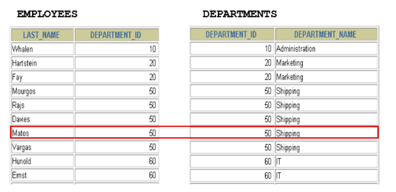
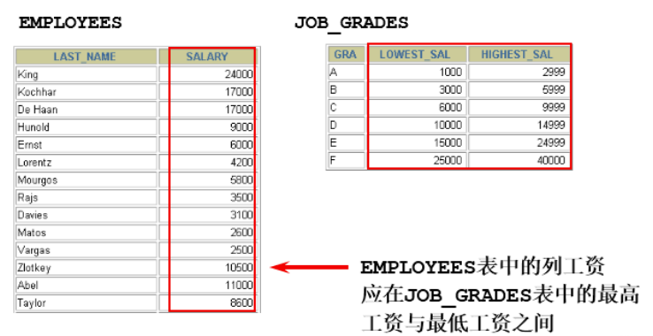
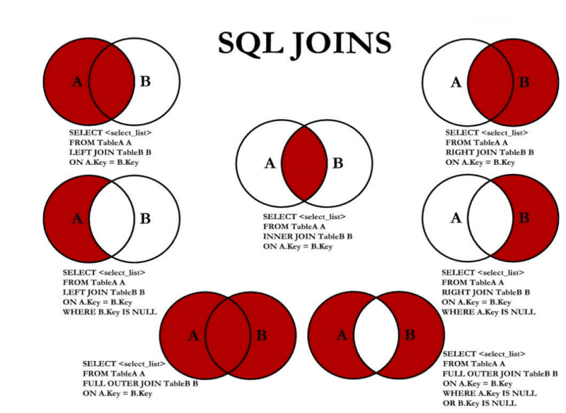

约束

**为什么需要约束**

数据完整性（Data Integrity）是指数据的精确性（Accuracy）和可靠性（Reliability）。它是防止数据库中存在不符合语义规定的数据和防止因错误信息的输入输出造成无效操作或错误信息而提出的。

为了保证数据的完整性，SQL规范以约束的方式对表数据进行额外的条件限制。从以下四个方面考虑：

- `实体完整性（Entity Integrity）`：例如，同一个表中，不能存在两条完全相同无法区分的记录（可以通过主键约束)
- `域完整性（Domain Integrity）`：例如：年龄范围0-120，性别范围“男/女”
- `引用完整性（Referential Integrity）`：例如：员工所在部门，在部门表中要能找到这个部门
- `用户自定义完整性（User-defined Integrity）`：例如：用户名唯一、密码不能为空等，本部门经理的工资不得高于本部门职工的平均工资的5倍。

**什么是约束**

约束是表级的强制规定。

可以在创建表时规定约束（通过 CREATE TABLE 语句），或者在 表创建之后通过 ALTER TABLE 语句规定约束。

## 约束的分类

- 根据约束数据列的限制，约束可分为：
  - 单列约束：每个约束只约束一列
  - 多列约束：每个约束可约束多列数据
- 根据约束的作用范围，约束可分为：
  - 列级约束：只能作用在一个列上，跟在列的定义后面
  - 表级约束：可以作用在多个列上，不与列一起，而是单独定义

|            | 位置         | 支持的约束类型             | 是否可以起约束名     |
| :--------- | :----------- | :------------------------- | :------------------- |
| 列级约束： | 列的后面     | 语法都支持，但外键没有效果 | 不可以               |
| 表级约束： | 所有列的下面 | 默认和非空不支持，其他支持 | 可以（主键没有效果） |

- 根据约束起的作用，约束可分为：
  - NOT NULL 非空约束，规定某个字段不能为空
  - UNIQUE 唯一约束，规定某个字段在整个表中是唯一的
  - PRIMARY KEY 主键(非空且唯一)约束
  - FOREIGN KEY 外键约束(表与表之间的关系，多对多，一对多)
  - CHECK 检查约束
  - DEFAULT 默认值约束（初始的默认值)

> 注意： MySQL不支持check约束，但可以使用check约束，而没有任何效果

- 查看某个表已有的约束

```
-- information_schema 数据库名（系统库）
-- table_constraints 表名称（专门存储各个表的约束）
SELECT *
FROM information_schema.table_constraints
WHERE table_name = '表名称';
```


## 非空约束

**作用：** 限定某个字段/某列的值不允许为空

**关键字：** NOT NULL

**特点**

- 默认，所有的类型的值都可以是 `NULL`，包括 `INT`、`FLOAT` 等数据类型
- 非空约束只能出现在表对象的列上，只能某个列单独限定非空，不能组合非空
- 一个表可以有很多列都分别限定了非空
- 空字符串 `''` 不等于 `NULL`，`0` 也不等于 `NULL`

### 添加非空约束

（1）建表时

```
CREATE TABLE 表名称
(
    字段名 数据类型,
    字段名 数据类型 NOT NULL,
    字段名 数据类型 NOT NULL
);
```


举例：

```
CREATE TABLE emp
(
    id   INT(10) NOT NULL,
    NAME VARCHAR(20) NOT NULL,
    sex  CHAR NULL
);
```


```
CREATE TABLE student
(
    sid    int,
    sname  varchar(20) not null,
    tel    char(11),
    cardid char(18)    not null
);
```


```
insert into student values (1, '张三', '13710011002', '110222198912032545'); -- 成功

insert into student values (2, '李四', '13710011002', null);  --身份证号为空
ERROR 1048 (23000): Column 'cardid' cannot be null

insert into student values(2,'李四',null,'110222198912032546');  --成功，tel允许为空

insert into student values(3,null,null,'110222198912032547');  --失败
ERROR 1048 (23000): Column 'sname' cannot be null
```


（2）建表后

```
alter table 表名称 modify 字段名 数据类型 not null;
```


举例：

```
ALTER TABLE emp
    MODIFY sex VARCHAR (30) NOT NULL;
```


```
alter table student modify sname varchar (20) not null;
```


### 删除非空约束

```
alter table 表名称 modify 字段名 数据类型 NULL;
--去掉 not null，相当于修改某个非注解字段，该字段允许为空

-- 或 

-- 去掉not null，相当于修改某个非注解字段，该字段允许为空
alter table 表名称 modify 字段名 数据类型;
```


举例：

```
ALTER TABLE emp
    MODIFY sex VARCHAR (30) NULL;
```


```
ALTER TABLE emp
    MODIFY NAME VARCHAR (15) DEFAULT 'abc' NULL;
```


## 唯一性约束

**作用：** 用来限制某个字段/某列的值不能重复。

**关键字：** UNIQUE

**特点**

- 同一个表可以有多个唯一约束。
- 唯一约束可以是某一个列的值唯一，也可以多个列组合的值唯一。
- 唯一性约束允许列值为空。
- 在创建唯一约束的时候，如果不给唯一约束命名，就默认和列名相同。
- MySQL会给唯一约束的列上默认创建一个唯一索引。

### 添加唯一约束

（1）建表时

```
create table 表名称
(
    字段名 数据类型,
    字段名 数据类型 unique,
    字段名 数据类型 unique key,
    字段名 数据类型
);
```


```
create table 表名称(
	字段名  数据类型,
    字段名  数据类型,  
    字段名  数据类型,
    [constraint 约束名] unique key(字段名)
);
```


举例：

```
create table student
(
    sid    int,
    sname  varchar(20),
    tel    char(11) unique,
    cardid char(18) unique key
);
```


```
CREATE TABLE t_course
(
    cid         INT UNIQUE,
    cname       VARCHAR(100) UNIQUE,
    description VARCHAR(200)
);
```


符合唯一索引

```
CREATE TABLE USER
(
    id       INT NOT NULL,
    NAME     VARCHAR(25),
    PASSWORD VARCHAR(16),
    -- 使用表级约束语法
    CONSTRAINT uk_name_pwd UNIQUE (NAME, PASSWORD)
);
```


表示用户名和密码组合不能重复

```
insert into student
values (1, '张三', '13710011002', '101223199012015623');
insert into student
values (2, '李四', '13710011003', '101223199012015624');
```


```
mysql> select * from student;
+-----+-------+-------------+--------------------+
| sid | sname | tel         | cardid             |
+-----+-------+-------------+--------------------+
|   1 | 张三  | 13710011002 | 101223199012015623 |
|   2 | 李四  | 13710011003 | 101223199012015624 |
+-----+-------+-------------+--------------------+
2 rows in set (0.00 sec)
```


```
insert into student
values (3, '王五', '13710011004', '101223199012015624');
-- 身份证号重复
-- ERROR 1062 (23000): Duplicate entry '101223199012015624' for key 'cardid'

insert into student
values (3, '王五', '13710011003', '101223199012015625');
ERROR
1062 (23000): Duplicate entry '13710011003' for key 'tel'
```


（2）建表后指定唯一键约束

```
-- 字段列表中如果是一个字段，表示该列的值唯一。如果是两个或更多个字段，那么复合唯一，即多个字段的组合是唯一的
-- 方式1：
alter table 表名称
    add unique key (字段列表);
```


```
-- 方式2：
alter table 表名称 modify 字段名 字段类型 unique;
```


举例：

```
ALTER TABLE USER
    ADD UNIQUE (NAME, PASSWORD);
```


```
ALTER TABLE USER
    ADD CONSTRAINT uk_name_pwd UNIQUE (NAME, PASSWORD);
```


```
ALTER TABLE USER
    MODIFY NAME VARCHAR (20) UNIQUE;
```


举例：

```
create table student
(
    sid    int primary key,
    sname  varchar(20),
    tel    char(11),
    cardid char(18)
);
```


```
alter table student
    add unique key (tel);

alter table student
    add unique key (cardid);
```


### 关于复合唯一约束

```
create table 表名称
(
    字段名 数据类型,
    字段名 数据类型,
    字段名 数据类型,
    unique key (字段列表) -- 字段列表中写的是多个字段名，多个字段名用逗号分隔，表示那么是复合唯一，即多个字段的组合是唯一的
);
```


```
-- 学生表
create table student
(
    sid    int,                 -- 学号
    sname  varchar(20),         -- 姓名
    tel    char(11) unique key, -- 电话
    cardid char(18) unique key  -- 身份证号
);

-- 课程表
create table course
(
    cid   int,        -- 课程编号
    cname varchar(20) -- 课程名称
);

-- 选课表
create table student_course
(
    id    int,
    sid   int,
    cid   int,
    score int,
    unique key (sid,cid) -- 复合唯一
);
```


```
insert into student
values (1, '张三', '13710011002', '101223199012015623');-- 成功

insert into student
values (2, '李四', '13710011003', '101223199012015624');-- 成功

insert into course
values (1001, 'Java'),
       (1002, 'MySQL');--成功
```


```
mysql> select * from student;
+-----+-------+-------------+--------------------+
| sid | sname | tel         | cardid             |
+-----+-------+-------------+--------------------+
|   1 | 张三  | 13710011002 | 101223199012015623 |
|   2 | 李四  | 13710011003 | 101223199012015624 |
+-----+-------+-------------+--------------------+
2 rows in set (0.00 sec)

mysql> select * from course;
+------+-------+
| cid  | cname |
+------+-------+
| 1001 | Java  |
| 1002 | MySQL |
+------+-------+
2 rows in set (0.00 sec)
```


```
insert into student_course
values (1, 1, 1001, 89),
       (2, 1, 1002, 90),
       (3, 2, 1001, 88),
       (4, 2, 1002, 56);
-- 成功
```


```
mysql> select * from student_course;
+----+------+------+-------+
| id | sid  | cid  | score |
+----+------+------+-------+
|  1 |    1 | 1001 |    89 |
|  2 |    1 | 1002 |    90 |
|  3 |    2 | 1001 |    88 |
|  4 |    2 | 1002 |    56 |
+----+------+------+-------+
4 rows in set (0.00 sec)
```


```
insert into student_course
values (5, 1, 1001, 88);
-- 失败

-- ERROR 1062 (23000): Duplicate entry '1-1001' for key 'sid'   违反sid-cid的复合唯一
```


### 删除唯一约束

- 添加唯一性约束的列上也会自动创建唯一索引。
- 删除唯一约束只能通过删除唯一索引的方式删除。
- 删除时需要指定唯一索引名，唯一索引名就和唯一约束名一样。
- 如果创建唯一约束时未指定名称，如果是单列，就默认和列名相同；如果是组合列，那么默认和()中排在第一个的列名相同。也可以自定义唯一性约束名。

```
SELECT *
FROM information_schema.table_constraints
WHERE table_name = '表名'; -- 查看都有哪些约束
```


```
ALTER TABLE USER
DROP INDEX uk_name_pwd;
```


> 注意：可以通过 `show index from 表名称; `查看表的索引

## PRIMARY KEY 约束

**作用：** 用来唯一标识表中的一行记录。

**关键字：** primary key

**特点**

- 主键约束相当于唯一约束+非空约束的组合，主键约束列不允许重复，也不允许出现空值。
- 一个表最多只能有一个主键约束，建立主键约束可以在列级别创建，也可以在表级别上创建。
- 主键约束对应着表中的一列或者多列（复合主键）复合主键约束就是多个列一般不会使用对表的限制太大了，不灵活
- 如果是多列组合的复合主键约束，那么这些列都不允许为空值，并且组合的值不允许重复。
- MySQL的主键名总是PRIMARY，就算自己命名了主键约束名也没用。
- 当创建主键约束时，系统默认会在所在的列或列组合上建立对应的主键索引 （能够根据主键查询的，就根据主键查询，效率更高）。如果删除主键约束了，主键约束对应的索引就自动删除了。
- 需要注意的一点是，不要修改主键字段的值。因为主键是数据记录的唯一标识，如果修改了主键的值，就有可能会破坏数据的完整性。

### 添加主键约束

（1）建表时指定主键约束


```
create table 表名称(
	字段名  数据类型  primary key, -- 列级模式
    字段名  数据类型,  
    字段名  数据类型  
);

create table 表名称(
	字段名  数据类型,
    字段名  数据类型,  
    字段名  数据类型,
    [constraint 约束名] primary key(字段名) -- 表级模式
);
```


举例：

```
create table temp
(
    id   int primary key,
    name varchar(20)
);
```


```
mysql> desc temp;
+-------+-------------+------+-----+---------+-------+
| Field | Type        | Null | Key | Default | Extra |
+-------+-------------+------+-----+---------+-------+
| id    | int(11)     | NO   | PRI | NULL    |       |
| name  | varchar(20) | YES  |     | NULL    |       |
+-------+-------------+------+-----+---------+-------+
2 rows in set (0.00 sec)
```


```
insert into temp
values (1, '张三');-- 成功
insert into temp
values (2, '李四');-- 成功
```


```
mysql> select * from temp;
+----+------+
| id | name |
+----+------+
|  1 | 张三 |
|  2 | 李四 |
+----+------+
2 rows in set (0.00 sec)
```


```
insert into temp values(1,'张三');--失败
ERROR 1062 (23000): Duplicate（重复） entry（键入，输入） '1' for key 'PRIMARY'

insert into temp values(1,'王五');--失败
ERROR 1062 (23000): Duplicate entry '1' for key 'PRIMARY'

insert into temp values(3,'张三');--成功
```


```
mysql> select * from temp;
+----+------+
| id | name |
+----+------+
|  1 | 张三 |
|  2 | 李四 |
|  3 | 张三 |
+----+------+
3 rows in set (0.00 sec)
```


```
insert into temp values(4,null);--成功

insert into temp values(null,'李琦');--失败
ERROR 1048 (23000): Column 'id' cannot be null
```


```
mysql> select * from temp;
+----+------+
| id | name |
+----+------+
|  1 | 张三 |
|  2 | 李四 |
|  3 | 张三 |
|  4 | NULL |
+----+------+
4 rows in set (0.00 sec)
```


```
-- 演示一个表建立两个主键约束
create table temp(
	id int primary key,
    name varchar(20) primary key
);
ERROR 1068 (42000): Multiple（多重的） primary key defined（定义）
```


再举例：

- 列级约束

```
CREATE TABLE emp4
(
    id   INT PRIMARY KEY AUTO_INCREMENT,
    NAME VARCHAR(20)
);
```


- 表级约束

```
CREATE TABLE emp5
(
    id   INT NOT NULL AUTO_INCREMENT,
    NAME VARCHAR(20),
    pwd  VARCHAR(15),
    CONSTRAINT emp5_id_pk PRIMARY KEY (id)
);
```


（2）建表后增加主键约束

```
ALTER TABLE 表名称
    ADD PRIMARY KEY (字段列表); -- 字段列表可以是一个字段，也可以是多个字段，如果是多个字段的话，是复合主键
```


```
ALTER TABLE student
    ADD PRIMARY KEY (sid);
```


```
ALTER TABLE emp5
    ADD PRIMARY KEY (NAME, pwd);
```


### 关于复合主键

```
create table 表名称
(
    字段名 数据类型,
    字段名 数据类型,
    字段名 数据类型,
    primary key (字段名1, 字段名2) --表示字段1和字段2的组合是唯一的，也可以有更多个字段
);
```


```
-- 学生表
create table student
(
    sid   int primary key, -- 学号
    sname varchar(20)      -- 学生姓名
);

-- 课程表
create table course
(
    cid   int primary key, -- 课程编号
    cname varchar(20)      -- 课程名称
);

-- 选课表
create table student_course
(
    sid   int,
    cid   int,
    score int,
    primary key (sid, cid) -- 复合主键
);
```


```
insert into student
values (1, '张三'),
       (2, '李四');

insert into course
values (1001, 'Java'),
       (1002, 'MySQL');
```


```
mysql> select * from student;
+-----+-------+
| sid | sname |
+-----+-------+
|   1 | 张三  |
|   2 | 李四  |
+-----+-------+
2 rows in set (0.00 sec)

mysql> select * from course;
+------+-------+
| cid  | cname |
+------+-------+
| 1001 | Java  |
| 1002 | MySQL |
+------+-------+
2 rows in set (0.00 sec)
```


```
insert into student_course
values (1, 1001, 89),
       (1, 1002, 90),
       (2, 1001, 88),
       (2, 1002, 56);
```


```
mysql> select * from student_course;
+-----+------+-------+
| sid | cid  | score |
+-----+------+-------+
|   1 | 1001 |    89 |
|   1 | 1002 |    90 |
|   2 | 1001 |    88 |
|   2 | 1002 |    56 |
+-----+------+-------+
4 rows in set (0.00 sec)
```


```
insert into student_course values(1, 1001, 100);
ERROR 1062 (23000): Duplicate entry '1-1001' for key 'PRIMARY'
```


```
mysql> desc student_course;
+-------+---------+------+-----+---------+-------+
| Field | Type    | Null | Key | Default | Extra |
+-------+---------+------+-----+---------+-------+
| sid   | int(11) | NO   | PRI | NULL    |       |
| cid   | int(11) | NO   | PRI | NULL    |       |
| score | int(11) | YES  |     | NULL    |       |
+-------+---------+------+-----+---------+-------+
3 rows in set (0.00 sec)
```


- 再举例


```
CREATE TABLE emp6
(
    id   INT NOT NULL,
    NAME VARCHAR(20),
    pwd  VARCHAR(15),
    CONSTRAINT emp7_pk PRIMARY KEY (NAME, pwd)
);
```


### 删除主键约束


```
alter table 表名称 drop primary key;
```


举例：


```
ALTER TABLE student DROP PRIMARY KEY;
```


```
ALTER TABLE emp5 DROP PRIMARY KEY;
```


> 说明：删除主键约束，不需要指定主键名，因为一个表只有一个主键，删除主键约束后，非空还存在。

## 自增列：AUTO_INCREMENT

**作用：** 某个字段的值自增

**关键字：** auto_increment

**特点和要求**

（1）一个表最多只能有一个自增长列

（2）当需要产生唯一标识符或顺序值时，可设置自增长

（3）自增长列约束的列必须是键列（主键列，唯一键列）

（4）自增约束的列的数据类型必须是整数类型

（5）如果自增列指定了 0 和 null，会在当前最大值的基础上自增；如果自增列手动指定了具体值，直接赋值为具体值。

错误演示：


```
create table employee
(
    eid   int auto_increment,
    ename varchar(20)
);
-- ERROR 1075 (42000): Incorrect table definition; there can be only one auto column and it must be defined as a key
```


```
create table employee(
	eid int primary key,
    ename varchar(20) unique key auto_increment
);
-- ERROR 1063 (42000): Incorrect column specifier for column 'ename'  因为 ename 不是整数类型
```


### 如何指定自增约束

（1）建表时


```
create table 表名称
(
    字段名 数据类型 primary key auto_increment,
    字段名 数据类型 unique key not null,
    字段名 数据类型 unique key,
    字段名 数据类型 not null default 默认值,
);

create table 表名称
(
    字段名 数据类型          default 默认值,
    字段名 数据类型 unique key auto_increment,
    字段名 数据类型 not null default 默认值, ,
    primary key (字段名)
);
```


```
create table employee
(
    eid   int primary key auto_increment,
    ename varchar(20)
);
```


```
mysql> desc employee;
+-------+-------------+------+-----+---------+----------------+
| Field | Type        | Null | Key | Default | Extra          |
+-------+-------------+------+-----+---------+----------------+
| eid   | int(11)     | NO   | PRI | NULL    | auto_increment |
| ename | varchar(20) | YES  |     | NULL    |                |
+-------+-------------+------+-----+---------+----------------+
2 rows in set (0.00 sec)
```


（2）建表后


```
alter table 表名称 modify 字段名 数据类型 auto_increment;
```

1

例如：


```
create table employee
(
    eid   int primary key,
    ename varchar(20)
);
```


```
alter table employee modify eid int auto_increment;
```


```
mysql> desc employee;
+-------+-------------+------+-----+---------+----------------+
| Field | Type        | Null | Key | Default | Extra          |
+-------+-------------+------+-----+---------+----------------+
| eid   | int(11)     | NO   | PRI | NULL    | auto_increment |
| ename | varchar(20) | YES  |     | NULL    |                |
+-------+-------------+------+-----+---------+----------------+
2 rows in set (0.00 sec)
```


### 如何删除自增约束

```
alter table 表名称 modify 字段名 数据类型 auto_increment;--给这个字段增加自增约束

alter table 表名称 modify 字段名 数据类型; -- 去掉auto_increment相当于删除
```


```
alter table employee modify eid int;
```


```
mysql> desc employee;
+-------+-------------+------+-----+---------+-------+
| Field | Type        | Null | Key | Default | Extra |
+-------+-------------+------+-----+---------+-------+
| eid   | int(11)     | NO   | PRI | NULL    |       |
| ename | varchar(20) | YES  |     | NULL    |       |
+-------+-------------+------+-----+---------+-------+
2 rows in set (0.00 sec)
```


## FOREIGN KEY 约束[

**作用：** 限定某个表的某个字段的引用完整性。

比如：员工表的员工所在部门的选择，必须在部门表能找到对应的部分。

**关键字：** FOREIGN KEY

**主表和从表/父表和子表**

主表（父表）：被引用的表，被参考的表

从表（子表）：引用别人的表，参考别人的表

例如：员工表的员工所在部门这个字段的值要参考部门表：部门表是主表，员工表是从表。

例如：学生表、课程表、选课表：选课表的学生和课程要分别参考学生表和课程表，学生表和课程表是主表，选课表是从表。

**特点**

（1）从表的外键列，必须引用/参考主表的主键或唯一约束的列。为什么？因为被依赖/被参考的值必须是唯一的

（2）在创建外键约束时，如果不给外键约束命名，默认名不是列名，而是自动产生一个外键名（例如 student_ibfk_1;），也可以指定外键约束名。

（3）创建(CREATE)表时就指定外键约束的话，先创建主表，再创建从表

（4）删表时，先删从表（或先删除外键约束），再删除主表

（5）当主表的记录被从表参照时，主表的记录将不允许删除，如果要删除数据，需要先删除从表中依赖该记录的数据，然后才可以删除主表的数据

（6）在“从表”中指定外键约束，并且一个表可以建立多个外键约束

（7）从表的外键列与主表被参照的列名字可以不相同，但是数据类型必须一样，逻辑意义一致。如果类型不一样，创建子表时，就会出现错误“ERROR 1005 (HY000): Can't create table'database.tablename'(errno: 150)”。

例如：都是表示部门编号，都是int类型。

（8）当创建外键约束时，系统默认会在所在的列上建立对应的普通索引。但是索引名是外键的约束名。（根据外键查询效率很高）

（9）删除外键约束后，必须`手动`删除对应的索引

### 添加外键约束

（1）建表时


```
create table 主表名称(
	字段1  数据类型  primary key,
    字段2  数据类型
);

create table 从表名称(
	字段1  数据类型  primary key,
    字段2  数据类型,
    [CONSTRAINT <外键约束名称>] FOREIGN KEY（从表的某个字段) references 主表名(被参考字段)
);
-- (从表的某个字段)的数据类型必须与主表名(被参考字段)的数据类型一致，逻辑意义也一样
-- (从表的某个字段)的字段名可以与主表名(被参考字段)的字段名一样，也可以不一样

-- FOREIGN KEY: 在表级指定子表中的列
-- REFERENCES: 标示在父表中的列
```


```
create table dept
(                          -- 主表
    did   int primary key, -- 部门编号
    dname varchar(50)      -- 部门名称
);

create table emp
(-- 从表
    eid    int primary key, -- 员工编号
    ename  varchar(5), -- 员工姓名
    deptid int, -- 员工所在的部门
    foreign key (deptid) references dept (did) -- 在从表中指定外键约束
    -- emp 表的 deptid 和和 dept 表的 did 的数据类型一致，意义都是表示部门的编号
);
/*
说明：
（1）主表dept必须先创建成功，然后才能创建emp表，指定外键成功。
（2）删除表时，先删除从表emp，再删除主表dept
*/
```


（2）建表后

一般情况下，表与表的关联都是提前设计好了的，因此，会在创建表的时候就把外键约束定义好。不过，如果需要修改表的设计（比如添加新的字段，增加新的关联关系），但没有预先定义外键约束，那么，就要用修改表的方式来补充定义。

格式：


```
ALTER TABLE 从表名 ADD [CONSTRAINT 约束名] FOREIGN KEY (从表的字段) REFERENCES 主表名(被引用字段) [on update xx][on delete xx];
```


举例：


```
ALTER TABLE emp1
ADD [CONSTRAINT emp_dept_id_fk] FOREIGN KEY(dept_id) REFERENCES dept(dept_id);
```


举例：


```
create table dept
(
    did   int primary key, -- 部门编号
    dname varchar(50)      -- 部门名称
);

create table emp
(
    eid    int primary key, -- 员工编号
    ename  varchar(5),      -- 员工姓名
    deptid int              -- 员工所在的部门
);
-- 这两个表创建时，没有指定外键的话，那么创建顺序是随意
```


```
alter table emp
    add foreign key (deptid) references dept (did);
```


### 演示问题

（1）失败：不是键列


```
create table dept
(
    did   int,        -- 部门编号
    dname varchar(50) -- 部门名称
);

create table emp
(
    eid    int primary key, -- 员工编号
    ename  varchar(5),      -- 员工姓名
    deptid int,             -- 员工所在的部门
    foreign key (deptid) references dept (did)
);
-- ERROR 1215 (HY000): Cannot add foreign key constraint  原因是dept的did不是键列
```


（2）失败：数据类型不一致


```
create table dept
(
    did   int primary key, -- 部门编号
    dname varchar(50)      -- 部门名称
);

create table emp
(
    eid    int primary key, -- 员工编号
    ename  varchar(5),      -- 员工姓名
    deptid char,            -- 员工所在的部门
    foreign key (deptid) references dept (did)
);
-- ERROR 1215 (HY000): Cannot add foreign key constraint  原因是从表的deptid字段和主表的did字段的数据类型不一致，并且要它俩的逻辑意义一致
```


（3）成功，两个表字段名一样


```
create table dept
(
    did   int primary key, -- 部门编号
    dname varchar(50)      -- 部门名称
);

create table emp
(
    eid   int primary key, -- 员工编号
    ename varchar(5),      -- 员工姓名
    did   int,             -- 员工所在的部门
    foreign key (did) references dept (did)
    -- emp表的deptid和和dept表的did的数据类型一致，意义都是表示部门的编号
    -- 是否重名没问题，因为两个did在不同的表中
);
```


（4）添加、删除、修改问题


```
create table dept
(
    did   int primary key, -- 部门编号
    dname varchar(50)      -- 部门名称
);

create table emp
(
    eid    int primary key, -- 员工编号
    ename  varchar(5),      -- 员工姓名
    deptid int,             -- 员工所在的部门
    foreign key (deptid) references dept (did)
    -- emp表的deptid和和dept表的did的数据类型一致，意义都是表示部门的编号
);
```


```
insert into dept
values (1001, '教学部');
insert into dept
values (1003, '财务部');

insert into emp
values (1, '张三', 1001); -- 添加从表记录成功，在添加这条记录时，要求部门表有1001部门

insert into emp
values (2, '李四', 1005);
-- 添加从表记录失败
-- ERROR 1452 (23000): Cannot add（添加） or update（修改） a child row: a foreign key constraint fails (`atguigudb`.`emp`, CONSTRAINT `emp_ibfk_1` FOREIGN KEY (`deptid`) REFERENCES `dept` (`did`)) 从表emp添加记录失败，因为主表dept没有1005部门
```


```
mysql> select * from dept;
+------+--------+
| did  | dname  |
+------+--------+
| 1001 | 教学部  |
| 1003 | 财务部  |
+------+--------+
2 rows in set (0.00 sec)

mysql> select * from emp;
+-----+-------+--------+
| eid | ename | deptid |
+-----+-------+--------+
|   1 | 张三   |   1001 |
+-----+-------+--------+
1 row in set (0.00 sec)
```


```
update emp set deptid = 1002 where eid = 1;--修改从表失败 
ERROR 1452 (23000): Cannot add（添加） or update（修改） a child row（子表的记录）: a foreign key constraint fails（外键约束失败） (`atguigudb`.`emp`, CONSTRAINT `emp_ibfk_1` FOREIGN KEY (`deptid`) REFERENCES `dept` (`did`))  --部门表did字段现在没有1002的值，所以员工表中不能修改员工所在部门deptid为1002

update dept set did = 1002 where did = 1001;--修改主表失败
ERROR 1451 (23000): Cannot delete（删除） or update（修改） a parent row（父表的记录）: a foreign key constraint fails (`atguigudb`.`emp`, CONSTRAINT `emp_ibfk_1` FOREIGN KEY (`deptid`) REFERENCES `dept` (`did`)) --部门表did的1001字段已经被emp引用了，所以部门表的1001字段就不能修改了。

update dept set did = 1002 where did = 1003;--修改主表成功  因为部门表的1003部门没有被emp表引用，所以可以修改
```


```
delete from dept where did=1001; --删除主表失败
ERROR 1451 (23000): Cannot delete（删除） or update（修改） a parent row（父表记录）: a foreign key constraint fails (`atguigudb`.`emp`, CONSTRAINT `emp_ibfk_1` FOREIGN KEY (`deptid`) REFERENCES `dept` (`did`))  --因为部门表did的1001字段已经被emp引用了，所以部门表的1001字段对应的记录就不能被删除
```


总结：约束关系是针对双方的

- 添加了外键约束后，主表的修改和删除数据受约束
- 添加了外键约束后，从表的添加和修改数据受约束
- 在从表上建立外键，要求主表必须存在
- 删除主表时，要求从表从表先删除，或将从表中外键引用该主表的关系先删除

### 约束等级

- `Cascade方式`：在父表上 update/delete 记录时，同步 update/delete 掉子表的匹配记录
- `Set null方式`：在父表上 update/delete 记录时，将子表上匹配记录的列设为null，但是要注意子表的外键列不能为 not null
- `No action方式`：如果子表中有匹配的记录，则不允许对父表对应候选键进行 update/delete 操作
- `Restrict方式`：同 no action， 都是立即检查外键约束
- `Set default方式`（在可视化工具 SQLyog 中可能显示空白）：父表有变更时，子表将外键列设置成一个默认的值，但 Innodb 不能识别

如果没有指定等级，就相当于 Restrict 方式。

对于外键约束，最好是采用: `ON UPDATE CASCADE ON DELETE RESTRICT` 的方式。

（1）演示1：on update cascade on delete set null


```
create table dept
(
    did   int primary key, --部门编号
    dname varchar(50)      --部门名称
);

create table emp
(
    eid    int primary key, --员工编号
    ename  varchar(5),      --员工姓名
    deptid int,             --员工所在的部门
    foreign key (deptid) references dept (did) on update cascade on delete set null
    --把修改操作设置为级联修改等级，把删除操作设置为set null等级
);
```


```
insert into dept values(1001,'教学部');
insert into dept values(1002, '财务部');
insert into dept values(1003, '咨询部');


insert into emp values(1,'张三',1001); --在添加这条记录时，要求部门表有1001部门
insert into emp values(2,'李四',1001);
insert into emp values(3,'王五',1002);
```


```
mysql> select * from dept;

mysql> select * from emp;
```


```
--修改主表成功，从表也跟着修改，修改了主表被引用的字段1002为1004，从表的引用字段就跟着修改为1004了
mysql> update dept set did = 1004 where did = 1002;
Query OK, 1 row affected (0.00 sec)
Rows matched: 1  Changed: 1  Warnings: 0

mysql> select * from dept;
+------+--------+
| did  | dname  |
+------+--------+
| 1001 | 教学部 |
| 1003 | 咨询部 |
| 1004 | 财务部 | --原来是1002，修改为1004
+------+--------+
3 rows in set (0.00 sec)

mysql> select * from emp;
+-----+-------+--------+
| eid | ename | deptid |
+-----+-------+--------+
|   1 | 张三  |   1001 |
|   2 | 李四  |   1001 |
|   3 | 王五  |   1004 | --原来是1002，跟着修改为1004
+-----+-------+--------+
3 rows in set (0.00 sec)
```


```
--删除主表的记录成功，从表对应的字段的值被修改为null
mysql> delete from dept where did = 1001;
Query OK, 1 row affected (0.01 sec)

mysql> select * from dept;
+------+--------+
| did  | dname  | --记录1001部门被删除了
+------+--------+
| 1003 | 咨询部  |
| 1004 | 财务部  |
+------+--------+
2 rows in set (0.00 sec)

mysql> select * from emp;
+-----+-------+--------+
| eid | ename | deptid |
+-----+-------+--------+
|   1 | 张三  |   NULL | --原来引用1001部门的员工，deptid字段变为null
|   2 | 李四  |   NULL |
|   3 | 王五  |   1004 |
+-----+-------+--------+
3 rows in set (0.00 sec)
```


（2）演示2：on update set null on delete cascade


```
create table dept
(
    did   int primary key, --部门编号
    dname varchar(50)      --部门名称
);

create table emp
(
    eid    int primary key, --员工编号
    ename  varchar(5),      --员工姓名
    deptid int,             --员工所在的部门
    foreign key (deptid) references dept (did) on update set null on delete cascade
    --把修改操作设置为set null等级，把删除操作设置为级联删除等级
);
```


```
insert into dept values(1001,'教学部');
insert into dept values(1002, '财务部');
insert into dept values(1003, '咨询部');

insert into emp values(1,'张三',1001); --在添加这条记录时，要求部门表有1001部门
insert into emp values(2,'李四',1001);
insert into emp values(3,'王五',1002);
```


```
mysql> select * from dept;
+------+--------+
| did  | dname  |
+------+--------+
| 1001 | 教学部 |
| 1002 | 财务部 |
| 1003 | 咨询部 |
+------+--------+
3 rows in set (0.00 sec)

mysql> select * from emp;
+-----+-------+--------+
| eid | ename | deptid |
+-----+-------+--------+
|   1 | 张三  |   1001 |
|   2 | 李四  |   1001 |
|   3 | 王五  |   1002 |
+-----+-------+--------+
3 rows in set (0.00 sec)
```


```
-- 修改主表，从表对应的字段设置为null
mysql> update dept set did = 1004 where did = 1002;
Query OK, 1 row affected (0.00 sec)
Rows matched: 1  Changed: 1  Warnings: 0

mysql> select * from dept;
+------+--------+
| did  | dname  |
+------+--------+
| 1001 | 教学部 |
| 1003 | 咨询部 |
| 1004 | 财务部 | --原来did是1002
+------+--------+
3 rows in set (0.00 sec)

mysql> select * from emp;
+-----+-------+--------+
| eid | ename | deptid |
+-----+-------+--------+
|   1 | 张三  |   1001 |
|   2 | 李四  |   1001 |
|   3 | 王五  |   NULL | --原来deptid是1002，因为部门表1002被修改了，1002没有对应的了，就设置为null
+-----+-------+--------+
3 rows in set (0.00 sec)
```


```
--删除主表的记录成功，主表的1001行被删除了，从表相应的记录也被删除了
mysql> delete from dept where did=1001;
Query OK, 1 row affected (0.00 sec)

mysql> select * from dept;
+------+--------+
| did  | dname  | --部门表中1001部门被删除
+------+--------+
| 1003 | 咨询部 |
| 1004 | 财务部 |
+------+--------+
2 rows in set (0.00 sec)

mysql> select * from emp;
+-----+-------+--------+
| eid | ename | deptid |--原来1001部门的员工也被删除了
+-----+-------+--------+
|   3 | 王五  |   NULL |
+-----+-------+--------+
1 row in set (0.00 sec)
```


（3）演示：on update cascade on delete cascade


```
create table dept
(
    did   int primary key, --部门编号
    dname varchar(50)      --部门名称
);

create table emp
(
    eid    int primary key, --员工编号
    ename  varchar(5),      --员工姓名
    deptid int,             --员工所在的部门
    foreign key (deptid) references dept (did) on update cascade on delete cascade
    --把修改操作设置为级联修改等级，把删除操作也设置为级联删除等级
);
```


```
insert into dept values(1001,'教学部');
insert into dept values(1002, '财务部');
insert into dept values(1003, '咨询部');

insert into emp values(1,'张三',1001); --在添加这条记录时，要求部门表有1001部门
insert into emp values(2,'李四',1001);
insert into emp values(3,'王五',1002);
```


```
mysql> select * from dept;
+------+--------+
| did  | dname  |
+------+--------+
| 1001 | 教学部 |
| 1002 | 财务部 |
| 1003 | 咨询部 |
+------+--------+
3 rows in set (0.00 sec)

mysql> select * from emp;
+-----+-------+--------+
| eid | ename | deptid |
+-----+-------+--------+
|   1 | 张三  |   1001 |
|   2 | 李四  |   1001 |
|   3 | 王五  |   1002 |
+-----+-------+--------+
3 rows in set (0.00 sec)
```


```
--修改主表，从表对应的字段自动修改
mysql> update dept set did = 1004 where did = 1002;
Query OK, 1 row affected (0.00 sec)
Rows matched: 1  Changed: 1  Warnings: 0

mysql> select * from dept;
+------+--------+
| did  | dname  |
+------+--------+
| 1001 | 教学部 |
| 1003 | 咨询部 |
| 1004 | 财务部 | --部门1002修改为1004
+------+--------+
3 rows in set (0.00 sec)

mysql> select * from emp;
+-----+-------+--------+
| eid | ename | deptid |
+-----+-------+--------+
|   1 | 张三  |   1001 |
|   2 | 李四  |   1001 |
|   3 | 王五  |   1004 | --级联修改
+-----+-------+--------+
3 rows in set (0.00 sec)
```


```
--删除主表的记录成功，主表的1001行被删除了，从表相应的记录也被删除了
mysql> delete from dept where did=1001;
Query OK, 1 row affected (0.00 sec)

mysql> select * from dept;
+------+--------+
| did  | dname  | --1001部门被删除了
+------+--------+
| 1003 | 咨询部 |
| 1004 | 财务部 | 
+------+--------+
2 rows in set (0.00 sec)

mysql> select * from emp;
+-----+-------+--------+
| eid | ename | deptid |  --1001部门的员工也被删除了
+-----+-------+--------+
|   3 | 王五  |   1004 |
+-----+-------+--------+
1 row in set (0.00 sec)
```


### 删除外键约束

流程如下：


```
(1)第一步先查看约束名和删除外键约束

SELECT * FROM information_schema.table_constraints WHERE table_name = '表名称';--查看某个表的约束名

ALTER TABLE 从表名 DROP FOREIGN KEY 外键约束名;

（2）第二步查看索引名和删除索引。（注意，只能手动删除）
SHOW INDEX FROM 表名称; --查看某个表的索引名

ALTER TABLE 从表名 DROP INDEX 索引名;
```


举例：


```
mysql> SELECT * FROM information_schema.table_constraints WHERE table_name = 'emp';

mysql> alter table emp drop foreign key emp_ibfk_1;
Query OK, 0 rows affected (0.02 sec)
Records: 0  Duplicates: 0  Warnings: 0
```


```
mysql> show index from emp;

mysql> alter table emp drop index deptid;
Query OK, 0 rows affected (0.01 sec)
Records: 0  Duplicates: 0  Warnings: 0

mysql>  show index from emp;
```


### 开发场景

问题1：如果两个表之间有关系（一对一、一对多），比如：员工表和部门表（一对多），它们之间是否一定要建外键约束？

答：不是的

问题2：建和不建外键约束有什么区别？

答：建外键约束，你的操作（创建表、删除表、添加、修改、删除）会受到限制，从语法层面受到限制。例如：在员工表中不可能添加一个员工信息，它的部门的值在部门表中找不到。

不建外键约束，你的操作（创建表、删除表、添加、修改、删除）不受限制，要保证数据的`引用完整性`，只能依`靠程序员的自觉` ，或者是`在Java程序中进行限定`。例如：在员工表中，可以添加一个员工的信息，它的部门指定为一个完全不存在的部门。

问题3：那么建和不建外键约束和查询有没有关系？

答：没有

> 在 MySQL 里，外键约束是有成本的，需要消耗系统资源。对于大并发的 SQL 操作，有可能会不适合。比如大型网站的中央数据库，可能会`因为外键约束的系统开销而变得非常慢`。所以， MySQL 允许你不使用系统自带的外键约束，在`应用层面`完成检查数据一致性的逻辑。也就是说，即使你不用外键约束，也要想办法通过应用层面的附加逻辑，来实现外键约束的功能，确保数据的一致性。

### 阿里开发规范

【`强制`】不得使用外键与级联，一切外键概念必须在应用层解决。

说明：（概念解释）学生表中的 student_id 是主键，那么成绩表中的 student_id 则为外键。如果更新学生表中的 student_id，同时触发成绩表中的 student_id 更新，即为级联更新。外键与级联更新适用于`单机低并发`，不适合`分布式`、`高并发集群` ；级联更新是强阻塞，存在数据库`更新风暴`的风险；外键影响数据库的`插入速度`。

## CHECK 约束

**作用：** 检查某个字段的值是否符号xx要求，一般指的是值的范围

**关键字：** CHECK

**说明：MySQL 5.7 不支持**

MySQL5.7 可以使用 check 约束，但 check 约束对数据验证没有任何作用。添加数据时，没有任何错误或警告

但是 MySQL 8.0 中可以使用 check 约束了。

sql

```
create table employee
(
    eid    int primary key,
    ename  varchar(5),
    gender char check ('男' or '女')
);
```


```
insert into employee
values (1, '张三', '妖');
```


```
mysql> select * from employee;
+-----+-------+--------+
| eid | ename | gender |
+-----+-------+--------+
|   1 | 张三   | 妖     |
+-----+-------+--------+
1 row in set (0.00 sec)
```


- 再举例


```
CREATE TABLE temp
(
    id   INT AUTO_INCREMENT,
    NAME VARCHAR(20),
    age  INT CHECK (age > 20),
    PRIMARY KEY (id)
);
```


- 再举例


```
age tinyint check(age >20) 或 sex char(2) check(sex in('男','女'))
```


- 再举例


```
CHECK(height>=0 AND height<3)
```


## DEFAULT约束

**作用：** 给某个字段/某列指定默认值，一旦设置默认值，在插入数据时，如果此字段没有显式赋值，则赋值为默认值。

**关键字：** DEFAULT

### 如何给字段加默认值

（1）建表时


```
create table 表名称
(
    字段名 数据类型 primary key,
    字段名 数据类型 unique key not null,
    字段名 数据类型 unique key,
    字段名 数据类型 not null default 默认值,
);
create table 表名称
(
    字段名 数据类型          default 默认值,
    字段名 数据类型 not null default 默认值,
    字段名 数据类型 not null default 默认值,
    primary key (字段名),
    unique key (字段名)
);

-- 说明：默认值约束一般不在唯一键和主键列上加
```


```
create table employee
(
    eid    int primary key,
    ename  varchar(20) not null,
    gender char                 default '男',
    tel    char(11)    not null default '' --默认是空字符串
);
```


```
mysql> desc employee;
+--------+-------------+------+-----+---------+-------+
| Field  | Type        | Null | Key | Default | Extra |
+--------+-------------+------+-----+---------+-------+
| eid    | int(11)     | NO   | PRI | NULL    |       |
| ename  | varchar(20) | NO   |     | NULL    |       |
| gender | char(1)     | YES  |     | 男      |       |
| tel    | char(11)    | NO   |     |         |       |
+--------+-------------+------+-----+---------+-------+
4 rows in set (0.00 sec)
```


```
insert into employee
values (1, '汪飞', '男', '13700102535'); --成功
```


```
mysql> select * from employee;
+-----+-------+--------+-------------+
| eid | ename | gender | tel         |
+-----+-------+--------+-------------+
|   1 | 汪飞  | 男     | 13700102535 |
+-----+-------+--------+-------------+
1 row in set (0.00 sec)
```


```
insert into employee(eid, ename)
values (2, '天琪'); --成功
```


```
mysql> select * from employee;
+-----+-------+--------+-------------+
| eid | ename | gender | tel         |
+-----+-------+--------+-------------+
|   1 | 汪飞  | 男     | 13700102535 |
|   2 | 天琪  | 男     |             |
+-----+-------+--------+-------------+
2 rows in set (0.00 sec)
```


```
insert into employee(eid, ename)
values (3, '二虎');

-- ERROR 1062 (23000): Duplicate entry '' for key 'tel'  
-- 如果 tel 有唯一性约束的话会报错，如果tel没有唯一性约束，可以添加成功
```


再举例：


```
CREATE TABLE myemp
(
    id     INT AUTO_INCREMENT PRIMARY KEY,
    NAME   VARCHAR(15),
    salary DOUBLE(10, 2) DEFAULT 2000
);
```


（2）建表后


```
alter table 表名称 modify 字段名 数据类型 default 默认值;

--如果这个字段原来有非空约束，你还保留非空约束，那么在加默认值约束时，还得保留非空约束，否则非空约束就被删除了
--同理，在给某个字段加非空约束也一样，如果这个字段原来有默认值约束，你想保留，也要在modify语句中保留默认值约束，否则就删除了

alter table 表名称 modify 字段名 数据类型 default 默认值 not null;
```


```
create table employee
(
    eid    int primary key,
    ename  varchar(20),
    gender char,
    tel    char(11) not null
);
```


```
mysql> desc employee;
+--------+-------------+------+-----+---------+-------+
| Field  | Type        | Null | Key | Default | Extra |
+--------+-------------+------+-----+---------+-------+
| eid    | int(11)     | NO   | PRI | NULL    |       |
| ename  | varchar(20) | YES  |     | NULL    |       |
| gender | char(1)     | YES  |     | NULL    |       |
| tel    | char(11)    | NO   |     | NULL    |       |
+--------+-------------+------+-----+---------+-------+
4 rows in set (0.00 sec)
```


```
alter table employee modify gender char default '男'; --给gender字段增加默认值约束
alter table employee modify tel char (11) default ''; --给tel字段增加默认值约束
```


```
mysql> desc employee;
+--------+-------------+------+-----+---------+-------+
| Field  | Type        | Null | Key | Default | Extra |
+--------+-------------+------+-----+---------+-------+
| eid    | int(11)     | NO   | PRI | NULL    |       |
| ename  | varchar(20) | YES  |     | NULL    |       |
| gender | char(1)     | YES  |     | 男      |       |
| tel    | char(11)    | YES  |     |         |       |
+--------+-------------+------+-----+---------+-------+
4 rows in set (0.00 sec)
```


```
alter table employee modify tel char (11) default '' not null;--给tel字段增加默认值约束，并保留非空约束
```


```
mysql> desc employee;
+--------+-------------+------+-----+---------+-------+
| Field  | Type        | Null | Key | Default | Extra |
+--------+-------------+------+-----+---------+-------+
| eid    | int(11)     | NO   | PRI | NULL    |       |
| ename  | varchar(20) | YES  |     | NULL    |       |
| gender | char(1)     | YES  |     | 男      |       |
| tel    | char(11)    | NO   |     |         |       |
+--------+-------------+------+-----+---------+-------+
4 rows in set (0.00 sec)
```


### 如何删除默认值约束

```
alter table 表名称 modify 字段名 数据类型;--删除默认值约束，也不保留非空约束

alter table 表名称 modify 字段名 数据类型 not null; --删除默认值约束，保留非空约束
```


```
alter table employee modify gender char; --删除 gender 字段默认值约束，如果有非空约束，也一并删除
alter table employee modify tel char (11) not null;--删除 tel 字段默认值约束，保留非空约束
```


```
mysql> desc employee;
+--------+-------------+------+-----+---------+-------+
| Field  | Type        | Null | Key | Default | Extra |
+--------+-------------+------+-----+---------+-------+
| eid    | int(11)     | NO   | PRI | NULL    |       |
| ename  | varchar(20) | YES  |     | NULL    |       |
| gender | char(1)     | YES  |     | NULL    |       |
| tel    | char(11)    | NO   |     | NULL    |       |
+--------+-------------+------+-----+---------+-------+
4 rows in set (0.00 sec)
```


## 面试

面试1、为什么建表时，加 not null default '' 或 default 0

答：不想让表中出现 null 值。

面试2、为什么不想要 null 的值

答:（1）不好比较。null 是一种特殊值，比较时只能用专门的 is null 和 is not null 来比较。碰到运算符，通常返回 null。

（2）效率不高。影响提高索引效果。因此，我们往往在建表时 not null default '' 或 default 0

面试3、带 AUTO_INCREMENT 约束的字段值是从 1 开始的吗？

在 MySQL 中，默认 AUTO_INCREMENT 的初始值是1，每新增一条记录，字段值自动加1。设置自增属性（AUTO_INCREMENT）的时候，还可以指定第一条插入记录的自增字段的值，这样新插入的记录的自增字段值从初始值开始递增，如在表中插入第一条记录，同时指定id值为5，则以后插入的记录的id值就会从6开始往上增加。添加主键约束时，往往需要设置字段自动增加属性。

面试4、并不是每个表都可以任意选择存储引擎？

外键约束（FOREIGN KEY）不能跨引擎使用。

MySQL 支持多种存储引擎，每一个表都可以指定一个不同的存储引擎，需要注意的是：外键约束是用来保证数据的参照完整性的，如果表之间需要关联外键，却指定了不同的存储引擎，那么这些表之间是不能创建外键约束的。所以说，存储引擎的选择也不完全是随意的。


# 多表查询

多表查询，也称为关联查询，指两个或更多个表一起完成查询操作。

前提条件：这些一起查询的表之间是有关系的（一对一、一对多），它们之间一定是有关联字段，这个关联字段可能建立了外键，也可能没有建立外键。比如：员工表和部门表，这两个表依靠“部门编号”进行关联。

## 一个案例引发的多表连接

### 案例说明


从多个表中获取数据：


```
--  案例：查询员工的姓名及其部门名称
SELECT last_name, department_name
FROM employees,
     departments;
```


查询结果：


```
+-----------+----------------------+
| last_name | department_name      |
+-----------+----------------------+
| King      | Administration       |
| King      | Marketing            |
| King      | Purchasing           |
| King      | Human Resources      |
| King      | Shipping             |
| King      | IT                   |
| King      | Public Relations     |
| King      | Sales                |
| King      | Executive            |
| King      | Finance              |
| King      | Accounting           |
| King      | Treasury             |
.
..
| Gietz     | IT Support           |
| Gietz     | NOC                  |
| Gietz     | IT Helpdesk          |
| Gietz     | Government Sales     |
| Gietz     | Retail Sales         |
| Gietz     | Recruiting           |
| Gietz     | Payroll              |
+-----------+----------------------+
2889 rows in set
(0.01 sec)
```


**分析错误情况：**


```
SELECT COUNT(employee_id)
FROM employees;
-- 输出 107 行

SELECT COUNT(department_id)
FROM departments;
-- 输出 27 行

SELECT 107 * 27
FROM dual;
```


我们把上述多表查询中出现的问题称为：笛卡尔积的错误。

### 笛卡尔积（或交叉连接）的理解

笛卡尔乘积是一个数学运算。假设我有两个集合 X 和 Y，那么 X 和 Y 的笛卡尔积就是 X 和 Y 的所有可能组合，也就是第一个对象来自于 X，第二个对象来自于 Y 的所有可能。组合的个数即为两个集合中元素个数的乘积数。


SQL92中，笛卡尔积也称为`交叉连接`，英文是 `CROSS JOIN`。在 SQL99 中也是使用 `CROSS JOIN` 表示交叉连接。它的作用就是可以把任意表进行连接，即使这两张表不相关。在 MySQL 中如下情况会出现笛卡尔积：


```
-- 查询员工姓名和所在部门名称
SELECT last_name, department_name
FROM employees,
     departments;

SELECT last_name, department_name
FROM employees
         CROSS JOIN departments;

SELECT last_name, department_name
FROM employees
         INNER JOIN departments;

SELECT last_name, department_name
FROM employees
         JOIN departments;
```


### 案例分析与问题解决

- 笛卡尔积的错误会在下面条件下产生：
  - 省略多个表的连接条件（或关联条件）
  - 连接条件（或关联条件）无效
  - 所有表中的所有行互相连接
- 为了避免笛卡尔积， 可以在 WHERE 加入有效的连接条件。
- 加入连接条件后，查询语法：


```
SELECT table1.column, table2.column
FROM table1,
     table2
WHERE table1.column1 = table2.column2; -- 连接条件
```


- **在 WHERE子句中写入连接条件。**
- 正确写法：


```
-- 案例：查询员工的姓名及其部门名称
SELECT last_name, department_name
FROM employees,
     departments
WHERE employees.department_id = departments.department_id;
```


- **在表中有相同列时，在列名之前加上表名前缀。**

## 多表查询分类讲解

### 分类1：等值连接 vs 非等值连接[

#### 等值连接


```
SELECT employees.employee_id,
       employees.last_name,
       employees.department_id,
       departments.department_id,
       departments.location_id
FROM employees,
     departments
WHERE employees.department_id = departments.department_id;
```


**拓展1：多个连接条件与 AND 操作符**



**拓展2：区分重复的列名**

- **多个表中有相同列时，必须在列名之前加上表名前缀。**
- 在不同表中具有相同列名的列可以用`表名`加以区分。


```
SELECT employees.last_name, departments.department_name, employees.department_id
FROM employees,
     departments
WHERE employees.department_id = departments.department_id;
```


**拓展3：表的别名**

- 使用别名可以简化查询。
- 列名前使用表名前缀可以提高查询效率。


```
SELECT e.employee_id,
       e.last_name,
       e.department_id,
       d.department_id,
       d.location_id
FROM employees e,
     departments d
WHERE e.department_id = d.department_id;
```


需要注意的是，如果我们使用了表的别名，在查询字段中、过滤条件中就只能使用别名进行代替，不能使用原有的表名，否则就会报错。

TIP

`阿里开发规范`：

【`强制`】对于数据库中表记录的查询和变更，只要涉及多个表，都需要在列名前加表的别名（或 表名）进行限定。

`说明`：对多表进行查询记录、更新记录、删除记录时，如果对操作列没有限定表的别名（或表名），并且操作列在多个表中存在时，就会抛异常。

`正例`：select t1.name from table_first as t1 , table_second as t2 where t1.id=t2.id;

`反例`：在某业务中，由于多表关联查询语句没有加表的别名（或表名）的限制，正常运行两年后，最近在 某个表中增加一个同名字段，在预发布环境做数据库变更后，线上查询语句出现出 1052 异常：Column 'name' in field list is ambiguous。

**拓展4：连接多个表**


**总结：连接 n个表,至少需要n-1个连接条件。** 比如，连接三个表，至少需要两个连接条件。

练习：查询出公司员工的 last_name,department_name, city

#### 非等值连接




```
SELECT e.last_name, e.salary, j.grade_level
FROM employees e,
     job_grades j
WHERE e.salary BETWEEN j.lowest_sal AND j.highest_sal;
```


### 分类2：自连接 vs 非自连接


- 当table1和table2本质上是同一张表，只是用取别名的方式虚拟成两张表以代表不同的意义。然后两个表再进行内连接，外连接等查询。

**题目：查询employees表，返回“Xxx works for Xxx”**


```
SELECT CONCAT(worker.last_name, ' works for ', manager.last_name)
FROM employees worker,
     employees manager
WHERE worker.manager_id = manager.employee_id;
```

练习：查询出last_name为 ‘Chen’ 的员工的 manager 的信息。

### 分类3：内连接 vs 外连接

除了查询满足条件的记录以外，外连接还可以查询某一方不满足条件的记录。


- 内连接: 合并具有同一列的两个以上的表的行, **结果集中不包含一个表与另一个表不匹配的行**
- 外连接: 两个表在连接过程中除了返回满足连接条件的行以外**还返回左（或右）表中不满足条件的行****，这种连接称为左（或右） 外连接** 。没有匹配的行时, 结果表中相应的列为空(NULL)。
- 如果是左外连接，则连接条件中左边的表也称为`主表`，右边的表称为`从表`。
- 如果是右外连接，则连接条件中右边的表也称为`主表`，左边的表称为`从表`。

## 多表查询

### 基本语法

- 使用 `JOIN...ON` 子句创建连接的语法结构：


```
SELECT table1.column, table2.column, table3.column
FROM table1
         JOIN table2 ON table1 和 table2 的连接条件
        JOIN table3
ON table2 和 table3 的连接条件
```


它的嵌套逻辑类似我们使用的 FOR 循环：


```
for t1 in table1:
    for t2 in table2:
       if condition1:
           for t3 in table3:
              if condition2:
                  output t1 + t2 + t3
```


SQL99 采用的这种嵌套结构非常清爽、层次性更强、可读性更强，即使再多的表进行连接也都清晰可见。如果你采用 SQL92，可读性就会大打折扣。

- 语法说明：
  - **可以使用** **ON** **子句指定额外的连接条件**。
  - 这个连接条件是与其它条件分开的。
  - **ON** **子句使语句具有更高的易读性**。
  - 关键字 JOIN、INNER JOIN、CROSS JOIN 的含义是一样的，都表示内连接

### 内连接(INNER JOIN)的实现

- 语法：


```
SELECT 字段列表
FROM A表
         INNER JOIN B表
                    ON 关联条件
WHERE 等其他子句;
```


题目1：


```
SELECT e.employee_id,
       e.last_name,
       e.department_id,
       d.department_id,
       d.location_id
FROM employees e
         JOIN departments d
              ON (e.department_id = d.department_id);
```


题目2：


```
SELECT employee_id, city, department_name
FROM employees e
         JOIN departments d
              ON d.department_id = e.department_id
         JOIN locations l
              ON d.location_id = l.location_id;
```


### 外连接(OUTER JOIN)的实现

#### 左外连接(LEFT OUTER JOIN)

- 语法：


```
-- 实现查询结果是A
SELECT 字段列表
FROM A表
         LEFT JOIN B表
                   ON 关联条件
WHERE 等其他子句;
```


- 举例：


```
SELECT e.last_name, e.department_id, d.department_name
FROM employees e
         LEFT OUTER JOIN departments d
                         ON (e.department_id = d.department_id);
```


#### 右外连接(RIGHT OUTER JOIN)

- 语法：


```
-- 实现查询结果是B
SELECT 字段列表
FROM A表
         RIGHT JOIN B表
                    ON 关联条件
WHERE 等其他子句;
```


- 举例：


```
SELECT e.last_name, e.department_id, d.department_name
FROM employees e
         RIGHT OUTER JOIN departments d
                          ON (e.department_id = d.department_id);
```


> 需要注意的是，LEFT JOIN 和 RIGHT JOIN 只存在于 SQL99 及以后的标准中，在 SQL92 中不存在，只能用 (+) 表示。

#### 满外连接(FULL OUTER JOIN)

- 满外连接的结果 = 左右表匹配的数据 + 左表没有匹配到的数据 + 右表没有匹配到的数据。
- SQL99是支持满外连接的。使用FULL JOIN 或 FULL OUTER JOIN来实现。
- 需要注意的是，MySQL不支持FULL JOIN，但是可以用 LEFT JOIN **UNION** RIGHT join代替。

## UNION的使用

**合并查询结果** 利用UNION关键字，可以给出多条SELECT语句，并将它们的结果组合成单个结果集。合并时，两个表对应的列数和数据类型必须相同，并且相互对应。各个SELECT语句之间使用UNION或UNION ALL关键字分隔。

语法格式：


```
SELECT column, ... FROM table1
UNION [ALL]
SELECT column, ... FROM table2
```


**UNION操作符**


UNION 操作符返回两个查询的结果集的并集，去除重复记录。

**UNION ALL操作符**


UNION ALL操作符返回两个查询的结果集的并集。对于两个结果集的重复部分，不去重。

> 注意：执行UNION ALL语句时所需要的资源比UNION语句少。如果明确知道合并数据后的结果数据不存在重复数据，或者不需要去除重复的数据，则尽量使用UNION ALL语句，以提高数据查询的效率。

举例：查询部门编号>90或邮箱包含a的员工信息


```
-- 方式1
SELECT *
FROM employees
WHERE email LIKE '%a%'
   OR department_id > 90;
```


```
-- 方式2
SELECT *
FROM employees
WHERE email LIKE '%a%'
UNION
SELECT *
FROM employees
WHERE department_id > 90;
```


举例：查询中国用户中男性的信息以及美国用户中年男性的用户信息


```
SELECT id, cname
FROM t_chinamale
WHERE csex = '男'
UNION ALL
SELECT id, tname
FROM t_usmale
WHERE tGender = 'male';
```


## 7 种 SQL JOINS 的实现



### 代码实现


```
-- 中图：内连接 A∩B
SELECT employee_id, last_name, department_name
FROM employees e
         JOIN departments d
              ON e.`department_id` = d.`department_id`;
```


```
-- 左上图：左外连接
SELECT employee_id, last_name, department_name
FROM employees e
         LEFT JOIN departments d
                   ON e.`department_id` = d.`department_id`;
```


```
-- 右上图：右外连接
SELECT employee_id, last_name, department_name
FROM employees e
         RIGHT JOIN departments d
                    ON e.`department_id` = d.`department_id`;
```


```
--左中图：A - A∩B
SELECT employee_id, last_name, department_name
FROM employees e
         LEFT JOIN departments d
                   ON e.`department_id` = d.`department_id`
WHERE d.`department_id` IS NULL
```


```
--右中图：B-A∩B
SELECT employee_id, last_name, department_name
FROM employees e
         RIGHT JOIN departments d
                    ON e.`department_id` = d.`department_id`
WHERE e.`department_id` IS NULL
```


```
-- 左下图：满外连接
-- 左中图 + 右上图  A∪B
SELECT employee_id, last_name, department_name
FROM employees e
         LEFT JOIN departments d
                   ON e.`department_id` = d.`department_id`
WHERE d.`department_id` IS NULL
UNION ALL

-- 没有去重操作，效率高
SELECT employee_id, last_name, department_name
FROM employees e
         RIGHT JOIN departments d
                    ON e.`department_id` = d.`department_id`;
```


```
-- 右下图
-- 左中图 + 右中图  A ∪B- A∩B 或者 (A -  A∩B) ∪ （B - A∩B）
SELECT employee_id, last_name, department_name
FROM employees e
         LEFT JOIN departments d
                   ON e.`department_id` = d.`department_id`
WHERE d.`department_id` IS NULL

UNION ALL

SELECT employee_id, last_name, department_name
FROM employees e
         RIGHT JOIN departments d
                    ON e.`department_id` = d.`department_id`
WHERE e.`department_id` IS NULL
```


### 语法格式小结

- 左中图


```
--实现A -  A∩B
select 字段列表
from A表
         left join B表
                   on 关联条件
where 从表关联字段 is null
  and 等其他子句;
```


- 右中图


```
-- 实现B -  A∩B
select 字段列表
from A表
         right join B表
                    on 关联条件
where 从表关联字段 is null
  and 等其他子句;
```


- 左下图


```
-- 实现查询结果是A∪B
-- 用左外的A，union 右外的B
select 字段列表
from A表
         left join B表
                   on 关联条件
where 等其他子句

union

select 字段列表
from A表
         right join B表
                    on 关联条件
where 等其他子句;
```


- 右下图


```
-- 实现A∪B -  A∩B  或   (A -  A∩B) ∪ （B - A∩B）
-- 使用左外的 (A -  A∩B)  union 右外的（B - A∩B）
select 字段列表
from A表
         left join B表
                   on 关联条件
where 从表关联字段 is null
  and 等其他子句

union

select 字段列表
from A表
         right join B表
                    on 关联条件
where 从表关联字段 is null
  and 等其他子句
```


## 语法新特性

### 自然连接

SQL99 在 SQL92 的基础上提供了一些特殊语法，比如 `NATURAL JOIN` 用来表示自然连接。我们可以把自然连接理解为 SQL92 中的等值连接。它会帮你自动查询两张连接表中`所有相同的字段`，然后进行`等值连接`。

在SQL92标准中：


```
SELECT employee_id, last_name, department_name
FROM employees e
         JOIN departments d
              ON e.`department_id` = d.`department_id`
                  AND e.`manager_id` = d.`manager_id`;
```


在 SQL99 中你可以写成：


```
SELECT employee_id, last_name, department_name
FROM employees e
         NATURAL JOIN departments d;
```


### USING 连接

当我们进行连接的时候，SQL99还支持使用 USING 指定数据表里的`同名字段`进行等值连接。但是只能配合JOIN一起使用。比如：


```
SELECT employee_id, last_name, department_name
FROM employees e
         JOIN departments d
              USING (department_id);
```


你能看出与自然连接 NATURAL JOIN 不同的是，USING 指定了具体的相同的字段名称，你需要在 USING 的括号 () 中填入要指定的同名字段。同时使用 `JOIN...USING` 可以简化 JOIN ON 的等值连接。它与下面的 SQL 查询结果是相同的：


```
SELECT employee_id, last_name, department_name
FROM employees e,
     departments d
WHERE e.department_id = d.department_id;
```


## 章节小结

表连接的约束条件可以有三种方式：WHERE, ON, USING

- WHERE：适用于所有关联查询
- `ON`：只能和JOIN一起使用，只能写关联条件。虽然关联条件可以并到WHERE中和其他条件一起写，但分开写可读性更好。
- USING：只能和JOIN一起使用，而且要求**两个**关联字段在关联表中名称一致，而且只能表示关联字段值相等


```
-- 关联条件
-- 把关联条件写在 where 后面
SELECT last_name, department_name
FROM employees,
     departments
WHERE employees.department_id = departments.department_id;

-- 把关联条件写在on后面，只能和 JOIN 一起使用
SELECT last_name, department_name
FROM employees
         INNER JOIN departments
                    ON employees.department_id = departments.department_id;

SELECT last_name, department_name
FROM employees
         CROSS JOIN departments
    ON employees.department_id = departments.department_id;

SELECT last_name, department_name
FROM employees
         JOIN departments
              ON employees.department_id = departments.department_id;

-- 把关联字段写在 using() 中，只能和 JOIN 一起使用
-- 而且两个表中的关联字段必须名称相同，而且只能表示 =
-- 查询员工姓名与基本工资
SELECT last_name, job_title
FROM employees
         INNER JOIN jobs USING (job_id);

-- n张表关联，需要 n-1 个关联条件
-- 查询员工姓名，基本工资，部门名称
SELECT last_name, job_title, department_name
FROM employees,
     departments,
     jobs
WHERE employees.department_id = departments.department_id
  AND employees.job_id = jobs.job_id;

SELECT last_name, job_title, department_name
FROM employees
         INNER JOIN departments
         INNER JOIN jobs
                    ON employees.department_id = departments.department_id
                        AND employees.job_id = jobs.job_id;
```


**注意：**

我们要`控制连接表的数量`。多表连接就相当于嵌套 for 循环一样，非常消耗资源，会让 SQL 查询性能下降得很严重，因此不要连接不必要的表。在许多 DBMS 中，也都会有最大连接表的限制。

WARNING

【强制】超过三个表禁止 join。需要 join 的字段，数据类型保持绝对一致；多表关联查询时， 保证被关联的字段需要有索引。

说明：即使双表 join 也要注意表索引、SQL 性能。

来源：阿里巴巴《Java开发手册》


# 备份与恢复

## 备份数据

数据库中的数据十分重要，出于安全性考虑，在数据库的使用中，应该注意使用备份功能。

> 备份与导出的区别：导出的文件只是保存数据库中的数据；而备份，则是把数据库的结构，包括数据、约束、索引、视图等全部另存为一个文件。

`mysqldump` 是 `MySQL` 用于备份数据库的实用程序。它主要产生一个 `SQL` 脚本文件，其中包含从头重新创建数据库所必需的命令 CREATE TABLE INSERT 等。

使用 `mysqldump` 备份的语句：

shell

```
mysqldump -u root -p 数据库名 > 备份文件名;        # 备份整个数据库
mysqldump -u root -p 数据库名 表名字 > 备份文件名;    # 备份整个表
```


> mysqldump 是一个备份工具，因此该命令是在终端中执行的，而不是在 mysql 交互环境下

我们尝试备份整个数据库 `python`，将备份文件命名为 `bak.sql`，先 `Ctrl+D` 退出 MySQL 控制台，再打开命令终端，在终端中输入命令：

shell

```
cd /home/ubuntu/
mysqldump -u root -p python > bak.sql;
```


使用命令 `ls` 可见已经生成备份文件 `bak.sql`：

查看备份文件的内容，可以看见里面不仅保存了数据，还有所备份的数据库的其他信息。

## 恢复数据

mysql 命令导入


```
mysql -u 用户名 -p < /home/abc/源.sql
```


mysql 里面用 source 命令导入


```
mysql> source /home/abc/源.sql
```


使用


```
source /home/ubuntu/Desktop/bak.sql
```


这就是一条恢复语句，它把 `bak.sql` 文件中保存的`python` 数据库恢复。

还有另一种方式恢复数据库，但是在这之前我们先使用命令新建一个空的数据库 test：


```
mysql -u root -p         # 因为在上一步已经退出了MySQL，现在需要重新登录
CREATE DATABASE test;    # 新建一个名为test的数据库
```


再次退出 MySQL，然后输入语句进行恢复，把刚才备份的 **bak.sql** 恢复到 **test**数据库：


```
mysql -u root -p test < bak.sql
```


我们输入命令查看 test 数据库的表，便可验证是否恢复成功：

shell

```
mysql -u root -p          # 因为在上一步已经退出了MySQL，现在需要重新登录
use test;                 # 连接数据库test
SHOW TABLES;              # 查看test数据库的表
```


## 总结

**查询的完整格式 不要被吓到 其实很简单 !**

shell

```
SELECT select_expr[, select_expr, ...] [
  FROM tb_name
  [WHERE 条件判断]
  [GROUP BY {col_name | postion} [ASC | DESC],...] 
  [HAVING WHERE 条件判断]
  [ORDER BY {col_name|expr|postion} [ASC | DESC],...]
  [ LIMIT {[offset,]rowcount | row_count OFFSET offset}]
]
```


- 完整的select语句


```
select distinct *
from 表名
where....
group by ... having ...
order by ...
limit
start
,count
```


- 执行顺序为：
  - from 表名
  - where ....
  - group by ...
  - select distinct *
  - having ...
  - order by ...
  - limit start,count
- 实际使用中，只是语句中某些部分的组合，而不是全部


