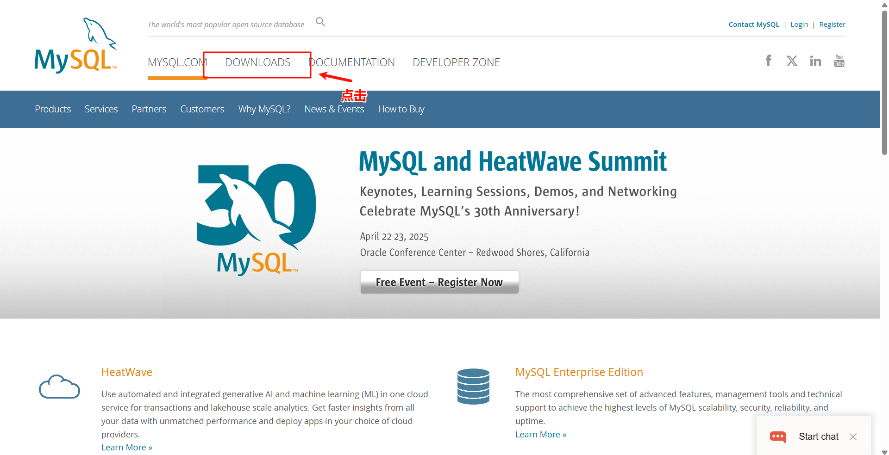
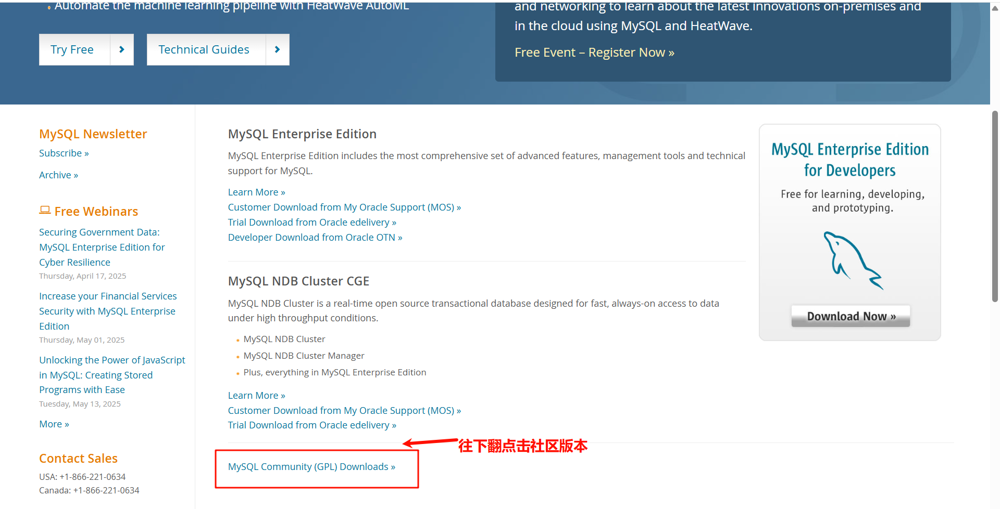
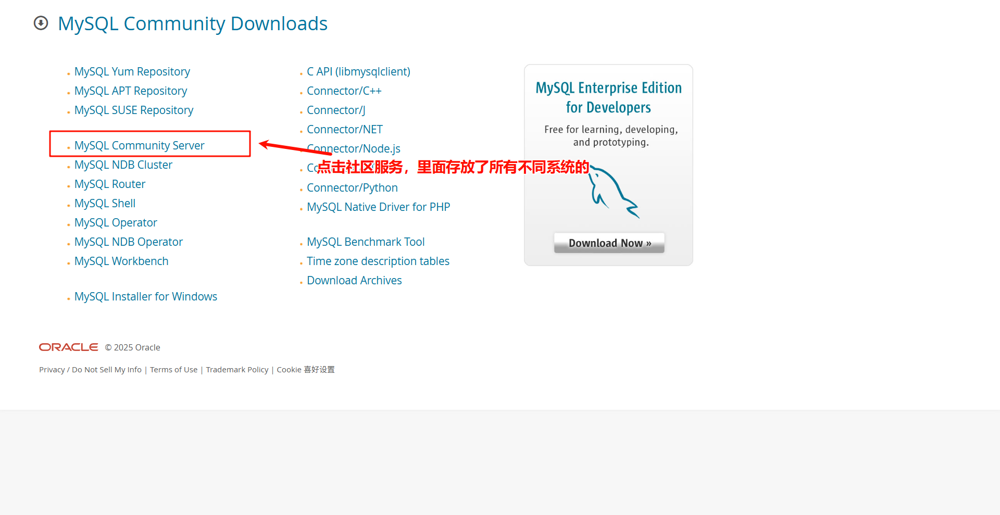
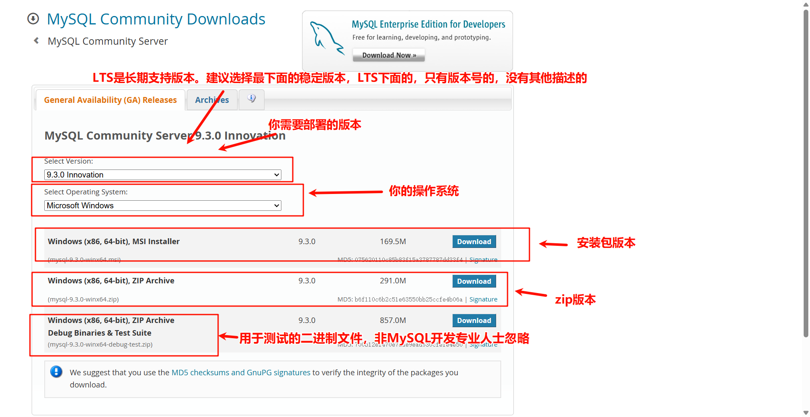
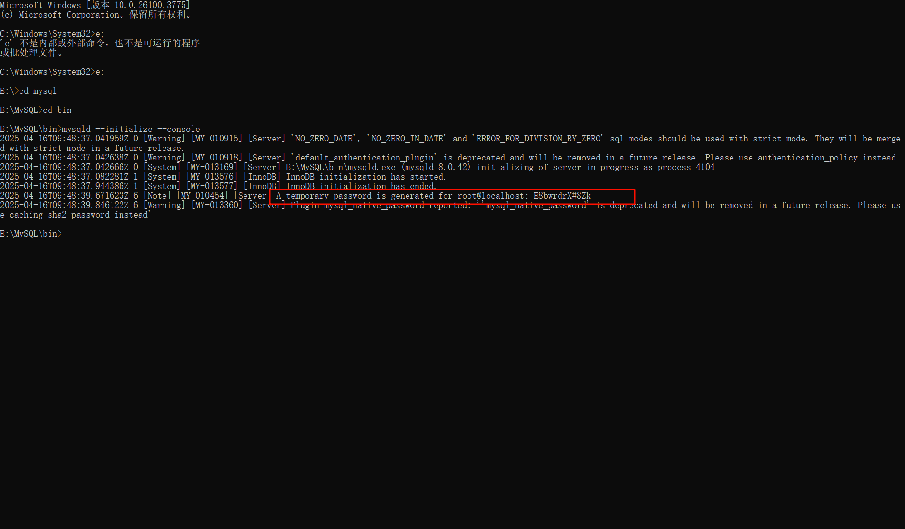

# 官网

https://www.mysql.com/

# 下载zip

## 第一步



## 第二步



## 第三步



## 第四步

> 点击下载zip本版的就行



# 部署MySQL

## 第一步：解压 ZIP 包，配置环境变量

将下载的 MySQL ZIP 包解压到你想要安装的目录（如：D:\mysql）。

### 配置环境变量(如果需要，这样更方便全局使用)

配置环境变量就不用到bin目录才能运行，这样全局都可以访问

1. 进入到你的bin目录，复制路径
2. 在Windows中打开环境变量添加，点击系统的path然后点击编辑在点击新建放入保存即可

## 步骤二：创建配置文件

在 D:\mysql 目录下创建一个 my.ini 文件

```ini
# MySQL 服务器主配置文件
# 保存位置建议放在 MySQL 根目录（如 D:\mysql）

[client]
# 设置默认连接端口
port = 3306

[mysqld]
# MySQL 安装路径（basedir 是解压的主目录）
basedir = D:/mysql

# 数据库存储目录（MySQL 初始化后会在这里生成 data 文件夹）
datadir = D:/mysql/data

# 监听端口
port = 3306

# 设置服务器使用的字符集（utf8mb4 支持 Emoji 等特殊字符）
character-set-server = utf8mb4

# 设置服务器默认的排序规则（推荐使用通用排序规则）
collation-server = utf8mb4_general_ci

# 允许最大连接数（根据需要可调整）
max_connections = 150

# 设置 SQL 模式（STRICT_TRANS_TABLES 可避免插入非法或错误数据）
sql_mode = STRICT_TRANS_TABLES

# 默认身份验证插件（兼容性更好，避免连接报错）
default-authentication-plugin = mysql_native_password

# 是否启用日志（可选）
# general_log=ON
# general_log_file=D:/mysql/logs/general.log

# 错误日志路径（可选）
# log-error=D:/mysql/logs/mysql_error.log

# 启用 MySQL 服务时的 PID 文件位置（可选）
# pid-file=D:/mysql/mysql.pid
```

## 步骤三：初始化数据库

1. 打开命令提示符（以管理员身份）。

2. 进入 bin 目录，例如：
    ```shell
    cd D:\mysql\bin
    ``` 
3. 初始化数据库（生成数据文件）：
   ```shell
   mysqld --initialize --console
   ```
   第一次执行时会显示一个临时密码，记下它（用于首次登录 root）。
   

## 步骤四：安装为 Windows 服务

```shell
mysqld --install MySQL --defaults-file="D:\mysql\my.ini"
```

## 步骤五：启动服务

```shell
net start MySQL
```

## 步骤六：登录并修改 root 密码

```shell
mysql -u root -p
```

输入初始化时生成的临时密码，登录成功后执行：

```mysql
ALTER USER 'root'@'localhost' IDENTIFIED BY '新密码';
```

默认使用的是mysql数据库，不需要USE mysql了

## 扩展

删除服务：

```shell
mysqld –remove
```

停止服务：

```shell
net stop mysql
```
