# 下载安装

## 官网

**https://www.mysql.com/**

## 第一步

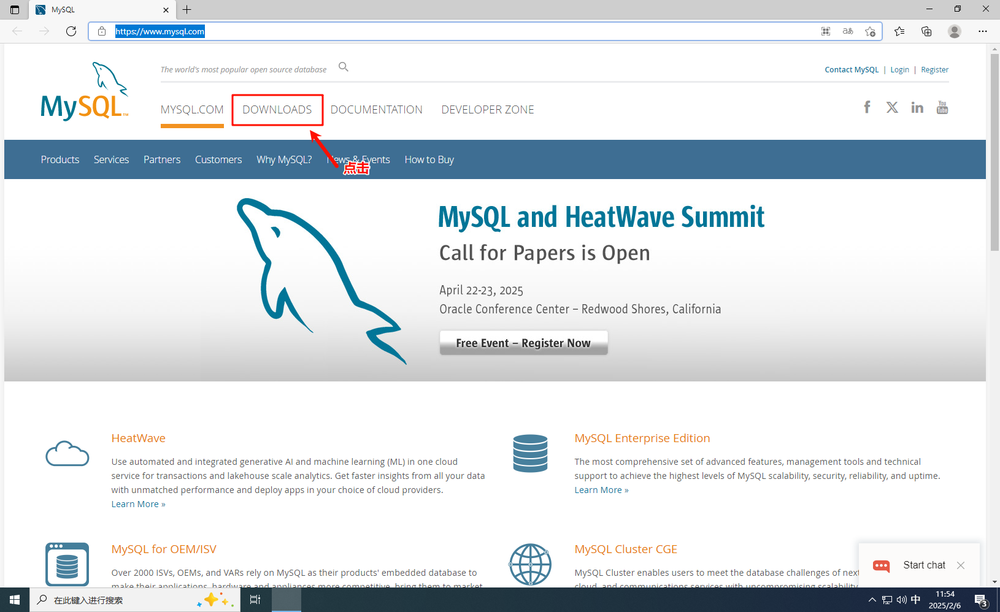

## 第二步

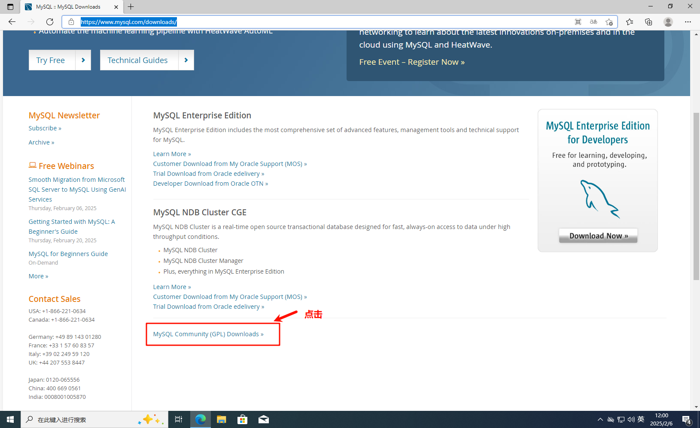

## 第三步

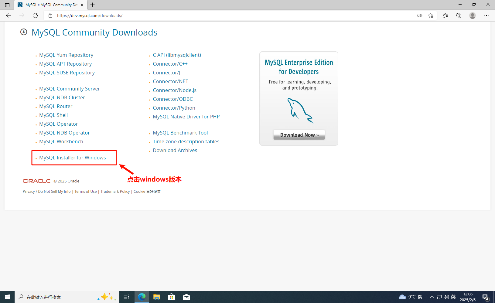

## 第四步

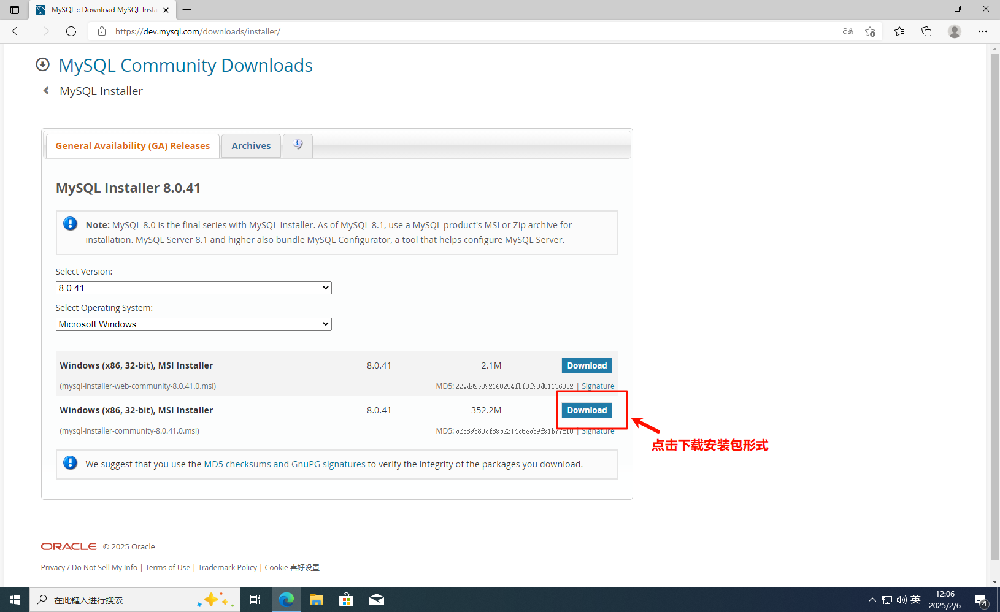

## 第五步

**会进行下载mis安装文件**

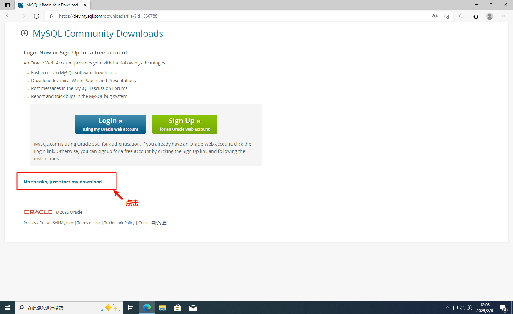

## 第六步

**找到安装文件进行安装**

## 第七步

**根据自己的情况进行安装，这里选择自定义安装**

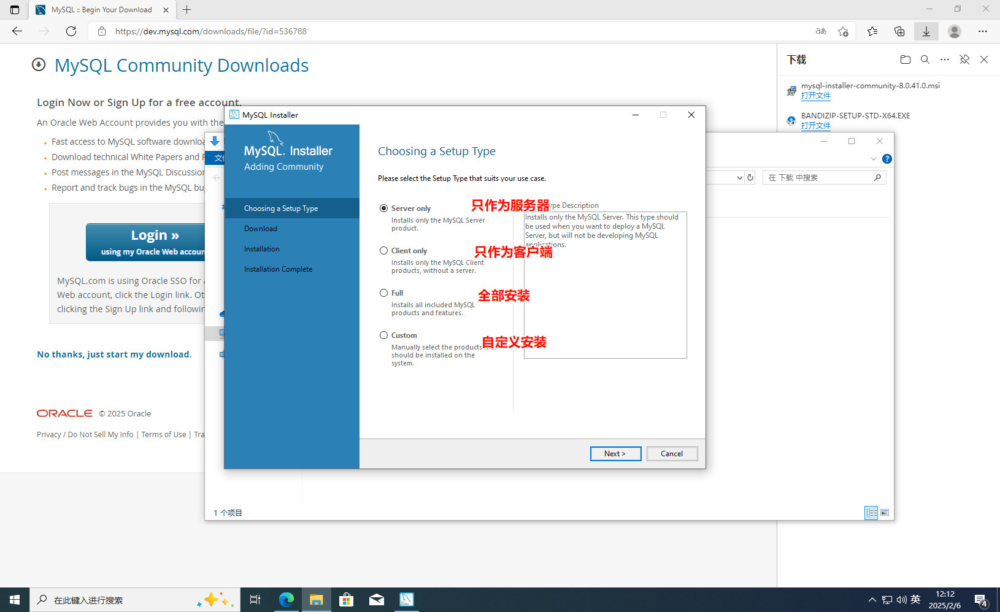

## 第八步

**选择你需要的服务进行放值右侧，点击你放右侧的服务会出现一个Advanced options**

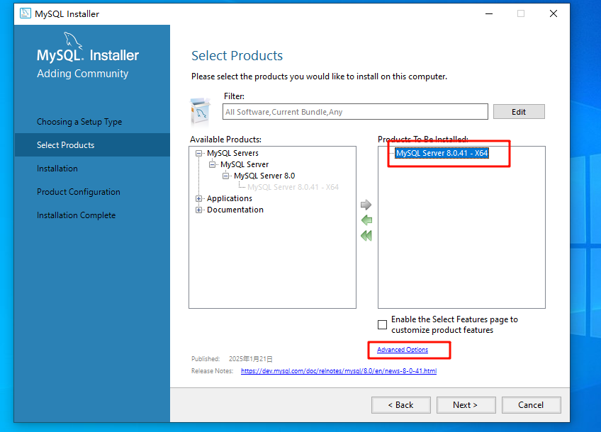

**点击Advanced options可以修改你安装的路径和数据存放的路径，如果目录已存在会弹出警告**

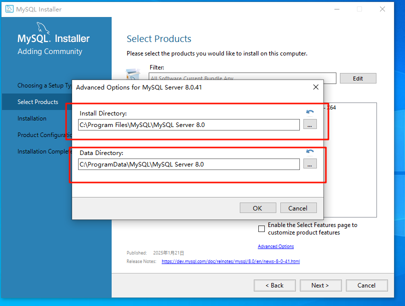

## 第九步

**选择好版本后一直点击execute/next，其余默认即可**   
**这一步会执行安装和初始化，需要等待一会儿**

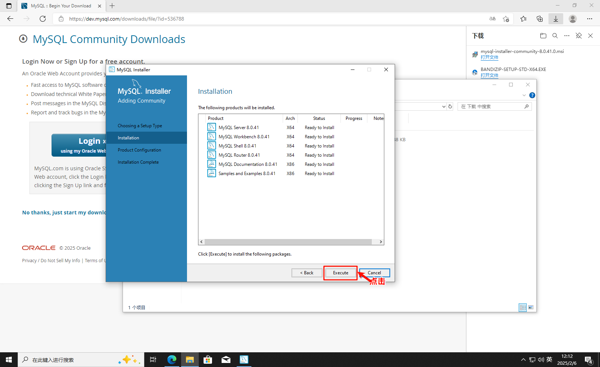

## 第十步

**进行设置你的密码，其余的一直下一步即可**

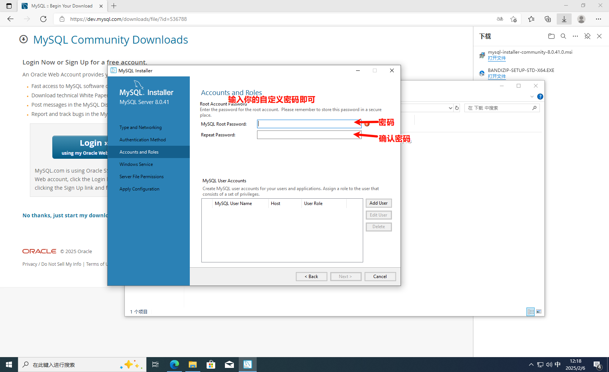

## 总结

**你的默认用户名是root**    
**你的密码是你设置的密码**

# 添加环境变量

## 1. window11/window10直接搜索环境变量打开

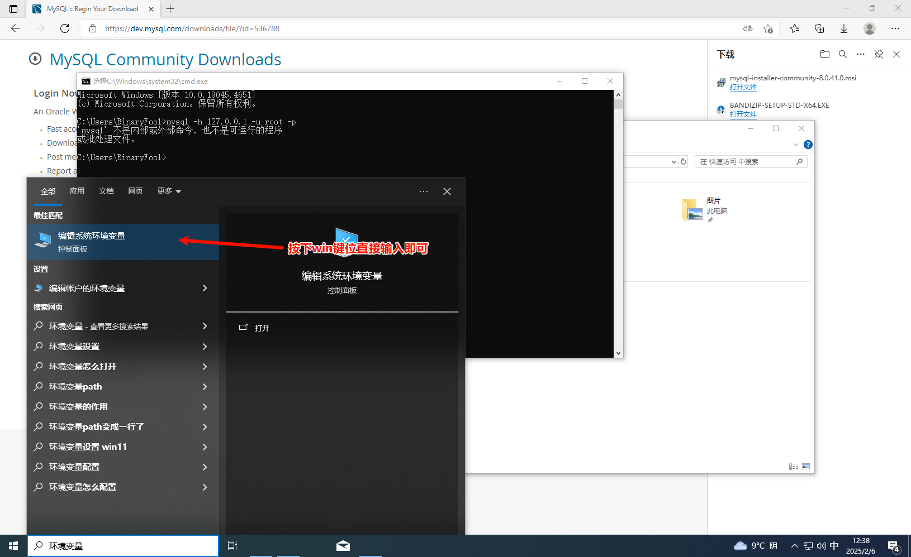

## 2. 点击环境变量

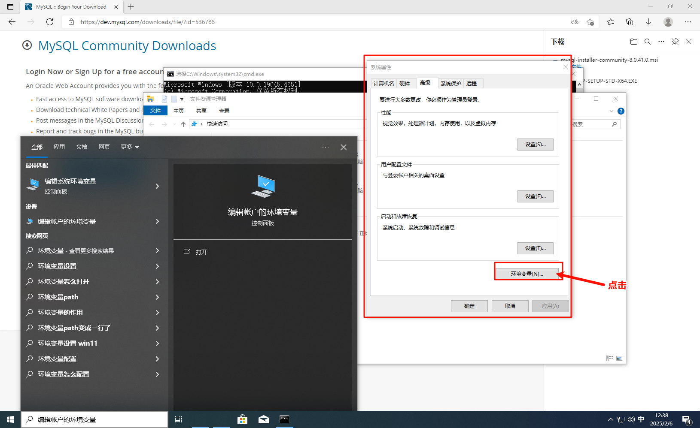

## 3.点击path再点击编辑

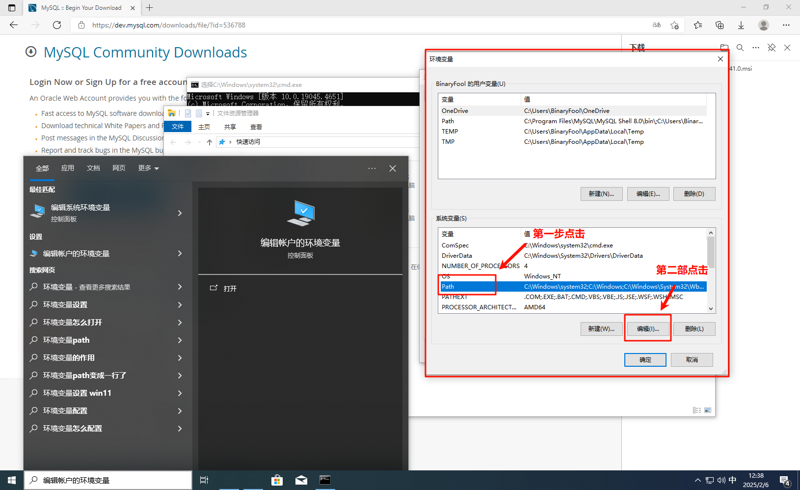

## 4.点击右侧的新建

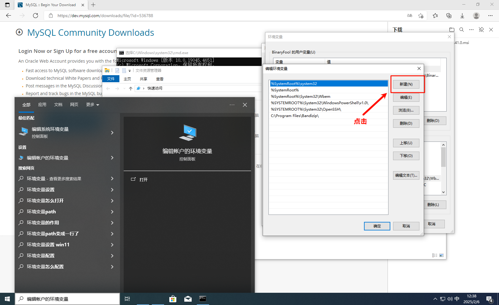

## 5. 粘贴MySQL的bin路径

> (默认在c盘，要粘贴上级带server的)`C:\Program Files\MySQL\MySQL Server 8.0\bin`

**然后点击确定关闭其余的即可**

## 6.测试环境变量是否可用

**win+r输入cmd**

> 1. 在cmd命令框输入 `mysql -h 127.0.0.1 -u root -p` 即可启动MySQL（默认127.0.0.1，不输入也可以）
> 2. 再输入你的密码即可进入MySQL
