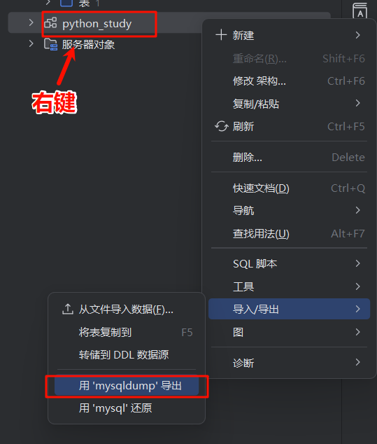
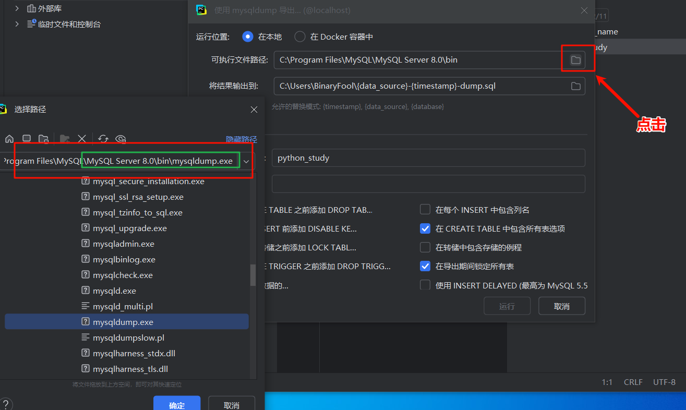
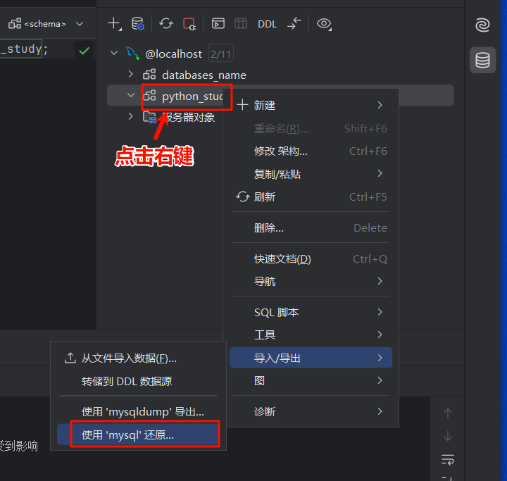
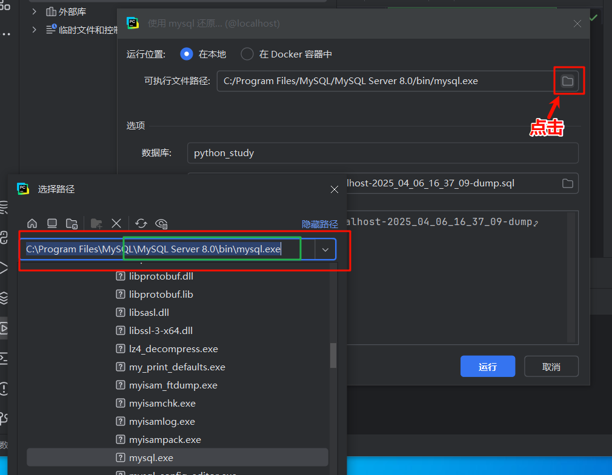
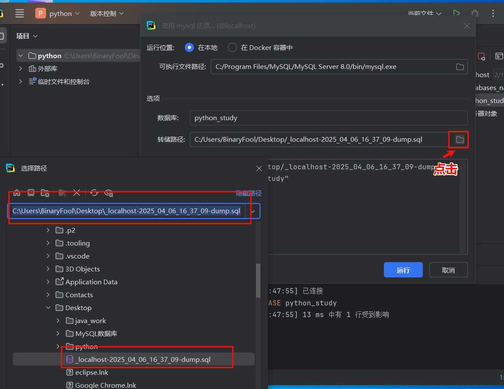

# 命令备份和还原

## 备份

**如果拒绝访问就使用管理员运行(win + r 然后CTRL + shift + enter)**

```shell
mysqldump -u root -p python_study > D:/备份/data.sql
```

## 恢复

**如果拒绝访问就使用管理员运行(win + r 然后CTRL + shift + enter)**

```shell
mysql -u root -p python_study < D:/备份/data.sql
```

# 自带的工具备份和还原

**!注意，还原的时候数据库还是需要在的，只不过里面的数据不在**

## 备份

### 第一步



### 第二步

**还可以选择输出的位置**


### 第三步

点击运行等待结束即可找输出目录找到*.sql文件

## 还原

### 第一步



### 第二步



### 第三步



### 第四步

**等待运行完成刷新即可看到恢复的数据库**
